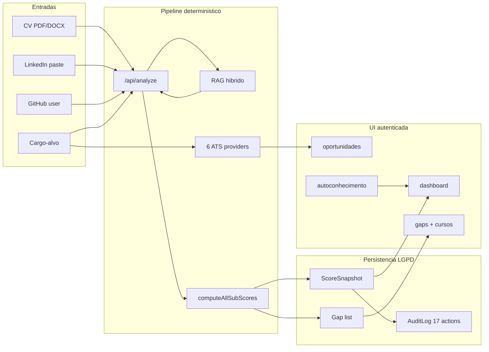
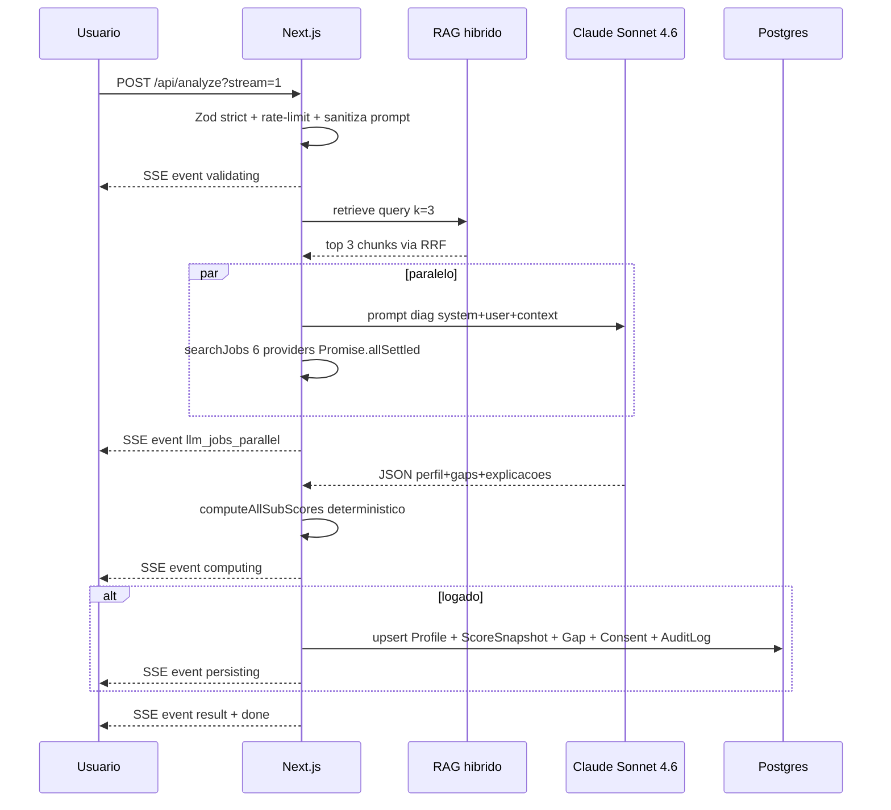
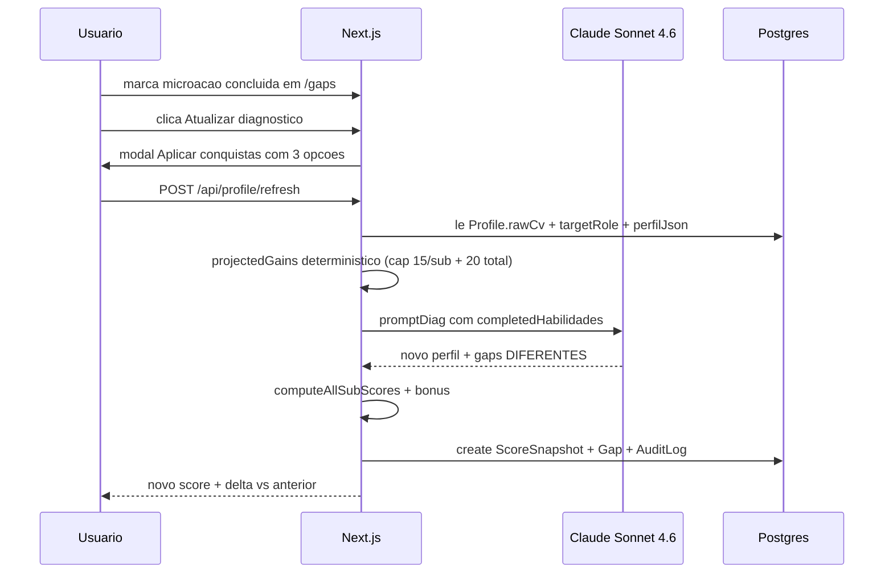
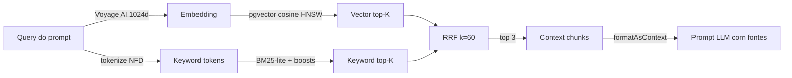
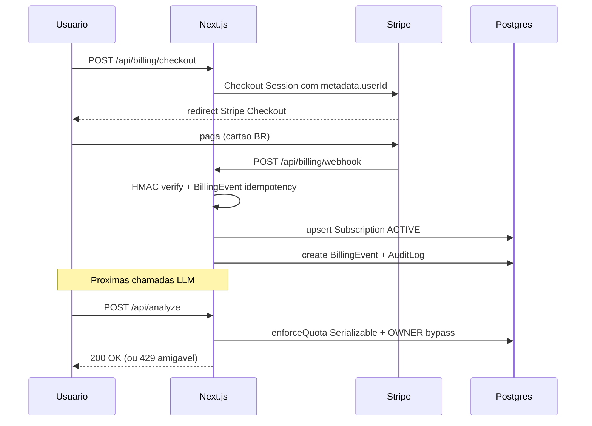
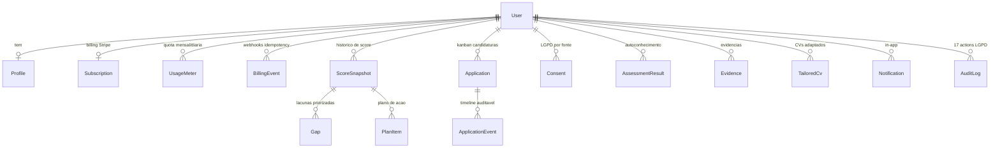

<div align="center">

```
   ▄▄▄▄    ▄▄▄  ▄▄▄  ▄▄▄ ▄▄▄ ▄▄▄ ▄▄▄    ▄▄▄▄▄ ▄▄▄ ▄ ▄ ▄ ▄▄▄ ▄ ▄
   █       █▄▄█ █▄▄▀ █▄▄ █▄▄ █▄▀  █        █  █▄▄█ █ █ █  █  ██▀
   █▄▄▄    █  █ █ ▄▄ █▄▄ █▄▄ █ █  █        █  █  █ ▀▄▀ ▄  █  █ █
```

# CareerTwin AI

### O gêmeo de carreira que cresce com você
*Copiloto de carreira em **pt-BR** — da identidade até a contratação, auditável, sem caixa-preta, LGPD por construção.*

<br/>

[](./package.json)
[](#)
[](#testes)
[](#)
[](./package.json)
[](#)

<br/>


<br/>

[**O que é**](#-o-que-é) ·
[**Highlights**](#-highlights) ·
[**Arquitetura**](#%EF%B8%8F-arquitetura) ·
[**Quick start**](#-quick-start) ·
[**Stack**](#-stack) ·
[**Algoritmos**](#-algoritmos--cálculos) ·
[**Segurança**](#-segurança) ·
[**Roadmap**](#%EF%B8%8F-roadmap) ·
[**Docs**](#-documentação)

</div>

---

## ✨ O que é

CareerTwin AI cria um **gêmeo digital de carreira** a partir de CV, LinkedIn e GitHub do usuário, e organiza a jornada em **quatro pilares** — da identidade até a contratação. Toda métrica é calculada em código **determinístico**; o LLM **explica** e **prioriza**, mas **não inventa números**.

| Pilar | O que faz | Como é calculado |
|---|---|---|
| ◇ **Autoconhecimento** | 3 mini-assessments com visualizações SVG (DISC, Valores, Ikigai) + 6 arquétipos. | Mapping determinístico em JS · LLM só polish |
| ◆ **Diagnóstico** | Career Health Score (0-100) com 4 sub-scores ponderados + mediana comparativa + refresh sem repaste. | 100% código (TF-IDF, set theory, regex) · LLM só explica |
| ▸ **Ação** | Skill Gap Mapper com 41 cursos curados, evidências de competência, CVs adaptados com diff. | Skill-keyed lookup + RAG híbrido · LLM gera microações |
| ● **Oportunidade** | Radar de vagas com 6 providers + filtros + match breakdown matemático + kanban de candidaturas. | Set intersection normalizada · LLM justifica em 1 frase |

> [!NOTE]
> **Princípio editorial:** número = cálculo auditável, texto = explicação com fonte. Sem caixa-preta. Sem promessa de aprovação garantida. **LGPD por construção.**

---

## 🚀 Highlights

> [!TIP]
> Os destaques abaixo são o que diferencia o CareerTwin de "mais um wrapper de LLM".

- **🧠 RAG híbrido real** — 159 chunks curados BR · Voyage AI 1024-dim · pgvector HNSW cosine · BM25-lite · Reciprocal Rank Fusion (k=60) · **recall@3 = 93.9%**.
- **⚡ Streaming SSE progressivo** em `/api/analyze?stream=1` com **6 etapas** visíveis (`validating → llm_jobs_parallel → computing → persisting → result → done`). O usuário **vê o trabalho rolando**, não fica olhando spinner.
- **🔀 Paralelização agressiva** — LLM call + `searchJobs` via `Promise.allSettled`. Ganho típico: **−3 a −5 segundos** por análise.
- **🪶 Claude Haiku 4.5** em 4 rotas leves (parser LinkedIn, portfolio, bullets, perguntas de entrevista) — **3-5× mais rápido** e **¼ do custo** vs Sonnet.
- **💾 LLM response cache** — chave SHA-256 do prompt, TTL 1h, Upstash Redis primary, fallback Map em memória.
- **🛡️ LGPD-by-construction** — `AuditLog` com **17 actions**, IP via **sha256+salt** (anti-rainbow), `Profile.rawCv` com **TTL 90 dias**, exportação JSON completa, cron diário de redação.
- **🧪 Modo "experimentar" anônimo** — home e `/analyze` funcionam sem login; dados efêmeros (zero persistência).
- **🏆 17 conquistas (achievements)** com toast + confetti CSS — gamificação sem peso de bundle.
- **⏰ 6 cron jobs** — digest semanal, daily briefing, usage cleanup, redact CV, outcome survey, redact billing.
- **🧱 Defense-in-depth** — `NEVER_BLOCK_PREFIXES` whitelist + `PROTECTED_PREFIXES` SSoT (middleware + Auth.js) + Zod `.strict()` em **todos** os bodies.

---

## 📊 Métricas-vivas

<div align="center">

| Métrica | Valor | Onde |
|:---:|:---:|:---:|
| **Testes unitários (Vitest)** | `878 ✅` | 69 arquivos |
| **API routes** | `49` | `app/api/**/route.js` |
| **Chunks na knowledge base** | `159` | curados manualmente BR |
| **RAG · recall@3 (gate)** | `93.9 %` | threshold ≥ 70% |
| **Sub-scores determinísticos** | `4` | TF-IDF + set theory + regex |
| **Vulnerabilidades P0+P1 corrigidas** | `11` | Onda 11 (5 audits) |
| **ATS providers** | `6` | Adzuna · Jooble · Greenhouse · Lever · Ashby · Workable |
| **Audit actions (LGPD)** | `17` | IP hash sha256+salt |
| **Cron jobs** | `6` | Vercel cron + header `x-cron-secret` |
| **Models Prisma** | `21` | cascade delete em tudo |

</div>

---

## 🏗️ Arquitetura

Vista de alto nível: quatro pilares, integrações em paralelo, persistência só após login.



<details>
<summary><b>🔬 Fluxo 1 — Diagnóstico inicial (com streaming SSE)</b></summary>



</details>

<details>
<summary><b>🔁 Fluxo 2 — Refresh sem repaste (anti-loop, anti-gaming)</b></summary>



</details>

<details>
<summary><b>🔎 Fluxo 3 — RAG híbrido (Voyage + pgvector + RRF)</b></summary>



</details>

<details>
<summary><b>💳 Fluxo 4 — Billing Stripe (HMAC + idempotency)</b></summary>



</details>

---

## 🚀 Quick start

> [!IMPORTANT]
> Requisitos: **Node.js ≥ 18.18**, **Docker + docker-compose** (Postgres + Mailpit), e uma chave Anthropic ([console.anthropic.com](https://console.anthropic.com)).

```bash
# 1️⃣ Instalar
npm install

# 2️⃣ Subir Postgres + Mailpit (UI em http://localhost:8025)
docker compose up -d postgres mailpit

# 3️⃣ Configurar env
cp .env.example .env
# Mínimos obrigatórios:
#   ANTHROPIC_API_KEY=sk-ant-...
#   AUTH_SECRET=$(openssl rand -base64 32)
#   DATABASE_URL já vem apontando pro Postgres do compose

# 4️⃣ Aplicar schema (não roda no build — ver docs/DEPLOY.md)
npx prisma migrate deploy

# 5️⃣ Subir
npm run dev
```

Acesse **http://localhost:3000**. Em dev, `AUTH_DEV_CREDENTIALS=true` libera login com qualquer e-mail (sem SMTP).

### Comandos úteis

| Comando | O que faz |
|---|---|
| `npm run dev` | Dev server com hot reload |
| `npm run build` | Build de produção (sem `prisma migrate`) |
| `npm test` | Vitest unit · **878 testes** em 69 arquivos |
| `npm run test:watch` | Vitest em modo watch |
| `npm run test:e2e` | Playwright (requer dev rodando) |
| `npm run ingest:knowledge` | Ingerir 159 chunks no pgvector |
| `npm run eval:rag` | Eval 50 queries · gate `recall@3 ≥ 70%` |
| `npm run eval:rag:json` | Eval em JSON pra CI |
| `npx prisma studio` | GUI do banco em `:5555` |
| `npx prisma migrate dev --name <x>` | Criar nova migration |

---

## 🧰 Stack

<table>
  <thead>
    <tr><th align="left">Camada</th><th align="left">Tecnologias</th></tr>
  </thead>
  <tbody>
    <tr>
      <td><b>Frontend</b></td>
      <td>Next.js 14 (App Router) · React 18 · <b>CSS puro</b> (sem Tailwind) · Plus Jakarta Sans + Spectral</td>
    </tr>
    <tr>
      <td><b>Backend</b></td>
      <td>Next.js Route Handlers (Node runtime + alguns Edge)</td>
    </tr>
    <tr>
      <td><b>Banco</b></td>
      <td>Postgres 16 (Neon) · <b>pgvector</b> com índice HNSW cosine · Prisma 6</td>
    </tr>
    <tr>
      <td><b>Auth</b></td>
      <td>Auth.js v5 — magic link (Resend) + LinkedIn OIDC + dev credentials local</td>
    </tr>
    <tr>
      <td><b>LLM</b></td>
      <td>Anthropic <b>Claude Sonnet 4.6</b> (default) + <b>Haiku 4.5</b> (rotas leves) · OpenAI fallback opcional</td>
    </tr>
    <tr>
      <td><b>Embeddings</b></td>
      <td>Voyage AI <code>voyage-3-large</code> (1024 dims) · OpenAI Matryoshka fallback</td>
    </tr>
    <tr>
      <td><b>Vagas</b></td>
      <td>Adzuna BR · Jooble · Greenhouse · Lever · Ashby · Workable · fixtures fallback</td>
    </tr>
    <tr>
      <td><b>Email</b></td>
      <td>Resend (prod) · Nodemailer/Mailpit (dev)</td>
    </tr>
    <tr>
      <td><b>Pagamentos</b></td>
      <td>Stripe (Checkout + Customer Portal + Webhooks HMAC + idempotency)</td>
    </tr>
    <tr>
      <td><b>Cache + Rate-limit</b></td>
      <td>Upstash Redis (prod, cross-lambda) · Map em memória (dev/fallback)</td>
    </tr>
    <tr>
      <td><b>Parsers</b></td>
      <td>pdf-parse (magic-bytes check) + mammoth (DOCX)</td>
    </tr>
    <tr>
      <td><b>Validação</b></td>
      <td>Zod 4 · <code>.strict()</code> em todos os bodies + limites de tamanho</td>
    </tr>
    <tr>
      <td><b>Observabilidade</b></td>
      <td>Sentry (errors) · PostHog (eventos) · UptimeRobot (<code>/api/health</code>) · AuditLog 17 actions</td>
    </tr>
    <tr>
      <td><b>Testes</b></td>
      <td>Vitest <b>(878 passing)</b> · Playwright e2e · 50-query RAG eval</td>
    </tr>
    <tr>
      <td><b>CI/CD</b></td>
      <td>GitHub Actions (Dependabot weekly + npm audit gate) · Vercel</td>
    </tr>
    <tr>
      <td><b>Deploy</b></td>
      <td>Vercel + Neon (recomendado) — Supabase/Railway também OK</td>
    </tr>
  </tbody>
</table>

---

## 📐 Algoritmos & Cálculos

CareerTwin é **explicável por construção.** Toda métrica que vira "número" é calculada em código determinístico — o LLM só explica o que esses cálculos significam. Isso é o que viabiliza `/transparencia` (a fórmula é literalmente exibida na UI).

### Career Health Score

```
Score = (Aderência × 0.40) + (Habilidades × 0.30) + (Perfil × 0.20) + (Experiência × 0.10)
```

| # | Sub-score | Peso | Algoritmo |
|:---:|---|:---:|---|
| 1 | **Aderência a vagas** | `40 %` | TF-IDF simplificado. Extrai skills da vaga via taxonomy normalizada (NFD + lowercase), compara com `Profile.skills`. `lib/scoring/subscores.js` |
| 2 | **Relevância das habilidades** | `30 %` | Score composto: `count` (cap 12) + `validity` (% reconhecidas) + `diversity` (entropia simplificada de categorias). |
| 3 | **Otimização do perfil** | `20 %` | Weighted field-presence: rawCv=20, targetRole=15, skills=15, LinkedIn=15, GitHub=10... soma=100. `lib/metrics/completeness.js` |
| 4 | **Experiência de mercado** | `10 %` | Year-range parsing via regex + senioridade alignment (`jr/junior/trainee = junior`, `sr/senior/lead = senior`). |

Pesos vivem em `lib/score.js#WEIGHTS` e são **exibidos publicamente** em `/transparencia`.

### RAG híbrido — recall@3 = 93.9%

| Componente | O que é | Detalhe |
|---|---|---|
| **Embeddings** | Voyage AI `voyage-3-large` (1024 dims) | ~$0.06/1M tokens · fallback OpenAI `text-embedding-3-small` truncado via Matryoshka |
| **Storage** | pgvector no Neon | HNSW index com cosine distance · raw SQL via `Unsupported("vector(1024)")` |
| **Lane semântica** | Embedding + `ORDER BY embedding <=> $vec` | Top-K por similaridade cosine |
| **Lane keyword** | BM25-lite + NFD + audience boost 1.5× + tag-match | Top-K por overlap |
| **Fusion** | Reciprocal Rank Fusion `score = Σ 1/(k + rank)`, k=60 | Robusto contra magnitudes diferentes |
| **Knowledge base** | **159 chunks curados manualmente** BR | CV / Interview / Salary / Soft-skills / ATS / Mercado-BR / Identidade / Network |
| **Eval framework** | 50 queries com ground truth | `recall@3`, `recall@5`, `MRR`, `NDCG@5` · gate `recall@3 ≥ 70%` |

Detalhes profundos em [docs/RAG.md](./docs/RAG.md) (700 linhas).

### O que **NÃO** é Machine Learning

| Componente | Por que não é ML |
|---|---|
| Career Health Score | TF-IDF + set theory + regex. Determinístico. |
| Job match | Set intersection. Determinístico. |
| Skill extraction | Regex + taxonomy lookup. Determinístico. |
| Claude Sonnet 4.6 | Modelo **pré-treinado** Anthropic. Usamos via API. **Não treinamos.** |
| Embeddings Voyage AI | Modelo **pré-treinado** Voyage. Usamos via API. **Não treinamos.** |

### Outras camadas

| Camada | Implementação |
|---|---|
| Auth IDOR-safe | 2-step query pattern (busca IDs da sessão, depois `IN`) — `app/api/history/actions/route.js` |
| Anti-SSRF | DNS lookup + IP pinning + bloqueio IPv4/IPv6 privados + CGNAT — `lib/safe-fetch.js` |
| URL safety | `safeExternalUrl` + `safeHref` (Zod URL bloqueando `javascript:` / `data:`) |
| LGPD cascade | Prisma `onDelete: Cascade` + Consent `payloadHash` SHA256 |
| LGPD TTL | `Profile.rawCv` redacted após 90d (cron diário `/api/cron/redact-cv`) |
| Audit trail | 17 actions · IP hash sha256+`AUDIT_IP_SALT` (LGPD-friendly) |
| Cost cap LLM | Budget per-user diário: `$0.10` Free / `$5` Pro / `$20` Team |

Documentação completa em [docs/ALGORITHMS.md](./docs/ALGORITHMS.md).

---

## 📁 Estrutura de pastas

```
careertwin-ai/
├─ app/
│  ├─ page.js                       Home — split-panel + modo experimentar
│  ├─ (app)/                        Layout autenticado (AppShell sidebar 252px)
│  │  ├─ dashboard/                 Career Health + sub-scores + próximas ações
│  │  ├─ autoconhecimento/          3 assessments (DISC, Valores, Ikigai)
│  │  ├─ gaps/                      Skill Gap Mapper + microactions + cursos
│  │  ├─ oportunidades/             Radar de vagas + match breakdown
│  │  ├─ plano/                     Histórico de score + timeline
│  │  ├─ cvs-adaptados/             Histórico de CVs adaptados
│  │  ├─ evidencias/                Evidências de competência
│  │  ├─ transparencia/             Fórmula auditável + sources
│  │  └─ conta/                     Perfil + cargo-alvo + stats
│  ├─ candidaturas/                 Kanban + funil de conversão
│  ├─ entrar/                       Login (magic link, LinkedIn, dev)
│  ├─ meus-dados/                   LGPD (ver, baixar JSON, apagar tudo)
│  └─ api/                          49 route handlers
│     ├─ analyze/                   POST: CV + cargo → diagnóstico (SSE stream)
│     ├─ opportunities/             POST: perfil → vagas (6 providers) + plano
│     ├─ assessments/[kind]/        GET/POST: DISC-lite, valores, Ikigai
│     ├─ profile/refresh/           POST: refresh score sem repaste de CV
│     ├─ tailor/                    POST: CV + vaga → CV adaptado (enforce billing)
│     ├─ interview/                 POST: simulador STAR/CAR (enforce billing)
│     ├─ chat/                      POST: conversar com o "gêmeo"
│     ├─ billing/                   checkout · portal · webhook · plan
│     ├─ cron/                      digest · redact-cv · usage-cleanup
│     └─ ...
├─ components/
│  ├─ AppShell.js                   Sidebar 252px desktop + header mobile
│  ├─ Report.js                     Saída do diagnóstico (sub-scores compactos)
│  ├─ visualizations/
│  │  ├─ DiscMatrix.js              SVG quadrante DISC
│  │  ├─ ValoresRadar.js            SVG radar 16 eixos
│  │  └─ IkigaiVenn.js              SVG 4 círculos
│  └─ ...
├─ lib/
│  ├─ llm.js                        Anthropic/OpenAI (retry + timeout + budget cap)
│  ├─ embeddings.js                 Voyage AI + OpenAI fallback (1024 dims)
│  ├─ prompts.js                    Prompts (system + user separados)
│  ├─ validators.js                 Zod strict em tudo
│  ├─ score.js                      Career Health Score (4 sub-scores · WEIGHTS)
│  ├─ scoring/subscores.js          Sub-scores 100% determinísticos
│  ├─ knowledge/                    RAG hybrid (retrieval + courses + base curada)
│  ├─ jobs/                         6 providers + fixtures fallback
│  ├─ skills-taxonomy.js            Extração + match
│  ├─ rate-limit.js                 Upstash Redis (prod) ou Map (dev/fallback)
│  ├─ billing/                      Stripe SDK + plans + enforce TOCTOU-safe
│  ├─ audit.js                      AuditLog 17 actions (IP hash sha256+salt)
│  ├─ safe-fetch.js                 Anti-SSRF (DNS + IP pinning + private blocks)
│  └─ ...
├─ prisma/
│  ├─ schema.prisma                 21 modelos
│  └─ migrations/                   Migrations versionadas
├─ scripts/
│  └─ ingest-knowledge.mjs          Ingestão idempotente (sha256 contentHash)
├─ tests/
│  ├─ unit/                         Vitest (878 testes em 69 arquivos)
│  ├─ e2e/                          Playwright (5 specs)
│  └─ eval/rag/                     50 queries · recall@3/MRR/NDCG
├─ docs/                            PRODUTO · ALGORITHMS · API · RAG · ...
├─ middleware.js                    CSP + NextAuth gate + PROTECTED paths
├─ vercel.json                      6 crons configurados
└─ docker-compose.yml               Postgres + Mailpit pra dev
```

### Modelos de dados — `prisma/schema.prisma`



---

## 🔑 Variáveis de ambiente

> [!NOTE]
> Toda integração tem **flag off** com graceful degradation. Sem `STRIPE_SECRET_KEY` → billing retorna `503` amigável e o resto da app funciona. Sem `VOYAGE_API_KEY` → RAG cai em keyword-only.

<details>
<summary><b>📋 Tabela completa de env vars (clique pra expandir)</b></summary>

| Variável | Obrigatória | Descrição |
|---|:---:|---|
| `LLM_PROVIDER` | ❌ | `anthropic` (default) ou `openai` |
| `LLM_MODEL` | ❌ | `claude-sonnet-4-6` (default) ou outro |
| `LLM_MODEL_FAST` | ❌ | `claude-haiku-4-5-20251001` — rotas leves 3-5× mais rápidas |
| `ANTHROPIC_API_KEY` | ✅* | `*` se `LLM_PROVIDER=anthropic` |
| `OPENAI_API_KEY` | ✅* | `*` se `LLM_PROVIDER=openai` |
| `DATABASE_URL` | ✅ | Postgres connection string (Neon com `?sslmode=require`) |
| `AUTH_SECRET` | ✅ | `openssl rand -base64 32` |
| `AUTH_URL` | prod | URL pública (ex.: `https://careertwin.app`) |
| `EMAIL_FROM` | ✅ | `"CareerTwin <no-reply@seu-dominio>"` |
| `AUTH_RESEND_KEY` | prod | Chave Resend pra magic link + digest |
| `EMAIL_SERVER` | dev | `smtp://localhost:1025` (Mailpit) |
| `AUTH_LINKEDIN_ID` / `_SECRET` | ❌ | LinkedIn OIDC |
| `AUTH_DEV_CREDENTIALS` | dev | `true` libera login dev — **proibido em prod** (guarda dupla) |
| `ADZUNA_APP_ID` / `_KEY` | ❌ | Vagas reais BR |
| `JOOBLE_API_KEY` | ❌ | Vagas agregadas |
| `GREENHOUSE_BOARDS` | ❌ | CSV de slugs: `nubank,stone` |
| `LEVER_BOARDS` | ❌ | CSV de slugs Lever |
| `ASHBY_BOARDS` | ❌ | CSV de orgSlugs Ashby |
| `WORKABLE_BOARDS` | ❌ | CSV de accounts Workable |
| `SENTRY_DSN` / `NEXT_PUBLIC_SENTRY_DSN` | ❌ | Sentry server + client |
| `NEXT_PUBLIC_POSTHOG_KEY` | ❌ | PostHog product analytics |
| `CRON_SECRET` | prod | `openssl rand -hex 32` — header `x-cron-secret` |
| `OWNER_EMAILS` | ❌ | CSV bypass Free (`sergio@x,daniel@y`) |
| `AUDIT_IP_SALT` | prod | `openssl rand -hex 32` — salt do hash IP (anti-rainbow) |
| `STRIPE_SECRET_KEY` | ❌ | Sem isso → billing 503 amigável |
| `STRIPE_WEBHOOK_SECRET` | ✅* | `*` obrigatória se Stripe ativo (HMAC) |
| `STRIPE_PRICE_PRO_MONTHLY` | ❌ | Price ID Pro Mensal R$29 |
| `STRIPE_PRICE_PRO_YEARLY` | ❌ | Price ID Pro Anual R$290 |
| `STRIPE_PRICE_TEAM_MONTHLY` | ❌ | Price ID Team R$99/seat |
| `UPSTASH_REDIS_REST_URL` / `_TOKEN` | ❌ | Cache + rate-limit cross-lambda |
| `VOYAGE_API_KEY` | ❌ | Embeddings 1024-dim · sem isso → keyword-only |

</details>

---

## 🚢 Deploy no Vercel

<details>
<summary><b>Passo a passo completo</b></summary>

### 1️⃣ Postgres gerenciado (com pgvector)
- **[Neon](https://neon.tech)** — recomendado (free tier generoso, pgvector nativo: `CREATE EXTENSION vector`)
- Supabase, Railway também OK

### 2️⃣ Resend com domínio verificado
1. [resend.com/domains](https://resend.com/domains) → Add Domain
2. DNS records (SPF + DKIM)
3. API key com escopo "Sending access"

### 3️⃣ Push pro GitHub e importar no Vercel
```bash
git remote add origin git@github.com:SEU_USER/careertwin-ai.git
git push -u origin main
```

[vercel.com/new](https://vercel.com/new) → importe o repo. Framework: **Next.js** (auto). Adicione env vars. **NÃO** defina `AUTH_DEV_CREDENTIALS=true` em prod (a guarda dupla aborta o boot).

### 4️⃣ Rodar migration em prod (não roda no build)

```bash
# Opção A — manual:
DATABASE_URL="..." npx prisma migrate deploy

# Opção B — Vercel Install Command:
#   npm ci && npx prisma migrate deploy

# Opção C — GitHub Action dedicada (workflow_dispatch).
```

Detalhes em [docs/DEPLOY.md](./docs/DEPLOY.md).

### 5️⃣ Vercel Cron com header `x-cron-secret`

Project → Settings → Cron Jobs:
```
x-cron-secret: <valor do CRON_SECRET>
```

Pra testar:
```bash
curl -X POST -H "x-cron-secret: <SECRET>" https://seu-app.vercel.app/api/cron/digest
curl -X POST -H "x-cron-secret: <SECRET>" https://seu-app.vercel.app/api/cron/redact-cv
```

### 6️⃣ Ingestão RAG (opcional, ativa o lane vetorial)

```bash
DATABASE_URL="..." VOYAGE_API_KEY="pa-..." npm run ingest:knowledge
DATABASE_URL="..." npm run eval:rag
```

Sem ingestão → keyword-only lane (recall@3 ainda passa o gate).

</details>

---

## 🛡️ Segurança

> [!IMPORTANT]
> **11 vulnerabilidades P0+P1 já remediadas** (Onda 11). Auditoria em 5 read-only audits cobrindo **OWASP Top 10:2025** + **OWASP Top 10 LLM Apps 2025**.

| Camada | Defesa implementada |
|---|---|
| **Auth** | Auth.js v5 + JWT + adapter Prisma · guarda dupla `AUTH_DEV_CREDENTIALS` em prod (aborta boot) · rate-limit magic-link 3/email/hora |
| **Validação** | Zod `.strict()` em **todos** os bodies + limites de tamanho contra DoS de custo |
| **IDOR** | Escopo por `session.user.id` em toda query Prisma · 2-step query pattern |
| **Rate limit** | Upstash Redis (cross-lambda) · fallback Map · rotas LLM, jobs, billing |
| **Prompt injection** | System prompt isolado · sanitização de `"""` · null bytes removidos |
| **LLM** | Retry + backoff exponencial + jitter · AbortController 45s · budget per-user diário · cost log JSON-line |
| **TOCTOU** | UsageMeter via `Prisma.$transaction` isolationLevel `Serializable` |
| **CSP** | Middleware com `script-src 'self' 'unsafe-inline'` · `frame-ancestors 'none'` |
| **Headers** | HSTS · X-Frame-Options DENY · nosniff · Referrer-Policy · Permissions-Policy |
| **Upload** | Magic-bytes + content-length antes do parse (PDF/DOCX) |
| **SSRF** | Custom HTTPS agent · IP pinning · bloqueio IPv4/IPv6 privados, CGNAT, link-local, `.local`/`.internal` |
| **Cron** | Header `x-cron-secret` com comparação constante-tempo |
| **Email** | HTML escapado · `safeExternalUrl` + `safeHref` (Zod URL bloqueando `javascript:`/`data:`) |
| **Stripe** | Webhook HMAC verify · `BillingEvent.stripeEventId` unique pra idempotency |
| **Chat ownership** | Body sem perfil/gaps — server carrega do DB pra evitar spoofing |
| **LGPD** | Consent SHA256 · cascade delete · export JSON · `Profile.rawCv` TTL 90d · AuditLog 17 actions IP hash sha256+salt |
| **CI gate** | `npm audit` + Dependabot weekly |

Auditorias em [docs/audits/](./docs/audits/):
`01-backend.md` · `02-frontend.md` · `03-db-infra.md` · `04-appsec-owasp.md` · `05-ai-llm-security.md`

---

## 🧪 Testes

```bash
npm test                # 878 testes unit (vitest) em 69 arquivos
npm run test:e2e        # 5 specs playwright (skipped em CI por padrão)
npm run eval:rag        # 50 queries · gate recall@3 >= 70%
```

<details>
<summary><b>O que está coberto</b></summary>

- Validators Zod (60+ schemas: Analyze, Opp, Interview, Tailor, Chat, LinkedIn, Portfolio, Application, Assessment, Evidence, TailoredCv, Refresh, Billing...)
- Email digest HTML (escape XSS, singular/plural, validação de protocolo)
- Score determinístico (sub-scores 100% em código + bonus refresh capado)
- RAG hybrid (retrieval + course suggestion + RRF fusion)
- Billing enforce (TOCTOU-safe + OWNER_EMAILS bypass + plan limits)
- Anti-SSRF (DNS pinning + private IPv4/IPv6/CGNAT)
- URL safety (`safeExternalUrl` / `safeHref` Zod URL)
- AuditLog (17 actions + IP hash)
- Streaming SSE (6 etapas, ordering, persistência só se logado)
- Achievements (17 conquistas, idempotência, payloads)
- E2E Playwright: login → diagnóstico → persistência → "apagar tudo"

</details>

---

## 🗺️ Roadmap

### ✅ v0.9 — atual: MVP completo + RAG real + Stripe foundation
- 4 pilares (Autoconhecimento · Diagnóstico · Ação · Oportunidade)
- RAG real: Voyage AI + pgvector + RRF · 159 chunks · `recall@3 = 93.9%`
- Stripe Phase 1+2: Checkout + Portal + Webhooks HMAC + idempotência
- 6 ATS providers · LGPD by construction · AuditLog 17 actions
- 11 vulnerabilidades P0+P1 corrigidas · 5 audits read-only
- 878 testes unit + 5 e2e Playwright

### 🎯 v1.0 — validação com usuários (próximo)
- User testing com 5-10 candidatos
- Entrevistas B2B com universidades + RHs
- Decisão de ICP (B2C primário ou B2B primário)
- Refinamento baseado em feedback real

### 🔧 v1.1 — production hardening
- Vercel Install Command pra `prisma migrate deploy`
- Neon branch isolation (preview/prod separados)
- PITR drill (restore exercitado a cada 3 meses)
- Sentry + PostHog validados com tráfego real
- Lighthouse > 90 em todas as rotas · status page

### 💰 v1.2 — monetização ativa
- Criar Stripe Price IDs reais (placeholders hoje)
- NFe BR (integração com emissora)
- Pricing page + paywall UI nas rotas LLM
- Affiliate de cursos com tracking

### 🏢 v2.0 — B2B
- Modelo `Organization` + seats (universidades, consultorias)
- SAML/SSO · white-label · API pública
- Dataset proprietário anonimizado (defensibilidade)

### 🔮 futuro
- Mediana de contratados real (dataset)
- Mobile nativo · i18n (en/es)
- Análise psicométrica clínica validada

---

## 🤝 Como contribuir

> [!TIP]
> Branch principal: `main`. Branch de redesign atual: `redesign/claude-design`.

1. **Fork** o repo e crie um branch a partir de `main` (`feat/sua-feature` ou `fix/bug-x`).
2. Mantenha **Zod `.strict()`** em qualquer novo body de API. Sem exceção.
3. Use **`session.user.id`** em qualquer query Prisma que tocar dados de usuário. **Nunca confie em IDs no body.**
4. Rodadas obrigatórias antes de PR:
   ```bash
   npm test            # vitest deve passar (878+)
   npm run eval:rag    # gate recall@3 >= 70%
   ```
5. Para mudanças em LLM/auth/billing/upload/PII, consulte a skill `seguranca-careertwin` (OWASP + LLM Top 10).
6. PR description deve ter: **o que muda**, **por que**, **screenshots** (se UI) e **testes que cobrem**.

---

## 📚 Documentação

<table>
  <tr>
    <td valign="top" width="33%">
      <h4>🧭 Produto</h4>
      <ul>
        <li><a href="./docs/PRODUTO.md">PRODUTO.md</a> — visão, personas, princípios</li>
        <li><a href="./docs/ALGORITHMS.md">ALGORITHMS.md</a> — fórmulas + diagramas</li>
        <li><a href="./docs/API.md">API.md</a> — referência de rotas</li>
        <li><a href="./docs/STRATEGY_ROADMAP.md">STRATEGY_ROADMAP.md</a> — visão estratégica</li>
      </ul>
    </td>
    <td valign="top" width="33%">
      <h4>⚙️ Engenharia</h4>
      <ul>
        <li><a href="./docs/RAG.md">RAG.md</a> — Voyage + pgvector + RRF + eval</li>
        <li><a href="./docs/MONETIZACAO.md">MONETIZACAO.md</a> — Stripe + planos + enforcement</li>
        <li><a href="./docs/DEPLOY.md">DEPLOY.md</a> — 3 estratégias de migration</li>
        <li><a href="./docs/RELIABILITY.md">RELIABILITY.md</a> — SLOs + erros</li>
      </ul>
    </td>
    <td valign="top" width="33%">
      <h4>🔍 Auditorias</h4>
      <ul>
        <li><a href="./docs/audits/01-backend.md">01 · Backend</a></li>
        <li><a href="./docs/audits/02-frontend.md">02 · Frontend</a></li>
        <li><a href="./docs/audits/03-db-infra.md">03 · DB + Infra</a></li>
        <li><a href="./docs/audits/04-appsec-owasp.md">04 · OWASP Top 10:2025</a></li>
        <li><a href="./docs/audits/05-ai-llm-security.md">05 · OWASP LLM Top 10</a></li>
      </ul>
    </td>
  </tr>
  <tr>
    <td valign="top">
      <h4>📊 Operações</h4>
      <ul>
        <li><a href="./docs/OBSERVABILITY.md">OBSERVABILITY.md</a> — Sentry + PostHog + UptimeRobot</li>
        <li><a href="./docs/ANALYTICS.md">ANALYTICS.md</a> — eventos PostHog</li>
        <li><a href="./docs/OUTCOMES.md">OUTCOMES.md</a> — survey + tracking</li>
      </ul>
    </td>
    <td valign="top">
      <h4>🎨 Design</h4>
      <ul>
        <li><a href="./docs/redesign/00-MASTER_PLAN.md">Master Plan</a></li>
        <li><a href="./docs/redesign/01-FRONTEND.md">Frontend redesign</a></li>
        <li><a href="./docs/UX_AUDIT.md">UX_AUDIT.md</a> — referências internacionais</li>
        <li><a href="./docs/REBRAND_CANDIDATES.md">REBRAND_CANDIDATES.md</a> — 22 nomes</li>
      </ul>
    </td>
    <td valign="top">
      <h4>👥 Time</h4>
      <ul>
        <li><a href="./docs/HANDOFF_TIME_TERA.md">HANDOFF_TIME_TERA.md</a> — handoff 341 linhas</li>
        <li><a href="./docs/PROVIDERS_RESEARCH.md">PROVIDERS_RESEARCH.md</a> — pesquisa ATS</li>
      </ul>
    </td>
  </tr>
</table>

---

## 👥 Time

Fernanda Alves · Bianca Matos · Cicero Janiel · Caroline Guilmo · Jonatan Jamar · Daniel Scharf · **Sérgio Henrique**

---

<div align="center">

<sub>**CareerTwin AI** — copiloto de carreira em pt-BR · auditável · LGPD por construção</sub>

<sub>Built with `Next.js 14` · `Anthropic Claude` · `Voyage AI` · `pgvector` · `Postgres` · `Stripe` · `Resend` · `Upstash`</sub>

<br/>

<sub>Se este projeto te ajudou, considere deixar uma ⭐ — feedback é combustível.</sub>

</div>
