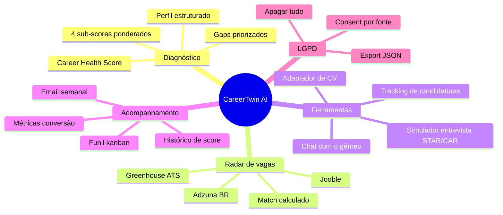
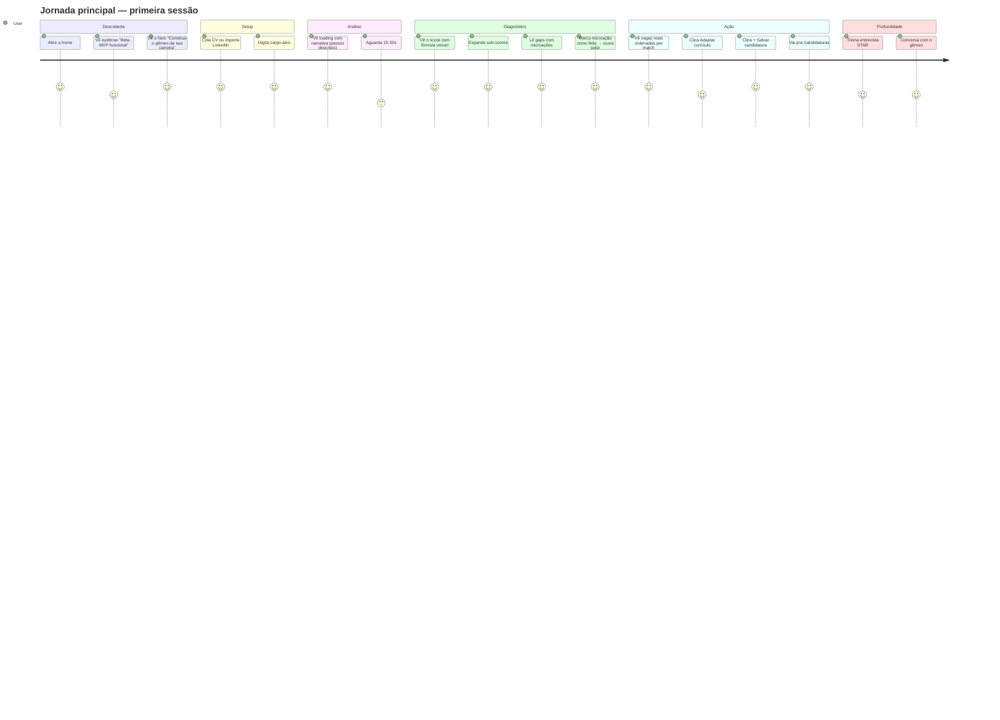

# CareerTwin AI — Documentação de Produto

> Copiloto de empregabilidade em pt-BR. Cola o currículo, diz o cargo que quer, recebe um diagnóstico auditável + vagas reais + plano executável.

---

## Sumário

1. [O que é](#o-que-é)
2. [Pra quem é](#pra-quem-é)
3. [O que o produto entrega](#o-que-o-produto-entrega)
4. [Jornada do usuário](#jornada-do-usuário)
5. [Funcionalidades em detalhe](#funcionalidades-em-detalhe)
6. [Princípios editoriais](#princípios-editoriais)
7. [Diferenciais](#diferenciais)
8. [Concorrência](#concorrência)
9. [Limitações conhecidas](#limitações-conhecidas)
10. [Modelo de negócio (planejado)](#modelo-de-negócio-planejado)
11. [FAQ](#faq)

---

## O que é

CareerTwin AI cria um **gêmeo digital da carreira** do usuário a partir de três fontes possíveis (CV em texto/PDF, perfil LinkedIn colado, portfólio GitHub) e compara com o que o mercado de fato pede para o cargo desejado. O retorno não é genérico: cada número tem fonte, cada lacuna tem microação concreta, cada vaga sugerida vem com a explicação do match e o link da publicação original.

**Em uma frase**: "Cole o que você é hoje, diga onde quer chegar — recebe a distância em números auditáveis e o caminho dividido em microações."

---

## Pra quem é

| Persona | Cenário típico |
|---|---|
| **Profissional em recolocação** (28-45a, demitido nos últimos 6 meses) | Precisa de clareza objetiva sobre onde está, o que falta, e onde aplicar primeiro. |
| **Profissional em evolução** (PJ → CLT, dev → tech lead, analista → coordenador) | Quer mapear o gap pro próximo nível e adaptar o LinkedIn/CV pra parecer "pronto pro próximo passo". |
| **Transição de área** (marketing → produto, financeiro → dados) | Precisa entender quais skills do passado se aproveitam e quais lacunas atacar primeiro. |
| **Recém-formado** (1º emprego ou júnior buscando pleno) | Sem perspectiva, recebe um diagnóstico de skills + plano de evolução. |
| **B2B futuro** (universidades, consultorias, RHs) | Acompanhar coorte de alunos/clientes em evolução de empregabilidade. |

---

## O que o produto entrega



---

## Jornada do usuário



---

## Funcionalidades em detalhe

### 1. Diagnóstico (`/api/analyze`)

**Input**: currículo (texto, mín. 60 chars) + cargo-alvo
**Output**: perfil estruturado + Career Health Score (0-100) + 4 sub-scores + 3-4 gaps com prioridade

**Career Health Score** é calculado **em código**, não pela IA (`lib/score.js`):

```
Score = (Aderência × 0.40) + (Habilidades × 0.30) + (Perfil × 0.20) + (Experiência × 0.10)
```

A IA só **explica** cada sub-score. O número é determinístico. O usuário pode auditar.

**Gaps**: cada lacuna vem com:
- Habilidade (ex.: "Threat modeling")
- Por que importa (com fonte)
- Frequência nas vagas analisadas (ex.: "72%")
- Microação concreta (ex.: "Curso de threat modeling — 4h")
- Impacto se feita (ex.: "+5 em relevância de habilidades")

### 2. Opportunity Radar (`/api/opportunities`)

Busca vagas reais em **paralelo** com timeout 6s:
- **Adzuna BR** (cobertura ampla, traz salário)
- **Jooble** (agregador)
- **Greenhouse ATS** (boards públicos: nubank, stone, etc.)

Match calculado em código (`lib/skills-taxonomy.js`):
1. Extrai skills do `titulo + descrição` da vaga
2. Compara com skills do perfil
3. Calcula `match = |skills∩| / max(|perfil|, |vaga|) × 100`

A IA só justifica o porquê do match em uma frase. Não inventa número.

Sem chave de vagas configurada → fallback com vagas ilustrativas etiquetadas como tal.

### 3. Adaptador de currículo (`/api/tailor`)

Reescreve o CV adaptado pra uma vaga específica. Princípio: **autenticidade**.

- Bullets marcados como `"reorganizacao"` (vem do que já está no CV)
- Bullets marcados como `"nova"` (sugestão que o usuário precisa confirmar)
- Nunca inventa número ou conquista

### 4. Simulador de entrevista (`/api/interview`)

Dois modos:
- **`action: "question"`** — gera pergunta contextual ao cargo e às lacunas, com tipo (comportamental/técnica) e dica
- **`action: "evaluate"`** — avalia resposta usando STAR (Situação, Tarefa, Ação, Resultado) ou CAR (Contexto, Ação, Resultado). Retorna: elementos presentes, faltando, feedback, versão melhorada, **alerta de autenticidade** (se a versão sugerida inventou algo)

O alerta de autenticidade é defesa contra "treinar e mentir" — o produto se recusa a fabricar conquistas do usuário.

### 5. Chat com o gêmeo (`/api/chat`)

Conversa livre em até 5 frases por resposta. O "gêmeo" responde só com base em perfil + lacunas — não inventa fatos do usuário.

### 6. Tracking de candidaturas (`/candidaturas`)

Kanban com 6-7 estados:
```
SAVED → APPLIED → SCREENING → INTERVIEW → OFFER / REJECTED / WITHDRAWN
```

Cada mudança gera `ApplicationEvent` (timeline auditável). Datas-chave (`appliedAt`, `offerAt`, `rejectedAt`) marcadas automaticamente.

**Métricas no topo**: total · aplicadas · entrevistas · ofertas — com **taxa de conversão entre etapas**. Essa é a única métrica do pitch (`entrevistas conquistadas`) que cumpre o prometido.

### 7. Histórico de score (`/meu-gemeo`)

Cada novo diagnóstico cria um `ScoreSnapshot` imutável. A página mostra a evolução em barras — só funciona pra ver tendência se o usuário refaz o diagnóstico periodicamente (com CV atualizado).

### 8. Imports

| Origem | Como funciona |
|---|---|
| **CV em texto** | Textarea, validação Zod (60-40k chars) |
| **CV em PDF** | Upload, magic-bytes check, pdf-parse, sandbox, sanitização |
| **LinkedIn** | Cola texto (Sobre + Experiência + Skills), IA estrutura em campos |
| **Portfólio GitHub** | Usuário → API pública GitHub (60 req/h) → 10 repos mais relevantes → IA resume stack |
| **Portfólio URL** | Fetch público com timeout, anti-SSRF (IPv4+IPv6 privados bloqueados), anti DNS-rebinding, parse HTML básico |

### 9. Weekly digest (`/api/cron/digest`)

Toda segunda 12h UTC (9h BRT), Vercel Cron dispara o endpoint. Para cada usuário com `digestEnabled=true` e `lastDigestAt > 7 dias`:
1. Busca vagas pro `targetRole`
2. Filtra match ≥ 60%
3. Envia top 5 por email HTML via Resend

Toggle em `/meus-dados`. Email tem link pra desativar e pro funil.

### 10. LGPD por construção (`/meus-dados`)

- **Lista**: snapshots, candidaturas, fontes de dado, consentimentos
- **Toggle**: email semanal on/off (server action)
- **Baixar tudo**: `/api/me/export` retorna JSON com User + Profile + Snapshots + Gaps + PlanItems + Applications + Consents
- **Apagar tudo**: confirmação digitando "APAGAR" → cascade delete em tudo + logout

---

## Princípios editoriais

Estes são os 4 princípios que regem o que entra no produto:

1. **Número = cálculo. Texto = explicação com fonte.**
   Toda explicação termina com a fonte entre colchetes: `[Currículo]`, `[Mercado]`, `[Base de Vagas]`.

2. **Transparência radical.**
   A fórmula do score é visível na UI. Os sub-scores são expandíveis. O cálculo de match é auditável.

3. **Autenticidade preservada.**
   A IA é treinada a NÃO inventar conquistas. Onde faltar dado mensurável, ela usa o marcador `[adicione aqui um resultado mensurável real]` em vez de fabricar.

4. **LGPD não é checklist — é arquitetura.**
   Cada fonte de dado cria um `Consent` com `payloadHash`. Apagar é cascade real. Export é JSON portável.

---

## Diferenciais

Comparado a alternativas no mercado brasileiro:

| | LinkedIn | Catho/InfoJobs | Coaches | **CareerTwin AI** |
|---|---|---|---|---|
| Análise de CV com IA | ❌ | ❌ | manual, caro | ✅ auditável |
| Score auditável | ❌ | ❌ | subjetivo | ✅ fórmula visível |
| Vagas reais BR | ✅ | ✅ | ❌ | ✅ + match calculado |
| Skill gap concreto | ❌ | ❌ | ✅ manual | ✅ IA + microações |
| Simulador entrevista | ❌ | ❌ | ✅ caro | ✅ STAR/CAR + alerta autenticidade |
| Funil de candidaturas | parcial | ❌ | ❌ | ✅ com conversão |
| Email digest | spam | spam | ❌ | ✅ relevante |
| LGPD por construção | ❌ | ❌ | n/a | ✅ |
| Preço | grátis/$$$ | $ | $$$ | grátis (futuro: $) |

---

## Concorrência

Mapeamento de produtos que dividem espaço com o CareerTwin AI. Levantado em **2026-06-22**. Nenhum cobre exatamente o mesmo recorte (diagnóstico auditável + matching com vagas BR + plano executável + LGPD), mas vários se sobrepõem em pedaços.

### Risco de marca — colisão direta de nome

Dois produtos usam o mesmo nome "CareerTwin" em domínios premium:

| Domínio | Empresa | Recorte | Preço | Mercado |
|---|---|---|---|---|
| **careertwin.io** | headwayOS Labs Inc. | Marketplace de talentos com "TWiN Passport" — verificação criptográfica de skills via análise de GitHub/GitLab, prova em blockchain Ethereum, auto-apply | ₹499-1999/mês candidato · ₹24.999/mês empresa | Índia, foco dev |
| **careertwin.ai** | (não-identificada) | "Interview Twin" — simulador de entrevista em áudio (3-5 rodadas, behavioral/system design/technical), CV vira IA que simula respostas | Free (3 sessões) · $8,33-16,67/mês | EUA, eng. FAANG-bound |

**Sobreposição com nosso produto:**
- careertwin.io usa "gêmeo digital" no mesmo sentido (avatar de carreira), mas o vetor é **verificação cripto + matching**, não **diagnóstico + plano**.
- careertwin.ai usa "Twin" como voz simulada do candidato, vertical de **mock interview** apenas — sobrepõe com nosso `/api/interview`, não com o resto.

**Implicação prática:** não conseguimos `.com`, `.io`, `.ai` nem `careertwin.app`. Antes de qualquer investimento em marca, **busca no INPI (BR) e USPTO** é obrigatória — se um dos dois depositar marca nominativa em classes 9/41/42 (software/educação/SaaS), pode forçar rebrand pós-tração.

### Categoria 1 — "Career copilots" all-in-one (concorrência mais próxima)

São plataformas que misturam análise de CV + matching de vagas + tracking + às vezes coaching. É a categoria com maior sobreposição funcional.

| Produto | Recorte | Diferencial deles | Preço | Onde batemos / perdemos |
|---|---|---|---|---|
| **[Careerflow](https://www.careerflow.ai/)** | Job Fit Analyzer + LinkedIn optimizer + CV builder + tracking | LinkedIn optimization profunda; freemium agressivo (1 CV tailored grátis, 10 jobs tracked) | Free · ~$24/mês | Eles vencem em LinkedIn; perdemos em score auditável e vagas BR |
| **[Jobright](https://jobright.ai/)** | Matching engine sobre 10M+ vagas + Orion AI Copilot 24/7 + auto-apply | Volume de vagas + filtro anti-spam em real-time | $29-59/mês | Eles vencem em volume; perdemos em transparência do match e foco BR |
| **[Wobo](https://www.wobo.ai/)** | "Persona" (digital twin que responde forms de recrutador) + Swipe-to-Apply + Autopilot | Auto-aplicar em background, sem revisão manual | Free · $44,99/mês (Autopilot) | Eles ganham em automação cega; perdemos no princípio "autenticidade" — eles inventam pra responder forms, nós nos recusamos |
| **[JobCopilot](https://jobcopilot.com/)** | Auto-apply em massa + tracking | Volume de candidaturas automáticas | Não detalhado | Mesmo trade-off: spray-and-pray vs. autenticidade |
| **[Career CoPilot](https://www.aicareercopilot.com/) / [Careera AI](https://usecareera.io/)** | Skill gap analysis + career trajectory mapping | Análise de skills contra demanda do mercado | Não detalhado | Sobreposição direta com nosso diagnóstico — vale monitorar |

**Onde nosso produto diferencia:**
- **Score auditável** (fórmula em código, não LLM) — nenhum dos cinco mostra a fórmula.
- **Vagas BR reais** (Adzuna/Jooble/Greenhouse) — todos focam vagas EUA.
- **Princípio antiautomação cega** — nós recusamos inventar resposta pro recrutador; Wobo e JobCopilot fazem isso como feature.
- **LGPD por construção** — irrelevante pra esses produtos americanos.

### Categoria 2 — Otimização de CV / ATS (sobreposição parcial)

Foca em "passar pelo ATS". Sobrepõe com nosso **Adaptador de currículo** (`/api/tailor`), não com diagnóstico nem matching.

| Produto | Recorte | Preço aprox. |
|---|---|---|
| **[Teal](https://www.tealhq.com/)** | CV builder + tailoring + tracking — workbench completo | Free + Premium |
| **[Jobscan](https://www.jobscan.co/)** | Keyword-matching ATS + 20+ checks por CV (diagnóstico granular) | Free limitado + paid |
| **[Rezi](https://www.rezi.ai/)** | CV ATS-otimizado + tailoring por descrição de vaga | Free + paid |
| **[Kickresume](https://www.kickresume.com/)** | CV builder com templates + ATS checks básicos | Free + paid |

**Onde nosso produto diferencia:**
- Nosso `/api/tailor` marca bullets como `"nova"` vs `"reorganizacao"` — força o usuário a confirmar fato novo. Nenhum dos quatro faz essa distinção.
- Nosso adaptador está embutido no fluxo "vaga → CV adaptado", não é produto standalone.

### Categoria 3 — Application tracking puro

| Produto | Recorte | Preço |
|---|---|---|
| **[Huntr](https://huntr.co/)** | Kanban + tracking + extensão Chrome pra capturar vagas + AI resume features secundárias | $40/mês |

**Onde nosso produto diferencia:**
- Nosso `/candidaturas` cumpre o tracking básico (kanban + ApplicationEvent + métricas), mas não tem extensão Chrome — Huntr ganha em ergonomia de captura.
- Nossa vantagem: tracking acoplado ao diagnóstico (vaga → match score → CV adaptado → candidatura).

### Categoria 4 — Mock interview (sobreposição com `/api/interview`)

| Produto | Recorte | Preço |
|---|---|---|
| **[Final Round AI](https://www.finalroundai.com/)** | Mock interview imersivo + copiloto durante entrevista real (controverso) | Paid |
| **[Sensei AI](https://www.senseicopilot.com/)** | Mock + scoring de clareza/estrutura/correção | Paid |
| **[Verve AI](https://www.vervecopilot.com/)** | Copiloto real-time durante entrevista ao vivo | Paid |
| **[Interview Sidekick](https://interviewsidekick.com/)** | Mock all-in-one | Paid |
| **[Skillora](https://skillora.ai/)** | Mock por papel/indústria | Paid |
| **careertwin.ai** | Áudio + 3-5 rodadas + sotaque configurável | $8-17/mês |

**Onde nosso produto diferencia:**
- Nosso simulador tem **alerta de autenticidade**: se a versão sugerida assumiu algo que o usuário não disse, marca como "inventado, confirme antes de usar". Nenhum concorrente tem essa salvaguarda explícita — todos otimizam pra "soar bem", não pra "soar verdadeiro".
- Trade-off: nossos mocks são texto, não áudio. Final Round AI e careertwin.ai ganham em fidelidade de simulação.

### Categoria 5 — Mercado brasileiro (concorrência indireta)

Não há concorrente BR direto com o nosso recorte. Quem ocupa o espaço hoje:

| Produto/categoria | Recorte | Limitação vs. nosso |
|---|---|---|
| **LinkedIn Premium** | Vagas + perfil + visibilidade | Não diagnostica, não dá score, não monta plano |
| **Catho / InfoJobs / Vagas.com** | Job boards tradicionais | Sem IA, sem matching com perfil, sem plano |
| **Coaches humanos de carreira** (Márcia Mattiollo etc.) | Consultoria 1:1 | Caro (R$ 500-3000/sessão), não escala, subjetivo |
| **driverh, Gi Group, ManpowerGroup** | Outplacement corporativo B2B | Vendido pra empresa em layoffs, não pra pessoa física |
| **Ferramentas genéricas (ChatGPT/Claude)** | 65% dos candidatos BR já usam IA pra carreira ([Fast Company BR](https://fastcompanybrasil.com/worklife/conheca-novo-coach-carreira-bot-ia/)) | Sem persistência, sem vagas reais, sem fórmula — usuário precisa saber prompt-engineer |

**Onde nosso produto diferencia (em BR):**
- **Único produto pt-BR** com diagnóstico estruturado + vagas BR + plano + LGPD.
- Preço-alvo (R$ 29-49/mês) vs. coach humano (R$ 500-3000/sessão).
- Comparado a Claude/ChatGPT crus: persistência, vagas reais, fórmula auditável, sem precisar saber escrever prompt.

### Resumo executivo de posicionamento

```
                     Diagnóstico  +  Matching BR  +  Plano  +  Mock  +  Tracking  +  LGPD
careertwin.io                          ✗ (vaga US)                                    ✗
careertwin.ai             ✗                ✗            ✗      ✅✅      ✗            ✗
Careerflow / Jobright    ~ (sem fórmula)  ✗ (vaga US)   ✗      ~        ✅            ✗
Teal / Rezi / Jobscan     ✗                ✗            ✗      ✗        ~             ✗
Huntr                     ✗                ✗            ✗      ✗        ✅✅          ✗
Final Round / Sensei      ✗                ✗            ✗      ✅✅     ✗             ✗
LinkedIn / Catho          ✗                ✅ (BR)      ✗      ✗        ~             ✗
Coach humano              ✅ (manual)      ~            ✅     ✅       ✗             n/a
─────────────────────────────────────────────────────────────────────────────────
CareerTwin AI (nosso)     ✅ (auditável)   ✅ (BR)      ✅     ✅       ✅            ✅
```

Ninguém cobre os 6 eixos. Nosso fosso é **a combinação**, não nenhum eixo isolado.

### Riscos de concorrência

1. **Nome:** dois produtos no mundo com o mesmo nome em domínios premium. **Ação:** consulta INPI + USPTO antes de marketing pago.
2. **Wobo / JobCopilot escalam volume.** Se usuário quiser quantidade > qualidade, perdem pra eles. **Resposta:** nosso pitch é antiautomação cega — "candidatar com critério".
3. **Careerflow / Jobright vão pra LATAM em algum momento.** Têm capital. **Resposta:** velocidade + pt-BR nativo + integração com fontes brasileiras (Adzuna BR, Greenhouse BR-friendly) + LGPD.
4. **LinkedIn pode embutir tudo isso.** Resposta: não compita em escala — compita em transparência (fórmula visível) e autenticidade (alertas).

---

## Limitações conhecidas

São transparentes — vale o usuário saber.

- **Sonnet 4.6 é lento** (15-30s por diagnóstico). Migração pra Haiku 4.5 reduz latência mas baixa qualidade. Trade-off em aberto.
- **Skills taxonomy é manual** (`lib/skills-taxonomy.js`, ~25 entradas). Match perde precisão fora desse dicionário. Futuro: embeddings ou DB próprio.
- **Plano de 3 semanas é o mesmo formato sempre** — sem personalização por tempo disponível.
- **Sem mobile nativo** — funciona responsivo no mobile mas não tem app.
- **Cron sem painel admin** — só log Vercel + email. Não tem dashboard interno de "quantos digests foram enviados".
- **Custo LLM não cobrado** — usuário paga $0, Anthropic cobra ~$0.02 por diagnóstico. Sem billing ainda.
- **Sem retry de PDF mal-formado** — se o PDF é escaneado (imagem), parse falha sem OCR.
- **Sem comparação com pares** — não há "perfis como o seu têm score X".

---

## Modelo de negócio (planejado)

### B2C — Freemium

| Plano | Preço | Limites |
|---|---|---|
| Free | R$ 0 | 3 diagnósticos/mês · sem digest · sem adaptador de CV |
| Plus | R$ 29/mês | Ilimitado · digest semanal · adaptador · histórico ilimitado |
| Pro | R$ 49/mês | Tudo do Plus · simulador de entrevista ilimitado · prioridade no LLM |

### B2B — Seats (planejado, ainda não implementado)

| Plano | Preço estimado | Público |
|---|---|---|
| Universidade | R$ 800/mês por turma de 30 | Faculdades acompanhando alunos em fim de curso |
| Consultoria | R$ 1.500/mês por consultor + R$ 30/cliente | Consultorias de outplacement / coaching |
| Empresa | R$ 3.000/mês | RHs em programas de mobilidade interna |

---

## FAQ

**O CareerTwin guarda meu CV?**
Só se você logar. No modo "experimentar" nada sai do seu navegador (a chamada à IA não persiste). Se você criar conta, o CV vai pro banco — mas pode apagar tudo em 1 clique em `/meus-dados`.

**A IA inventa coisa sobre mim?**
Não devia. Os prompts são explícitos contra alucinação, toda explicação cita fonte, e o simulador de entrevista tem alerta dedicado pra avisar quando a sugestão assume algo não comprovado. Mas LLMs erram — sempre verifique antes de mandar o CV pra alguém.

**Posso confiar no Career Health Score?**
O número em si é determinístico (fórmula em código). A qualidade da entrada (`sub_scores`) depende da IA. Vale como **direção**, não como "nota oficial".

**Funciona pra área não-tech?**
Sim. O produto não pressupõe área. Já testamos com PM, marketing, jurídico, comercial. O dicionário de skills é mais forte em tech ainda, mas a IA cobre o resto razoavelmente.

**Posso usar pra recolocação executiva?**
Sim, mas pra cargos C-level a qualidade depende muito de como o CV está estruturado. Vale colar o LinkedIn + experiências detalhadas em parágrafos.

**Como é gerado o número?**
A fórmula está visível na UI: `Score = (Aderência × .40) + (Habilidades × .30) + (Perfil × .20) + (Experiência × .10)`. Cada sub-score vai de 0 a 100, calculado pela IA com base no seu CV e no cargo. O score final é a média ponderada — feita em código JavaScript, não pela IA.

**Posso apagar minha conta?**
Sim. `/meus-dados` → "Apagar tudo definitivamente" → digita APAGAR → confirma. Cascade delete em tudo. Não fica nada em sombra.

**A IA é da OpenAI?**
Não, é da Anthropic (Claude Sonnet 4.6). Trocável pra OpenAI por env. Toda chamada acontece no servidor — sua chave nunca vai pro navegador.

**Vocês me mandam spam?**
Não. O único email automático é o digest semanal de vagas — e você pode desligar a qualquer momento em `/meus-dados`.

---

## Próximas releases

Ver [CHANGELOG.md](../CHANGELOG.md) pro histórico e [README.md#roadmap](../README.md#-roadmap) pro roadmap planejado.

---

*Documentação atualizada com a release v0.4. Última revisão: 2026-06-22 (inclui mapeamento de concorrência).*
