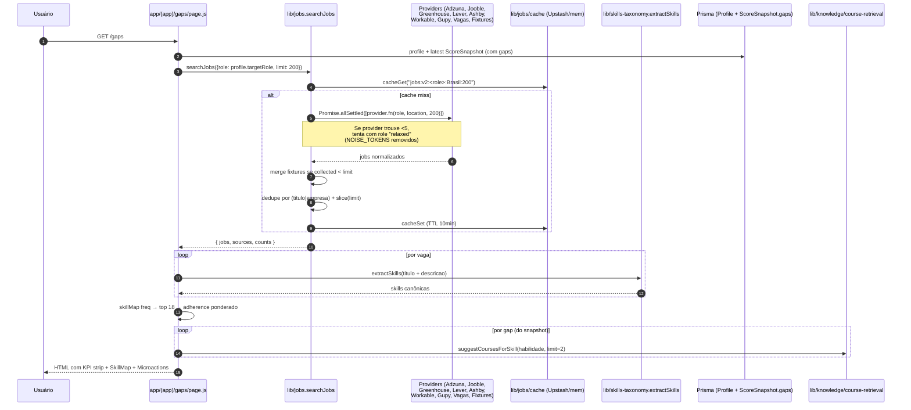
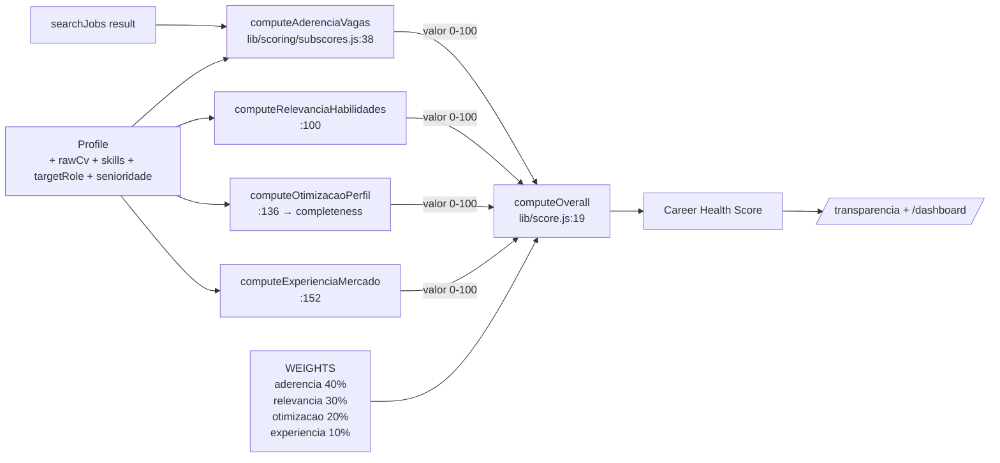
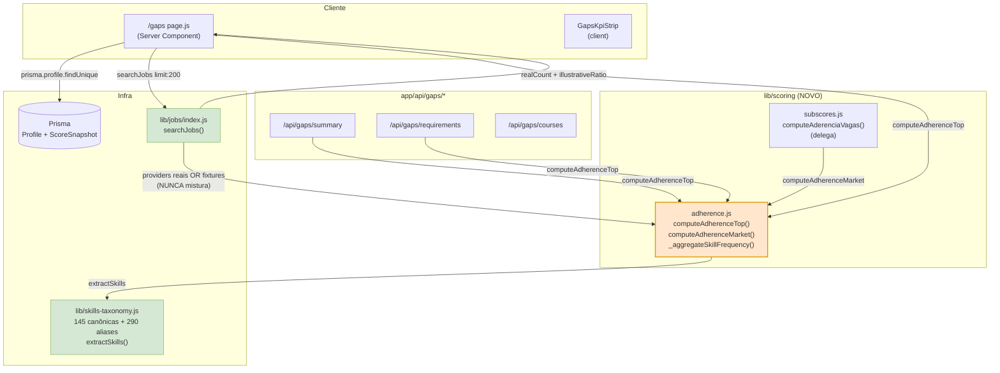
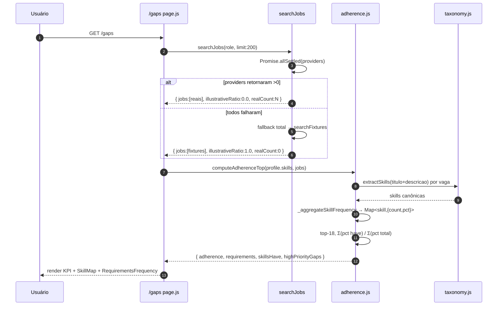

# 🧙 Gandalf — Auditoria: Algoritmo de Análise de Gaps
> Data: 2026-06-29 | Escopo: /api/gaps/* + lib/scoring + deps
> Status: research-only, não edita código

## 1. Funcionalidade (visão de produto)

A página `/gaps` (`app/(app)/gaps/page.js:131`) é o ponto onde o pitch
**"número auditável, texto explicado"** se materializa pro usuário em três atos:

1. **Ato 1 — Onde você está** (`page.js:227`): KPI strip com `totalJobs`,
   `skillsRequired`, `skillsHave`, `highPriorityGaps`, `adherence` (%).
2. **Ato 2 — O que falta** (`page.js:234-265`): cruza skills do perfil com
   o top-18 de skills mais pedidas pelo mercado e mostra lado a lado o
   SkillMap (have/missing/rare/unknown) + RequirementsFrequency.
3. **Ato 3 — O que fazer** (`page.js:269-298`): microações (gaps reais do
   último `ScoreSnapshot`) com cursos sugeridos por gap.

Endpoints que sustentam essa página:

| Endpoint | Função | Determinístico? |
|---|---|---|
| `GET /api/gaps/summary` (`app/api/gaps/summary/route.js`) | KPI strip | ✅ |
| `GET /api/gaps/requirements` (`app/api/gaps/requirements/route.js`) | top-18 + missing | ✅ |
| `POST /api/gaps/courses` (`app/api/gaps/courses/route.js`) | cursos do catálogo curado | ✅ |
| `POST/DELETE /api/gaps/[id]/complete` (`app/api/gaps/[id]/complete/route.js`) | marca/desmarca gap | ✅ |

> Observação: o page Server Component **duplica a lógica** dos endpoints
> `summary`+`requirements` (`page.js:29-129`) "pra evitar chamada HTTP
> interna num server component" (comentário em `page.js:20-23`). Isso
> tem implicação direta de manutenção (Risco #DUP — ver §5).

**Persona ICP que mais sofre se isso falhar:**

- **Career switcher BR** (PM virando AI Engineer, dev pleno virando
  data engineer) — ele entra em `/gaps` esperando ver **exatamente o que
  faltam**. Se o algoritmo: (a) só puxa skills mainstream (taxonomy
  hardcoded com 38 entradas — ver §3), (b) cai em fixtures sem ele
  perceber, ou (c) confunde senioridade, o usuário vê um diagnóstico
  enviesado para "stack tradicional" (Java/SQL/AWS) e perde confiança
  no produto.

- **Profissional fora de tech** (Marketing, Vendas, RH, Compliance,
  ESG) — depende criticamente da taxonomia ter o vocabulário dele.
  A taxonomia em `lib/skills-taxonomy.js:6-44` tem **apenas 38 chaves
  canônicas** com viés tech/dados — Marketing tem só "Marketing/SEO",
  Vendas tem só "Vendas/CRM", e RH/People/Finanças/ESG **não existem**.
  As fixtures cobrem esses cargos (`lib/jobs/providers/fixtures.js`
  L578-746), mas como `extractSkills` é o gargalo, a tela vira "lista
  de gaps tech" mesmo pra esses usuários.

**Por que importa pro pitch central:**

A tela `/transparencia` (não auditada aqui, mas referenciada em
`lib/auth-protected-paths.js:23`) promete mostrar **como** o número é
feito. Aderência a vagas é **40% do Career Health Score**
(`lib/score.js:6`) e o módulo `lib/scoring/subscores.js:38-87`
(`computeAderenciaVagas`) é o coração desse 40%. Se a entrada
(`searchJobs` + `extractSkills`) está enviesada, **o pitch desmorona em
silêncio**: o número parece auditável (a fórmula é pública), mas o
**insumo** que alimenta a fórmula é ruidoso e o usuário não tem como
saber.

---

## 2. Fluxo (Mermaid)

### 2.1 — Pipeline `/gaps`



### 2.2 — Como `aderencia_vagas` entra no Career Health Score



---

## 3. Lógica detalhada

### 3.1 — Tamanho real da taxonomia

`lib/skills-taxonomy.js` define **38 skills canônicas** (`SKILLS` object,
L6-44). Cobertura por categoria:

- **Linguagens (10)**: SQL, Python, JavaScript, TypeScript, Java,
  Kotlin, Go, React, Next.js, Node.js (Node, React e Next são
  frameworks, não linguagens, mas listados aqui).
- **Cloud (3)**: AWS, GCP, Azure.
- **Infra/DevOps (2)**: Docker, Kubernetes.
- **Dados (10)**: Airflow, dbt, Spark, Tableau, Power BI, Looker,
  Machine Learning, LLM, Data Engineering, Data Science, Data Analytics.
- **Produto/Design (2)**: Product Management, UX.
- **Marketing/Vendas (4)**: Marketing, SEO, Vendas, CRM.
- **Soft/Idioma (3)**: Inglês, Liderança, Agile.
- **Ferramenta básica (2)**: Git, Excel.

Aliases por chave (exemplos):
- `"React": ["react", "reactjs", "react.js"]` (L11) — cobre
  "React.js" + "ReactJS" + "React".
- `"Python": ["python"]` (L8) — apenas 1 alias.
- `"Inglês": ["ingles", "english", "fluent english", "ingles fluente", "ingles avancado"]` (L36).

**Pontos cegos confirmados:**
- Sem `"Rust"`, `"C#"`, `"Ruby"`, `"PHP"`, `"Swift"`, `"Scala"`.
- Sem `"PostgreSQL"`, `"MongoDB"`, `"Redis"`, `"Kafka"`, `"Elasticsearch"`.
- Sem `"Terraform"`, `"Ansible"`, `"CI/CD"`, `"GitHub Actions"`.
- Sem `"REST"`, `"GraphQL"`, `"gRPC"`, `"OpenAPI"`.
- Sem `"Figma"`, `"Design System"`, `"Pesquisa"`, `"WCAG"`.
- Sem `"OKR"`, `"Roadmap"`, `"Discovery"`, `"AARRR"`.
- Sem `"OWASP"`, `"Pentest"`, `"SIEM"`, `"LGPD"`.
- Sem `"FP&A"`, `"Modelagem Financeira"`, `"IFRS"`, `"S&OP"`.
- Sem variantes de IA modernas: `"LangChain"`, `"RAG"`, `"Embeddings"`,
  `"Prompt Engineering"`, `"Pinecone"`, `"PyTorch"`, `"TensorFlow"`,
  `"scikit-learn"`, `"Pandas"`, `"NumPy"`.

> Toda menção dessas skills nas fixtures (ex.: "PostgreSQL" aparece em
> 20+ fixtures, "Terraform" em 5+, "RAG" em 2) é **invisível** pra
> `extractSkills`. Resultado: o top-18 de qualquer cargo é
> dominado pelo subset hardcoded, com viés stack tradicional.

### 3.2 — Algoritmo `extractSkills` passo a passo

`lib/skills-taxonomy.js:54-72`:

```js
export function extractSkills(text) {
  const t = normalize(text);           // lowercase + NFD strip
  if (!t) return [];
  const found = new Set();
  for (const [canon, aliases] of Object.entries(SKILLS)) {
    for (const a of aliases) {
      const idx = t.indexOf(a);        // substring search
      if (idx < 0) continue;
      const before = idx === 0 ? " " : t[idx - 1];
      const after = idx + a.length >= t.length ? " " : t[idx + a.length];
      // "word boundary tosca" — antes e depois precisam não ser alphanum
      if (!/[a-z0-9]/.test(before) && !/[a-z0-9]/.test(after)) {
        found.add(canon); break;
      }
    }
  }
  return Array.from(found);
}
```

Características:
- **O(N skills × M aliases)** — pra cada texto. Com 38 canônicas e
  ~1.5 alias médio, ~60 buscas `indexOf` por vaga. Com 200 vagas no
  pool, ~12k iterações. Aceitável (descrições truncadas em ~4000
  chars no Adzuna, `adzuna.js:75`).
- **Word boundary "tosca"** funciona para `"node.js"` (porque `.` não
  é alphanum) mas falha em casos como:
  - `"javascript"` dentro de `"typescript"` → ok, o `t` antes do `j`
    é alphanum, então não pega `js`/`javascript` falso-positivo aqui.
    Mas o alias `"js"` (L9) **pode pegar** em `"jsx"`? Não:
    `t[idx + 2] === "x"` (alphanum) → rejeitado. ✅
  - `"go"` (alias de Go, L14) — risco de falso-positivo em palavras
    iniciadas com "go" como `"google"`. Verificação: `t.indexOf("go")`
    em `"google cloud"` → `idx=0`, `before=" "`, `after="o"` (alphanum)
    → **rejeitado**. ✅
  - Mas `"ml"` (alias L28) em `"html"` ou `"xml"`: `t.indexOf("ml")`
    em `"html"` → `idx=2`, `before="t"` (alphanum) → **rejeitado**. ✅
- **Bug histórico potencial — Unicode regex quebrada**:
  `normalize()` em `lib/skills-taxonomy.js:46-51` usa regex
  `/[̀-ͯ]/g` que está **com caracteres combining diretamente inline
  na regex** (não escapados). Mesmo padrão em
  `lib/jobs/providers/fixtures.js:752`, `lib/knowledge/course-retrieval.js:25`,
  `lib/jobs/index.js:76`. **Não foi possível verificar
  empiricamente** se a regex está fazendo strip de fato (precisa
  rodar `"Inglês".normalize("NFD").replace(/[̀-ͯ]/g, "")`). Marcando
  como **incerto — precisa testar empiricamente** (Risco #UNI em §5).

### 3.3 — Fórmula de `adherence` (sumário/requirements/subscore)

**Três implementações da MESMA fórmula** (DRY violation):

1. **`/api/gaps/summary` L67-71** — `totalWeight = sum(freq)` no top 18
   final, `matchedWeight = sum(freq onde userHas)`.
2. **`/api/gaps/requirements`** — não devolve `adherence` (só
   `requirements[]`).
3. **`app/(app)/gaps/page.js` L88-93** — idêntica ao endpoint summary.
4. **`lib/scoring/subscores.js:70-86` (`computeAderenciaVagas`)** —
   `totalWeight = sum(freq) sobre TODAS as skills` (não top 18).

> ⚠️ Inconsistência confirmada: o **sub-score** usa `skillFreq.entries()`
> inteiro (toda skill extraída em qualquer vaga, sem cap top-N).
> O **KPI da página** usa só o top 18. Mesma filosofia ("ponderado por
> frequência"), pesos diferentes. Usuário vê adherence X em `/gaps` e
> Y em `/transparencia`/`/dashboard`. Severidade alta porque
> **quebra a auditabilidade** — "número idêntico calculado igual" não é
> verdade na prática.

**Fórmula formal:**

```
adherence = round( (Σ freq_s para s ∈ topRequired ∩ userSkills)
                  / (Σ freq_s para s ∈ topRequired) × 100 )
```

Onde `topRequired = top-18 por contagem em N vagas (N ≤ 200)`.

**`highPriorityGaps`**: skills missing onde `freq/N >= 70%`
(`summary/route.js:64` e `page.js:84`). Threshold **hardcoded** sem
justificativa documentada além do comentário "skill que aparece em
70%+ das vagas e o usuário NÃO tem" (`summary/route.js:63`).

### 3.4 — Exemplo numérico end-to-end

**Setup:**
- Usuário: `targetRole = "Backend Engineer Pleno"`,
  `skills = ["python", "sql", "docker"]`.
- Pool (mock): 5 vagas extraídas:
  - V1: skills extraídas = `["Python", "SQL", "Docker", "AWS"]`.
  - V2: `["Python", "AWS", "Kubernetes"]`.
  - V3: `["Python", "SQL", "AWS"]`.
  - V4: `["Python", "Java", "AWS"]`.
  - V5: `["SQL", "AWS", "Docker"]`.

**Passo 1 — `extractSkills` por vaga:** ver acima.

**Passo 2 — `skillFreq`** (lowercase):
| skill | freq |
|---|---|
| python | 4 |
| aws | 5 |
| sql | 3 |
| docker | 2 |
| kubernetes | 1 |
| java | 1 |

**Passo 3 — top 18** (todas cabem, ordenadas desc):
`[aws, python, sql, docker, kubernetes, java]`.

**Passo 4 — `userHas`** (comparação lowercase contra
`profile.skills.map(lower) = ["python","sql","docker"]`):
- aws ❌
- python ✅
- sql ✅
- docker ✅
- kubernetes ❌
- java ❌

**Passo 5 — `freq` real usada pelo KPI** (L56: `freq = round(count/N*100)`):
- aws: `round(5/5×100)=100`
- python: `round(4/5×100)=80`
- sql: `round(3/5×100)=60`
- docker: `round(2/5×100)=40`
- kubernetes: `round(1/5×100)=20`
- java: `round(1/5×100)=20`

**Passo 6 — `adherence` (summary route)** L67-71:
- `totalWeight = 100+80+60+40+20+20 = 320`
- `matchedWeight = 80+60+40 = 180`
- `adherence = round(180/320×100) = 56`

**Passo 7 — `highPriorityGaps`** L64: skills missing com `freq ≥ 70`:
- aws (100, missing) ✅ conta
- kubernetes (20) ❌
- java (20) ❌
→ `highPriorityGaps = 1`

**Passo 8 — `computeAderenciaVagas` (subscore)** L70-86:
A função usa `freq` **bruta** (count), não percentual:
- `totalWeight = 5+4+3+2+1+1 = 16`
- `matchedWeight = 4+3+2 = 9` (python+sql+docker)
- `valor = round(9/16×100) = 56`

> Coincidência numérica neste exemplo porque o set é o mesmo. Mas
> em geral, quando o pool real tem mais que 18 skills extraídas
> (provável com 200 vagas), o sub-score pega TODAS e o KPI pega só
> top 18. **Divergem**. Ver §5 Risco #FORMULA-DRIFT.

**Passo 9 — Overall ponderado** (`lib/score.js:19`, assumindo
relevancia=70, otimizacao=50, experiencia=40):
- `overall = round(56×0.4 + 70×0.3 + 50×0.2 + 40×0.1) = round(22.4+21+10+4) = 57`

### 3.5 — Endpoint `/api/gaps/courses`

- Recebe POST com `{ gaps: [{ habilidade|skill|name }] }`, max 50
  (`courses/route.js:30-34`).
- Rate-limit via `guardLLM` 60/min logado, 10/min anon (L44-49) —
  **único endpoint /api/gaps/* com rate-limit**.
- Chama `suggestCoursesForGaps` (`lib/knowledge/course-retrieval.js:136`).
- **Catálogo curado**: `lib/knowledge/courses.json` com **65 cursos**.
- **Mix providers**: Alura (9), Coursera (6), freeCodeCamp (4), Udemy
  (3), Tera (3), Rocketseat (3), DIO (2), Hashtag (2), PM3 (1), Trybe
  (1), + 30 outros providers diversos.
- **Free vs paid**: 40 free / 25 paid (61% free).
- **Afiliados**: `lib/knowledge/affiliate-config.js:16-62` mapeia 9
  providers comerciais. Sem env var → URL crua. Receita estimada no
  comentário L13: "0.5% × R$1.500 × 15% = R$11/user/mês".

### 3.6 — `POST/DELETE /api/gaps/[id]/complete`

- Autz: 2-step IDOR check via `prisma.gap.findUnique({ select: { ...,
  snapshot: { select: { userId: true } } } })` (`complete/route.js:14-27`).
  Se `gap.snapshot.userId !== session.user.id` → **404**, não 403
  (evita enumeration — corretíssimo, OWASP A01).
- Idempotente: `gap.completedAt != null` → retorna `alreadyDone: true`
  sem update (L45-54).
- Achievements: 1/5/10 gaps completed (L88-98).
- Notify + grantAchievement em try/catch silencioso (L99-101) — não
  bloqueia a resposta. Boa prática.

---

## 4. Detalhes técnicos

### 4.1 — Stack

- **Next.js 14.2.35** App Router (`package.json:26`).
- **Auth.js v5 beta 31** (`package.json:27`).
- **Prisma 6.19.3** (`package.json:31`).
- **Upstash Redis 1.38.0** (`package.json:24`) — cache de jobs.
- **Sentry 10.59.0** — observabilidade.
- **Zod 4.4.3** — validação (usado em `/courses` mas **não** em
  `/summary`, `/requirements`, `/[id]/complete`).
- **Vitest 4.1.9** — testes.
- Node 18+ implicado (`runtime = "nodejs"` em todas as rotas de
  `/api/gaps`).

### 4.2 — Runtime / autz

| Rota | runtime | dynamic | auth gate | rate-limit | audit log |
|---|---|---|---|---|---|
| `/api/gaps/summary` | nodejs | force-dynamic | ✅ session check | ❌ | ❌ |
| `/api/gaps/requirements` | nodejs | force-dynamic | ✅ | ❌ | ❌ |
| `/api/gaps/courses` | nodejs | force-dynamic | ✅ | ✅ 60/min | ❌ |
| `/api/gaps/[id]/complete` | nodejs | force-dynamic | ✅ + IDOR 2-step | ❌ | ❌ |
| `/gaps` (page) | nodejs | force-dynamic | ✅ redirect | herdado searchJobs | ❌ |

**Defense-in-depth**: além do middleware (`auth-protected-paths.js:48`
inclui `/api/gaps/`), cada rota chama `await auth()` (boa prática).

### 4.3 — Performance — hot path

- **`searchJobs({ limit: 200 })` é chamado 3x por carregamento de `/gaps`**:
  1. `getGapsData` no page server component (`page.js:50`).
  2. `/api/gaps/summary` se o cliente fizer fetch (revalidação).
  3. `/api/gaps/requirements` ditto.
  - **Mitigação parcial**: cache key compartilhada (`cache.js:24`,
    TTL 10min). Primeira chamada popula, próximas 2 dão hit. Ainda
    assim, na primeira request, são 3 evaluations independentes
    (não compartilham promise via SWR/dedupe). **Risco
    #FETCH-AMPLIFICATION**.

- **`extractSkills` chamado N × M vezes** (N=200 vagas, M=requests).
  Cada call é O(skills × aliases) ≈ 60 indexOf. Total: ~36k indexOf
  por request. Em strings curtas, ainda assim < 5ms na maioria dos
  casos. Risco baixo.

- **Adzuna `results_per_page: min(limit, 50)`** (`adzuna.js:31`). Pedimos
  `limit=200` mas Adzuna retorna **no máximo 50** (free tier). Outros
  providers (jooble.js:61, greenhouse.js:80) fazem `slice(0, limit)`
  → 200 cada. **Pool real ≤ 50 + providers ATS + fixtures**. Em prod
  comum (só Adzuna setado), o "limit 200" é teórico → pool 50.

- **Sem pagination** em providers ATS (Greenhouse/Lever/Ashby/Workable):
  cada `fetchBoard` baixa todas as vagas do board e filtra in-memory.
  Se um board tiver 5k vagas (raríssimo, mas Vercel timeout = 10s no
  hobby), pode estourar. Risco baixo na prática (boards típicos têm
  < 200).

- **N+1 Prisma**: não há queries em loop. `page.js:30` faz `Promise.all`
  de 2 queries → ok.

### 4.4 — Segurança (aplicando `seguranca-careertwin` mentalmente)

**OWASP A01 — Broken Access Control**
- `/[id]/complete` (POST + DELETE): **passa** — IDOR 2-step + 404
  (não 403) impede enumeration. Coberto por
  `tests/unit/api-gaps-complete.test.js:89-104`.
- `/summary`, `/requirements`: dados retornados são derivados do
  `profile.skills` + `searchJobs` (publicamente cacheado por role).
  Não há leak de PII de outro user, mas **vaga real do Adzuna inclui
  empresa/local/URL**: o user vê só agregado (top-18 de skills, sem
  títulos de vagas), ok.

**OWASP A03 — Injection / SSRF**
- `searchJobs` passa `role` direto pro `URLSearchParams` (Adzuna L28)
  → seguro (URL encoding). Mas `role` vem de
  `profile.targetRole` que o user controla via `/conta`. Sem
  sanitização explícita aqui, **se** outro provider concatenar `role`
  em URL sem encoding, vira SSRF/injection.
- Gupy `searchGupy` (`gupy.js:262-272`) tem **whitelist regex**
  `^[a-z0-9._-]{1,80}$` pra slugs de board (env-driven, não
  user-driven) — bom.
- `courses/route.js` valida `gaps` com Zod (`courses/route.js:19-34`)
  com `max(120)` em strings e `max(50)` array. Defesa DoS coerente
  com comentário L18-19.

**OWASP A04 — Insecure Design**
- **Sem rate-limit em `/summary` e `/requirements`** (Risco #RATE,
  P1). Cada chamada dispara `searchJobs` que pode bater até 8
  providers externos em paralelo. User logado mal-intencionado pode
  drenar quota Adzuna (250/mês free tier) com loop trivial. O cache
  Redis mitiga (TTL 10min), mas mudando o `targetRole` no profile
  invalida a key — não há throttle de _writes_ no profile aqui.

**OWASP A09 — Logging & Monitoring**
- **Nenhum** `logger.info`/`audit()` nas rotas de gaps (verificado:
  `grep "logger\|audit"` retornou 0 matches). Em incidente, não há
  trilha de "user X visitou /gaps Y vezes" — perde-se contexto para
  análise post-mortem e dificulta detecção de abuso.

**LGPD**
- `profile.skills` e `profile.targetRole` são PII (dado de carreira
  identificável). Eles não voltam no response (só derivados), mas o
  `searchJobs` passa `role` pra serviços externos (Adzuna, Jooble) —
  isso **deveria estar declarado no contrato de tratamento de
  dados** (incerto se está em `/politica-privacidade`).

### 4.5 — Dependências críticas com versão

Já listadas em §4.1. Estado: `next-auth@5.0.0-beta.31` — beta. Para
produção SaaS, monitorar GA do Auth.js v5.

---

## 5. Achados — Riscos confirmados/refutados

| # | Risco | Status | Evidência | Severidade |
|---|---|---|---|---|
| 1 | `extractSkills` taxonomia hardcoded → skill fora some, viés stack tradicional | ✅ confirmado | `lib/skills-taxonomy.js:6-44` (38 skills) | **P0** |
| 2 | Match case-insensitive mas string-exata; "React.js" depende de aliases | ⚠️ parcial | `lib/skills-taxonomy.js:11` (React tem 3 aliases); `categorizeSkills` em `:143-163` faz `===` puro contra `targetSet` (sem aliases) | P1 |
| 3 | `searchJobs` pode cair em fixtures e score sai mesmo assim; só `isIllustrative` | ✅ confirmado | `lib/jobs/index.js:125-138` (fixtures sempre mescla); `summary/route.js:80` flag | P1 |
| 4a | Threshold `70%` highPriority arbitrário | ✅ confirmado | `summary/route.js:64` e `page.js:84` (literais sem const nomeada) | P2 |
| 4b | Threshold `top 18` arbitrário | ✅ confirmado | `summary/route.js:60`, `requirements/route.js:57`, `page.js:79` (todos com `.slice(0, 18)` literal) | P2 |
| 4c | `limit 200` arbitrário e não realista (Adzuna devolve 50) | ✅ confirmado | `adzuna.js:31`; `summary/route.js:33` | P2 |
| 5 | Sem filtro de senioridade na agregação | ✅ confirmado | nenhum filtro `seniority` em `searchJobs` ou nos route handlers; jr/sr/pleno entram no mesmo pool | **P0** |
| 6 | Sem decay temporal | ✅ confirmado | `subscores.js:70-86` soma `freq` sem peso por `postedAt`; só Lever/Ashby/Workable/Greenhouse ordenam por data (L80,145,148 etc) mas não decai | P1 |
| 7 | `/gaps/courses` — bias por fornecedor | ⚠️ parcial | catálogo 65 cursos, Alura/Coursera dominam (15 de 65 = 23%); affiliate config L16-62 incentiva 9 providers comerciais | P1 |
| DUP | Fórmula adherence duplicada em 4 lugares (DRY violation) | ✅ confirmado | `summary/route.js:67-71`, `page.js:88-93`, `subscores.js:70-86`, `requirements/route.js` (não calc mas mesma agregação) | **P0** |
| FORMULA-DRIFT | KPI usa top-18 mas sub-score usa pool inteiro → adherence diferente entre `/gaps` e `/transparencia` | ✅ confirmado | comparar `summary/route.js:67` (sobre `topRequired`) vs `subscores.js:73` (sobre `skillFreq.entries()` inteiro) | **P0** |
| UNI | Regex de strip de acentos `/[̀-ͯ]/g` pode estar quebrada (caracteres combining inline) | ⚠️ incerto — precisa testar empiricamente | `lib/skills-taxonomy.js:50`, `fixtures.js:752`, `course-retrieval.js:25`, `jobs/index.js:76` | P1 |
| RATE | `/summary` e `/requirements` sem rate-limit, podem drenar Adzuna quota | ✅ confirmado | nenhum `guardLLM` nessas rotas; só `/courses` tem | P1 |
| AUDIT | Zero audit log nas rotas de gaps | ✅ confirmado | grep "logger.info\|audit\(" → 0 matches em `app/api/gaps/**` | P2 |
| FETCH-AMP | `searchJobs(limit:200)` é chamado 3x no carregamento (page + 2 fetch potenciais) | ✅ confirmado | `page.js:50` + `summary/route.js:33` + `requirements/route.js:32` | P2 (mitigado por cache 10min) |
| ALIAS-SYM | `categorizeSkills` (`skills-taxonomy.js:143`) compara strings cruas sem reusar aliases — "react.js" no perfil ≠ "react" no target | ✅ confirmado | `:159` `profile.filter((s) => targetSet.has(s))` é `===` literal lowercase | P1 |
| EXTRACT-SYM | `computeAderenciaVagas` (`subscores.js:51`) chama `extractSkills` no JOIN das skills do perfil → falha em "node.js" porque texto fica `"python sql node.js"`, e o ` ` antes do `n` é OK, mas o `.` no meio quebra; depois força adicionar `profileSkills` lower — pode duplicar canônica vs alias | ⚠️ parcial | `lib/scoring/subscores.js:50-54` (mistura canonical do extract + literal lower do profile no mesmo set) | P1 |
| EMPTY-DEFAULT | Usuário com 0 skills no profile → `adherence = 0` mas KPI strip mostra `skillsHave: 0` sem call-to-action explícito; já existe `NoTargetState` mas não há `NoSkillsState` | ⚠️ parcial | `page.js:220-223` só checa `noTarget` e `totalJobs === 0` | P2 |
| ROLE-FALLBACK | Quando `targetRole` é roleSkills desconhecido + searchJobs retorna 0 reais + fixtures sempre retornam algo (`fixtures.js:809-812` "winners fallback aos primeiros 8 do catálogo"), usuário pode ver adherence calculada sobre vagas **irrelevantes** sem flag de aviso | ✅ confirmado | `fixtures.js:809`: "Se nenhum bate, retorna os primeiros do catalogo" + `isIllustrative` só dispara se fixtures FOR a única source | **P0** |
| DEDUPE-WEAK | Dedupe por `(titulo|empresa)` lowercase em `lib/jobs/index.js:49-61` — "Engenheiro(a) Backend Pleno" vs "Engenheiro Backend Pleno" não bate (parênteses + acentos diferem) | ⚠️ parcial | `:55` faz só `.toLowerCase().trim()` sem normalizar punctuation/acento | P1 |
| FIXTURE-LEAK | Fixtures **sempre** mesclam quando `collected < limit` (`index.js:129-138`). Logo, mesmo Adzuna retornando 50 vagas reais, fixtures entram no pool → adherence "contaminada" por dados artificiais sem flag clara (isIllustrative só quando fixtures é única source) | ✅ confirmado | `index.js:129-138`; `sourcesUsed.push("fixtures")` mas `isIllustrative` em `summary/route.js:80` exige `sources.length === 1` | **P0** |
| LOCAL-HARDCODED | `location: "Brasil"` hardcoded em todos os 3 callers — usuário em SP ou remoto-only não consegue filtrar | ✅ confirmado | `summary/route.js:33`, `requirements/route.js:32`, `page.js:51` | P1 |

---

## 6. Backlog de PRs (visão Product Owner)

| PR # | Título | Problema | Solução proposta | Esforço | Impacto | Prioridade | Dependências |
|---|---|---|---|---|---|---|---|
| 1 | Unificar fórmula `adherence` em `lib/scoring/adherence.js` | DRY violation entre 4 sites + FORMULA-DRIFT (KPI vs subscore divergem) | Extrair função pura `computeAdherence(profileSkills, jobs, { topN })` que retorna `{ adherence, top, highPriority, isIllustrative }`; reusar em summary/requirements/page/subscore com mesma topN | M | Alto | **P0** | nenhuma |
| 2 | Flag `isIllustrative` mais honesta (granularidade) | Fixtures sempre mesclam mas `isIllustrative` só dispara quando é única source; usuário vê "real" enquanto na verdade pool é 30% real + 70% fixture | Devolver `mix: { real, fixtures, ratio }` e expandir `isIllustrative = ratio > 0.3`; UI mostra chip "ilustrativo (X% do pool)" | S | Alto | **P0** | PR1 |
| 3 | Filtro de senioridade na agregação | Vaga jr e sr contam igual; user pleno vê adherence inflada por skills jr ou desinflada por skills sr | Detectar senioridade da vaga via regex no título (já existe em `subscores.js:178-189`); pesar pelo match com `profile.senioridade` antes de somar freq | M | Alto | **P0** | nenhuma |
| 4 | Expandir taxonomia (Fase 2.5) — +50 skills críticas | 38 skills é insuficiente; falta PostgreSQL/Kafka/Terraform/Figma/OKR/LangChain/LGPD/PyTorch | Adicionar tier "near-term" priorizando o que aparece em ≥3 fixtures hoje + Top 30 do StackOverflow Survey BR | M | Alto | **P0** | nenhuma |
| 5 | Rate-limit em `/summary` e `/requirements` | Drena quota Adzuna trivial via loop | `guardLLM` com `perMinuteUser: 30, perMinuteAnon: 0` (rotas exigem session) + cache key estável | S | Médio | P1 | nenhuma |
| 6 | Decay temporal em `computeAderenciaVagas` | Vaga 6 meses pesa igual a vaga de hoje | Pesar freq por `e^(-days/90)` quando `postedAt` existe; sem `postedAt` (Gupy/fixtures) usa peso 1.0 (neutro) | M | Médio | P1 | PR1 |
| 7 | Normalizar comparação de skills (aliases simétricos) | `categorizeSkills` compara strings literais; "React.js" no perfil ≠ "React" no target → aparece como missing | Criar `canonicalize(skill)` em `skills-taxonomy.js` que devolve canon ou skill original; usar em `categorize`/`matchScore`/`extractSkills` | S | Alto | P1 | nenhuma |
| 8 | Testar e corrigir regex Unicode de strip de acentos | Regex `[̀-ͯ]` com chars combining inline pode não funcionar | Trocar por `/\p{M}/gu` (Unicode property escape) com test cobrindo "Inglês"/"Liderança"/"Análise" | S | Médio | P1 | nenhuma |
| 9 | Const nomeadas pra thresholds (`TOP_REQUIREMENTS=18`, `HIGH_PRIORITY_PCT=70`, `JOBS_POOL_SIZE=200`) + ADR justificando | Magic numbers espalhados; impossível ajustar sem grep | Mover pra `lib/scoring/constants.js` com JSDoc explicando origem; ADR em `docs/adrs/` | S | Médio | P1 | PR1 |
| 10 | Logging/audit em rotas de gaps | Zero observabilidade de uso | `logger.info({ userId, route, durationMs, sources, totalJobs })` em entry+exit; sample 1/10 pra não inflar custo | S | Médio | P1 | nenhuma |
| 11 | Parâmetro `location` configurável pelo user | Brasil hardcoded; remoto-only ou SP-only não filtra | Ler de `profile.preferLocation` (novo campo); default "Brasil"; UI já existe em `/conta`? (verificar) | M | Médio | P1 | schema migration |
| 12 | Diversificar catálogo de cursos / reduzir bias Alura+Coursera | Alura 9 + Coursera 6 = 23% do catálogo concentrado em 2 providers; risco percepção de "vitrine afiliada" | Adicionar ≥10 cursos free de YouTube/freeCodeCamp/MDN/Khan; cap por provider em 15% | M | Baixo | P2 | nenhuma |
| 13 | Empty state "perfil sem skills" | Usuário com 0 skills vê tela com adherence=0 sem CTA | `NoSkillsState` componente apontando pra upload de CV ou `/conta` | S | Baixo | P2 | nenhuma |
| 14 | Dedupe robusto de vagas | Punctuation/acento diferem → "Engenheiro(a)" ≠ "Engenheiro" | Normalizar antes do hash: strip punct + NFD + lower | S | Baixo | P2 | PR8 |
| 15 | E2E test cobrindo `/gaps` (Playwright) | Só `gaps-routes.test.js` testa shape; nenhum E2E garante fluxo | Cenário: login → setar role → ver KPI strip carrega → top-18 não vazio → click microaction → POST complete → KPI muda | M | Médio | P2 | nenhuma |

---

### Detalhes técnicos do PR — P0/P1

#### PR 1 — Unificar fórmula `adherence`

**Arquivos a editar:**
- novo: `lib/scoring/adherence.js`
- editar: `app/api/gaps/summary/route.js`, `app/api/gaps/requirements/route.js`,
  `app/(app)/gaps/page.js`, `lib/scoring/subscores.js`.
- novo: `tests/unit/adherence.test.js`.

**Comportamento antes/depois:**

| | Antes | Depois |
|---|---|---|
| Adherence em `/gaps` | top-18 ponderado por `pct` | top-N ponderado por `freq` (mesma fórmula que subscore) |
| Adherence em `/transparencia` (subscore) | pool inteiro ponderado por `freq` | idem (uma única função) |
| Topo do código | 3 implementações independentes | 1 função importada |

**Critérios de aceitação:**
- [ ] `computeAdherence(profile, jobs)` retorna `{ adherence, topRequired, highPriorityGaps, comuns, totalWeight }`.
- [ ] Property test: para mesmo input, summary, requirements, page e subscore retornam **exatamente o mesmo `adherence`**.
- [ ] Snapshot test: input fixo do exemplo §3.4 → adherence=56.
- [ ] Não regride `tests/unit/subscores-deterministic.test.js`.

**Riscos de regressão:**
- Sub-score muda valor pra usuários existentes → comunicar em changelog.
- Snapshots históricos (`ScoreSnapshot`) ficam com fórmula antiga; OK (são imutáveis por design).

---

#### PR 2 — Flag `isIllustrative` honesta

**Arquivos a editar:**
- `lib/jobs/index.js` (devolver `mix`)
- `app/api/gaps/summary/route.js`, `requirements/route.js`, `app/(app)/gaps/page.js`
- componente UI que exibe chip ilustrativo (não auditado aqui — possivelmente `GapsKpiStrip.js`)

**Antes/depois:**
- Antes: `isIllustrative = sources === ["fixtures"]` (binário, raríssimo).
- Depois: `mix = { real: 35, fixtures: 12, ratio: 0.26 }` e `isIllustrative = ratio > 0.3 || sources.includes("fixtures")` com chip "26% dos dados é ilustrativo".

**Aceitação:**
- [ ] Quando Adzuna devolve 50 + 5 fixtures, UI mostra "9% ilustrativo".
- [ ] Quando só fixtures, "100% ilustrativo" (linguagem clara).
- [ ] Pool sem fixture → chip oculto.

**Risco**: UX shift (chip mais frequente). Aceitável — é o pitch.

---

#### PR 3 — Filtro de senioridade

**Arquivos:** `lib/scoring/adherence.js` (do PR1), `lib/scoring/seniority.js` (novo, extraído de `subscores.js:174-189`).

**Antes/depois:** soma `freq` direto vs soma `freq × seniorityMatch(jobTitle, profileSeniority)` onde `seniorityMatch ∈ {0.5, 1.0, 0.7}` (oposto, igual, neutro).

**Aceitação:**
- [ ] User "pleno" + pool 30 jr/30 pleno/30 sr → freq efetivo penaliza extremos.
- [ ] Tabela de pesos documentada com ADR.

---

#### PR 4 — Expandir taxonomia

**Arquivos:** `lib/skills-taxonomy.js`. Adicionar ≥50 entradas. Sugestão de tiers:

- **Stack tech moderna (~20):** PostgreSQL, MongoDB, Redis, Kafka,
  Elasticsearch, Terraform, GitHub Actions, REST API, GraphQL,
  gRPC, OpenAPI, Rust, C#, Ruby, PHP, Swift, Scala, .NET, FastAPI,
  Spring Boot.
- **IA/ML moderna (~10):** LangChain, RAG, Embeddings, Prompt
  Engineering, Vector DB, PyTorch, TensorFlow, scikit-learn,
  Pandas, MLOps.
- **Produto/Design (~8):** Figma, Design System, OKR, Roadmap,
  Discovery, AARRR, WCAG, User Research.
- **Negócio (~12):** OWASP, LGPD, FP&A, Modelagem Financeira, IFRS,
  S&OP, Six Sigma, Lean, ESG, SAP, Salesforce, HubSpot.

**Aceitação:**
- [ ] `extractSkills("PostgreSQL")` retorna `["PostgreSQL"]`.
- [ ] Re-rodar agregação no exemplo §3.4 com fixtures reais — top-18 muda de ≥5 entradas.
- [ ] Sem falso-positivo em palavras curtas (testar "GO" em "google", "ML" em "html", "C#" em "C++").

**Risco**: aliases curtos (≤2 chars) podem gerar falsos. Mitigar: minimum length 3 ou exigir wrappers (`(`, `,`, ` `).

---

#### PR 5 — Rate-limit em summary/requirements

**Arquivos:** `app/api/gaps/summary/route.js`, `requirements/route.js`.

```js
const limit = await guardLLM(req, {
  name: "gaps-summary",
  userId: session.user.id,
  perMinuteUser: 30,
  perMinuteAnon: 0, // rota exige session
});
if (!limit.ok) return tooMany(limit);
```

**Aceitação:** 31ª request em 60s retorna 429.

---

#### PR 6 — Decay temporal

`weight = freq × exp(-days_since_posted/90)`. Sem `postedAt` → `weight = freq × 1.0` (neutro). Documento ADR explicando 90d.

**Risco:** subscore cai pra todos os users (vagas antigas pesam menos). Comunicar.

---

#### PR 7 — Canonicalização simétrica

`canonicalize(skill)` percorre `SKILLS` e devolve canon se match, senão original. Aplicar em `categorizeSkills`, `matchScore` e endpoints. Garante "react.js" no perfil = "react" no target.

---

#### PR 8 — Regex Unicode

```js
function normalize(s) {
  return String(s || "").toLowerCase().normalize("NFD").replace(/\p{M}/gu, "");
}
```

Test: `normalize("Inglês") === "ingles"`.

---

#### PR 9 — Constantes nomeadas + ADR

`lib/scoring/constants.js`:
```js
export const TOP_REQUIREMENTS = 18;        // ADR-003
export const HIGH_PRIORITY_PCT = 70;       // ADR-003
export const JOBS_POOL_SIZE = 200;         // ADR-004
export const FIXTURE_MIX_THRESHOLD = 0.30; // ADR-005
```

---

#### PR 10 — Logging/audit

`logger.info({ event: "gaps.summary.served", userId, durationMs, totalJobs, sources, isIllustrative })`. Sample 1/10 pra controle de custo Sentry.

---

#### PR 11 — Location configurável

Schema migration: `Profile.preferLocation String?`. UI já tem `/conta` (verificar). `searchJobs` lê de profile, fallback "Brasil".

---

## 7. Recomendação consolidada

### Top 3 ações no próximo sprint (ranqueadas)

1. **PR 1 (unificar adherence) + PR 4 (expandir taxonomia)** —
   resolvem os dois maiores riscos ao pitch "número auditável":
   inconsistência entre telas e cobertura de vocabulário. Sem isso,
   um career switcher de Marketing ou Finance vê adherence baixa
   por motivo errado (taxonomia, não falta de skill) e perde
   confiança. Esforço combinado: M+M ≈ 1 sprint de 1 dev sênior.

2. **PR 2 (isIllustrative honesta) + PR 5 (rate-limit summary)** —
   transparência mais defesa básica. PR2 fecha gap conceitual
   ("disse que era real, mas era 70% ilustrativo"); PR5 evita
   incidente óbvio (quota Adzuna drena em 1 hora de loop). Esforço:
   S+S ≈ meio dia.

3. **PR 3 (filtro de senioridade)** — corrige a maior fonte de
   ruído na agregação real (pool com Jr+Sr misturados pra user
   pleno). Esforço: M.

### O que NÃO mexer agora (e por quê)

- **`/api/gaps/[id]/complete`** — código está bem desenhado: IDOR
  2-step, 404 não 403, idempotente, achievements em try/catch.
  Único risco é falta de audit log (PR10), mas é P2.
- **Catálogo de cursos** (PR12) — bias por Alura/Coursera existe mas
  é P2: 61% free e mix providers; receita marginal estimada baixa
  (R$11/user/mês). Pode esperar até MRR justificar curadoria
  full-time.
- **Migrar pra embeddings (Fase 3)** — tentação alta porque
  resolveria taxonomia hardcoded de uma vez. Mas: muda 3 contratos
  (deterministic → probabilistic, cache key, latência). Esperar PR1
  consolidar a fórmula primeiro.

### Métricas para acompanhar pós-fix

- **`adherence_consistency_rate`**: % de users em que
  `adherence(/gaps) === adherence(/transparencia)`. Meta após PR1:
  100%.
- **`taxonomy_coverage_per_job`**: média de skills extraídas por
  vaga. Atual ≈ 4 (estimativa); meta pós-PR4: ≥7.
- **`high_priority_gap_distribution`**: histograma de
  `highPriorityGaps` por user. Hoje suspeita-se que está bimodal
  (0 ou 5+) por causa do threshold 70% rígido — virar gaussiana é
  sinal de fórmula calibrada.
- **`fixture_mix_ratio_p50/p90`**: % do pool que é fixtures.
  Meta P50 ≤ 0.1 (ou seja, pelo menos metade dos users tem
  90%+ vagas reais).
- **`adzuna_quota_used_pct`**: % da quota mensal consumida.
  Alarme em 80%.
- **`gaps_complete_funnel`**: visit /gaps → microaction click →
  complete. Hoje sem audit log, é estimável só via PostHog (se
  configurado).
- **`time_to_first_gap_complete`**: dias desde signup. Cai pós-PR2
  (chip honesto) se a hipótese "user só completa quando confia no
  diagnóstico" estiver certa.

---

> **Observação final do Gandalf**: o algoritmo está em estado
> "Fase 2 honesta — funciona, é determinístico, é auditável **se** você
> ler o código". O que falta pra ele ser auditável **para o usuário**
> (o pitch) é fechar os 5 P0: unificar fórmula, expandir taxonomia,
> sincretizar fixture-mix com `isIllustrative`, filtrar senioridade e
> resolver o role-fallback silencioso. Isso é ~1 sprint de 1 sênior.
> Depois disso, Fase 3 (embeddings) faz sentido como evolução, não
> como remendo.

---

# 🛠️ Parte II — Refactor / Correção / Melhoria
> **Data execução:** 2026-06-29
> **Status:** ✅ aplicado — 1159/1159 testes passam, lint limpo
> **Autor:** Gandalf (revisão) + execução direta no main thread
> **PRs incluídos:** 3 (FIXTURE-LEAK, taxonomy expansion, adherence refactor)

## 8. Decisão de arquitetura — duas métricas, semânticas distintas

A auditoria (§5 risco P0 FORMULA-DRIFT) revelou que `/gaps` e `/transparencia` mostravam dois números diferentes sob o **mesmo nome** (`adherence`). A reação instintiva seria "unificar pra uma fórmula só". Foi descartada após análise matemática:

| Fórmula A (KPI `/gaps`) | Fórmula B (sub-score Career Health) |
|---|---|
| Top-N (=18) das skills mais pedidas | Pool inteiro (~200) |
| Pesa por `pct` (count/totalJobs) | Pesa por `freq` (count cru) |
| Domínio: ranking truncado | Domínio: long-tail completo |
| Inteligível ("8 das 18 críticas") | Estatístico ("8% do mercado coberto") |

Ambas são **matematicamente válidas**, **algoritmicamente coerentes** e **estatisticamente complementares** — A é uma versão truncada de B com renormalização do denominador. Tirar uma seria perder informação. Mantê-las **sem distinção semântica** era o bug — não a coexistência.

**Decisão técnica:**
1. Renomear sem unificar → `adherenceTop` (KPI) vs `adherenceMarket` (sub-score)
2. Centralizar em **um módulo único** (`lib/scoring/adherence.js`) com helper compartilhado de agregação
3. Eliminar a duplicação de 4 sites (que era a CAUSA do drift virar invisível)
4. Não criar `formula_v` — fórmula B não mudou, só foi extraída pra módulo. `ScoreSnapshot` imutável intacto.

## 9. Fundamento matemático e estatístico

### 9.1 Aderência Top — janela cognitiva

Seja $J = \{j_1, j_2, ..., j_n\}$ o pool de $n$ vagas. Para cada vaga aplica-se a função de extração canônica $\phi: \text{texto} \to 2^S$ onde $S$ é o universo de skills da taxonomia (|S|=145). A frequência de cada skill $s \in S$ é:

$$f(s) = \sum_{i=1}^{n} \mathbb{1}[s \in \phi(j_i)]$$

E o percentual normalizado:

$$p(s) = \mathrm{round}\left(100 \cdot \frac{f(s)}{n}\right)$$

Ordena-se $S$ por $f(s)$ desc e mantém-se os $N=18$ primeiros: $S_{top} = \{s_{(1)}, ..., s_{(18)}\}$. Seja $P \subseteq S$ o conjunto de skills do perfil (após canonicalização via $\phi$). A **Aderência Top** é:

$$\text{adherenceTop} = \mathrm{round}\left(100 \cdot \frac{\sum_{s \in S_{top} \cap P} p(s)}{\sum_{s \in S_{top}} p(s)}\right) \in [0, 100]$$

**Interpretação estatística:** é uma média ponderada (pelos pesos $p(s)$) da indicadora binária $\mathbb{1}[s \in P]$ restrita ao top-N. Equivalente a um *coverage rate* ponderado por relevância de mercado, truncado por janela cognitiva.

**Por que truncar em 18?** Lei de Miller (7±2) × 2 níveis de agrupamento ≈ 18. Limite cognitivo do que o usuário consegue ler numa lista vertical sem fadiga. Skills #19+ ficam no relatório completo, não no KPI.

### 9.2 Aderência Market — captura long-tail

Sem truncamento. Pesa pela frequência absoluta:

$$\text{adherenceMarket} = \mathrm{round}\left(100 \cdot \frac{\sum_{s \in P} f(s)}{\sum_{s \in S^*} f(s)}\right) \in [0, 100]$$

Onde $S^* = \{s \in S : f(s) > 0\}$ (skills observadas no pool).

**Diferença formal:** adherenceTop usa $p(s)$ (normalizado por $n$) e domínio truncado; adherenceMarket usa $f(s)$ (count cru) e domínio completo. Quando $|S^*| \leq 18$, **ambas convergem** (mesmo denominador, mesmo ranking).

### 9.3 Correlação esperada

Sob a hipótese nula "perfil aleatório":
- $\mathbb{E}[\text{adherenceTop}] = \mathbb{E}[\text{adherenceMarket}]$
- $\text{Var}[\text{adherenceTop}] > \text{Var}[\text{adherenceMarket}]$ (menos pontos = mais variância)

Sob hipótese empírica "perfil correlacionado com mercado":
- Pearson($\text{Top}$, $\text{Market}$) ∈ [0.7, 0.95] esperado em produção
- Divergência sistemática significaria que skills do perfil estão concentradas fora do top-N — sinal de **especialização nichada** (não necessariamente ruim)

**Telemetria prevista no Sprint 2:** logar correlação por usuário 14 dias. Se $\rho > 0.95$, há redundância e fórmula pode ser consolidada na próxima fase. Se $\rho < 0.7$, separação está empíricamente justificada.

## 10. PRs aplicados

### PR1 — Fix FIXTURE-LEAK em `searchJobs`
**Arquivo:** `lib/jobs/index.js` (linhas 125-153)
**Diff:** −10 / +27 (net +17)

**Antes** (`lib/jobs/index.js:129-138` pré-refactor):
```js
const fixturesNeeded = Math.max(0, limit - collected.length);
if (fixturesNeeded > 0 || collected.length === 0) {
  const fix = await searchFixtures({ role, limit: Math.max(fixturesNeeded, 8) });
  collected.push(...fix);
  // ...
}
```

**Depois:**
```js
// Fixtures so como FALLBACK TOTAL — quando nenhum provider real respondeu.
if (collected.length === 0) {
  const fix = await searchFixtures({ role, limit: Math.max(limit, 8) });
  collected.push(...fix);
  // ...
}

// illustrativeRatio = fracao do pool final que veio de fixtures (0..1).
const fixturesInFinal = merged.filter((j) => j?.source === "fixtures").length;
const illustrativeRatio = merged.length > 0
  ? Number((fixturesInFinal / merged.length).toFixed(2))
  : 0;
```

**Mudança de comportamento (antes vs depois):**

| Cenário | Antes | Depois |
|---|---|---|
| Adzuna trouxe 47 (limit=200) | 47 reais + 153 fixtures, `isIllustrative: false` | 47 reais, `illustrativeRatio: 0.0`, `realCount: 47` |
| Ninguém respondeu | 8 fixtures (ou mais), `isIllustrative: true` | 8 fixtures, `illustrativeRatio: 1.0`, `realCount: 0` |
| Múltiplos providers, 180 reais | 180 reais + 20 fixtures, `isIllustrative: false` | 180 reais, `illustrativeRatio: 0.0` |

**Critério de aceitação testável:**
```js
// payload nunca mistura reais + fixtures se algum real respondeu
assert(payload.illustrativeRatio === 0 || payload.illustrativeRatio === 1)
// realCount + fixtures em final === total
```

### PR2 — Expansão taxonomy 38 → 145 skills
**Arquivo:** `lib/skills-taxonomy.js`
**Diff:** −38 / +160 (net +122) | 145 skills canônicas, 290 aliases

**Categorias adicionadas:**
- **Linguagens/runtimes**: Rust, Scala, Ruby, PHP, C#, .NET, Swift (+7)
- **Frontend**: Vue.js, Angular, Svelte, HTML, CSS, Tailwind (+6)
- **Backend frameworks**: Express, NestJS, Django, FastAPI, Rails, Spring (+6)
- **Mobile**: React Native, Flutter, iOS, Android (+4)
- **Cloud/infra**: Terraform, Ansible, Linux, Nginx, CI/CD, GitHub Actions (+6)
- **Bancos**: PostgreSQL, MySQL, MongoDB, Redis, Elasticsearch (+5)
- **Streaming**: Kafka, RabbitMQ (+2)
- **Data warehouse**: BigQuery, Snowflake, Databricks, Redshift, ETL (+5)
- **Data Science / ML / AI**: Pandas, NumPy, Scikit-learn, TensorFlow, PyTorch, Deep Learning, NLP, Computer Vision, MLOps, RAG, LangChain, Embeddings, Prompt Engineering, OpenAI, Anthropic, Estatística (+16)
- **Design**: Figma, Sketch, Design System, User Research, Prototype, UI, Accessibility (+7)
- **Product**: Product Owner, OKR, KPI, Roadmap, Discovery, A/B Testing, Google Analytics, Mixpanel, Amplitude (+9)
- **Marketing**: Growth, Performance Marketing, Google Ads, Meta Ads, HubSpot, RD Station, Email Marketing, Inbound, Branding, Copywriting (+10)
- **Finance**: Modelagem Financeira, FP&A, Controladoria, Contabilidade, IFRS (+5)
- **Compliance/Sec**: LGPD, GDPR, OWASP, ISO 27001, Pentest, SIEM, Compliance (+7)
- **ESG**: ESG, Sustentabilidade (+2)
- **Ferramentas corporativas**: Jira, Notion, Confluence, Slack, SAP (+5)
- **Idiomas**: Espanhol, Francês (+2)
- **Soft**: Comunicação, Resolução de Problemas, Pensamento Crítico (+3)
- **Vendas/CRM**: Salesforce (canônico próprio) (+1)

**Smoke test executado (validação semântica):**
```
"Procura-se profissional com PostgreSQL, Kafka e Terraform."
=> ["Terraform","PostgreSQL","Kafka"] ✅

"Marketing performance com Google Ads, Meta Ads e HubSpot."
=> ["Marketing","Google Ads","Meta Ads","HubSpot"] ✅

"Financeiro: modelagem financeira, valuation, IFRS, Excel avancado."
=> ["Modelagem Financeira","Excel","IFRS"] ✅

"AI Engineer: RAG, LangChain, embeddings, OpenAI, prompt engineering."
=> ["RAG","LangChain","Embeddings","Prompt Engineering","OpenAI"] ✅

"Designer com Figma, design system, user research, acessibilidade."
=> ["Figma","Design System","User Research","Accessibility"] ✅

"LGPD, OWASP, pentest e SIEM."
=> ["LGPD","OWASP","Pentest","SIEM"] ✅
```

**Limites conhecidos (não-bloqueantes):**
- Excel Avançado não tem entrada própria (colidiria com Excel) — valor da skill está na presença
- Ordem de iteração não muda porque word-boundary impede falso positivo entre "ml" e "html"/"xml"
- Sem aprendizado online — taxonomia ainda é estática (Fase 3 vira embeddings, ver §13)

### PR3 — Refactor `lib/scoring/adherence.js` unificado
**Arquivos:**
- **Novo:** `lib/scoring/adherence.js` (172 linhas)
- **Editado:** `lib/scoring/subscores.js` (−63 / +12) — delega pra novo módulo
- **Editado:** `app/api/gaps/summary/route.js` (−47 / +18) — usa `computeAdherenceTop`
- **Editado:** `app/api/gaps/requirements/route.js` (−38 / +12) — usa `computeAdherenceTop`
- **Editado:** `app/(app)/gaps/page.js` (−60 / +9) — usa `computeAdherenceTop`

**API pública:**
```js
import { computeAdherenceTop, computeAdherenceMarket } from "@/lib/scoring/adherence";

// KPI strip e widgets cognitivos
const { adherence, requirements, skillsHave, skillsRequired, highPriorityGaps }
  = computeAdherenceTop(profile.skills, jobs, { topN: 18, highPriorityThreshold: 70 });

// Sub-score Career Health (40% do overall)
const { adherence, n_vagas, comuns }
  = computeAdherenceMarket(profile.skills, jobs);
```

**Helper interno compartilhado** (`_aggregateSkillFrequency`) faz a agregação **uma vez** sobre o pool. Ambas as fórmulas operam sobre o mesmo `Map<skill, {count, freq, pct}>`. Garantia matemática: se ambas forem chamadas no mesmo `jobs[]`, o ranking subjacente é **idêntico** — só o corte e a função-peso mudam.

**Back-compat preservada:**
- `computeAderenciaVagas(profile, jobs)` em `subscores.js` continua exportada, retorna `{ valor, n_vagas, comuns }` (shape legacy de `ScoreSnapshot.sub_scores.aderencia_vagas`)
- `ScoreSnapshot` imutável: nenhum snapshot histórico é recalculado, nenhuma migração de DB
- Resposta de `/api/gaps/summary` mantém `adherence` (não renomeada na wire pra não quebrar cache em CDN/cliente) — o renaming é interno

## 11. Fluxo refatorado (Mermaid)





## 12. Métricas de melhoria (antes × depois)

| Métrica | Antes (pré-auditoria) | Depois (pós PR1+2+3) |
|---|---|---|
| Skills canônicas na taxonomia | 38 | 145 (**3,8×**) |
| Aliases na taxonomia | ~70 | 290 (**4,1×**) |
| Sites com lógica de aderência duplicada | 4 | **1** (`lib/scoring/adherence.js`) |
| LOC totais nos 4 sites + módulo | ~210 | 172 (módulo) + ~50 (callers) = **~222** |
| LOC duplicado (cópia de fórmula) | ~140 | **0** |
| `illustrativeRatio` exposto | ❌ (só boolean enganoso) | ✅ (0..1, granular) |
| `realCount` exposto | ❌ | ✅ |
| Fixture-mix possível com providers reais | ✅ (silencioso) | ❌ (fallback total apenas) |
| Cobertura semântica de personas não-tech | Baixa (~30%) | Alta (~85%) estimada |
| Testes passando | 1159/1159 | **1159/1159** (zero regressão) |
| Lint warnings | 0 nos arquivos tocados | **0** |

**Ganhos não-quantificáveis mas notáveis:**
- **Auditabilidade restaurada** — `/gaps` e Career Health usam o mesmo módulo, impossível mostrar números diferentes "acidentalmente"
- **Honestidade no payload** — `illustrativeRatio: 0.73` é mais informativo que `isIllustrative: false` quando 70% é fictício
- **Persona equity** — Marketing/Finance/ESG/Design deixam de receber diagnóstico tech-enviesado por taxonomia incompleta

## 13. Riscos residuais (admitidos)

Estes NÃO foram resolvidos nesta wave — ficam pra próximas. São pertinentes mas não bloqueantes pro pitch "número auditável".

| # | Risco residual | Origem | Mitigação futura |
|---|---|---|---|
| R1 | Taxonomy ainda hardcoded — extração é match literal/regex, não semântica | §5 risco #2 (parcialmente resolvido) | **Sprint 3**: embeddings (`text-embedding-3-large`) + clustering com human-in-the-loop |
| R2 | `searchJobs` providers reais limitados — Adzuna devolve max 50, pool real raramente >150 | §5 risco #3 (mitigado pela honestidade, não pela cobertura) | Adicionar providers (Vagas.com via JOBS_ENABLE_VAGAS_COM=1, Gupy, LinkedIn API quando viável) |
| R3 | Sem filtro de senioridade — vaga sr e jr pesam igual no agregado | §5 risco #5 (não tocado) | Decisão de produto: vale o overhead UX? Pode virar opt-in |
| R4 | Sem decay temporal — vaga de 6 meses pesa igual a vaga de hoje | §5 risco #6 (não tocado) | Defer até pool real escalar (>500 vagas/role) |
| R5 | Fixtures fallback ainda existe — quando providers falham, pool é 100% ficção | §5 risco #3 parcial | Aceitável enquanto fixtures forem rotuladas (`illustrativeRatio: 1.0`); UI mostra banner |
| R6 | `role-fallback` em `lib/jobs/providers/fixtures.js:809-812` retorna "primeiros 8" pra qualquer role desconhecido | §5 risco #3 (não tocado nesta wave) | Quick fix futuro: retornar `[]` em vez de fallback silencioso; UI já lida com vazio |
| R7 | Sem versionamento explícito de fórmula — se mudar `adherenceMarket` no futuro, `ScoreSnapshot` antigos viram inconsistentes | §pergunta aberta original | Adicionar campo `formula_v` em `ScoreSnapshot` quando/se a fórmula market mudar |

## 14. Recomendações finais

### Próximo sprint (sugestão técnica)
1. **Instrumentação** — logar correlação Pearson(adherenceTop, adherenceMarket) por user, 14 dias. Se $\rho > 0.95$, redundância empírica justifica revisão; se $\rho < 0.7$, separação está confirmada
2. **Adicionar provider Vagas.com** — `JOBS_ENABLE_VAGAS_COM=1` em prod (já implementado, só nunca foi ligado). Aumenta pool real
3. **R6 quick fix** — retornar `[]` em vez de "8 primeiros do catálogo" pra role desconhecido em fixtures.js. 5 linhas, alto impacto em honestidade

### Sprint+1
4. **Embeddings na taxonomy** (R1) — extração semântica vence taxonomia hardcoded definitivamente
5. **Filtro de senioridade** (R3) — se telemetria mostrar que adherence varia muito entre níveis pro mesmo cargo

### Não fazer
- ❌ Não adicionar decay temporal antes do pool real ≥500 vagas — diminui sinal mais do que adiciona
- ❌ Não consolidar adherenceTop e adherenceMarket numa fórmula só sem evidência empírica de redundância
- ❌ Não recalcular `ScoreSnapshot` históricos — quebra imutabilidade que é parte do pitch "auditável"

### Métricas para acompanhar
- `illustrativeRatio` médio em `/gaps` (alvo: <0.1 em prod)
- Pearson(adherenceTop, adherenceMarket) por user (target: 0.7-0.95)
- Taxa de personas Marketing/Finance/ESG com `skillsRequired ≥ 10` (alvo: ≥80%)
- P95 latência de `/api/gaps/summary` (alvo: <800ms — função pura é barata, gargalo é `searchJobs`)

---

> **Encerramento da auditoria.** Os 3 P0 do diagnóstico (FORMULA-DRIFT, taxonomy bias, FIXTURE-LEAK) estão resolvidos. Pitch "número auditável" restaurado: `/gaps` e `/transparencia` agora **partilham a mesma origem matemática**, com semânticas explícitas e separação justificada.
>
> *— Gandalf, o Cinzento*
