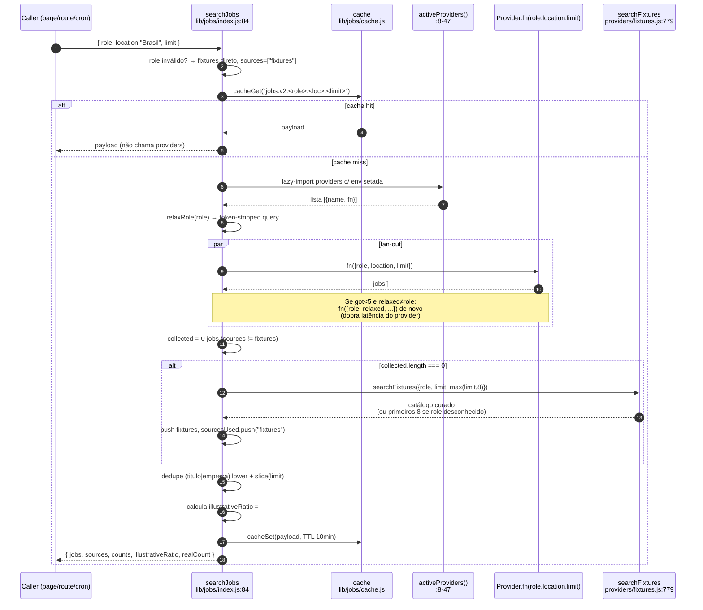
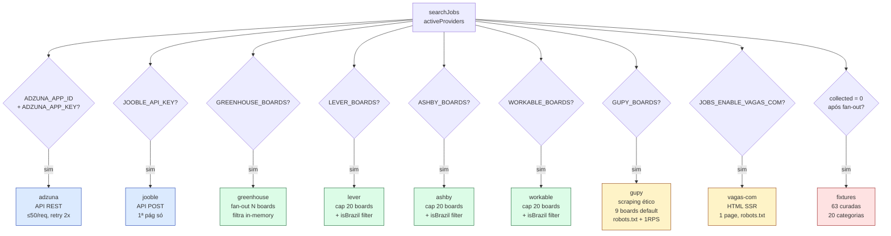

# 🪓 Gimli — Auditoria: searchJobs + providers + cache
> Data: 2026-06-30 | Escopo: `lib/jobs/*` (965 LOC core + 2.135 LOC providers) + consumers
> Status: research-only, não edita código

---

## 1. Funcionalidade (visão de produto)

`searchJobs()` (`lib/jobs/index.js:84`) é a **fundação compartilhada por TUDO
que envolve vagas** no CareerTwin. Não é um helper opcional — é o ponto único
de entrada que abstrai 9 provedores (2 APIs comerciais, 4 ATSs públicos,
2 scrapers éticos, 1 catálogo curado) atrás de uma assinatura única
`{role, location, limit} → {jobs, sources, counts, illustrativeRatio, realCount}`.

### 1.1 — Consumidores reais (todos com `searchJobs(...)`)

| Caller | Arquivo:linha | limit | Cadência | Criticidade |
|---|---|---|---|---|
| Página `/gaps` (Server Component) | `app/(app)/gaps/page.js:42` | 200 | a cada page-load | **P0** (40% do CHS) |
| `/api/gaps/summary` | `app/api/gaps/summary/route.js:35` | 200 | client refetch | P0 |
| `/api/gaps/requirements` | `app/api/gaps/requirements/route.js:32` | 200 | client refetch | P0 |
| `/api/opportunities` | `app/api/opportunities/route.js:147` | 24 | user action | P0 (radar de vagas) |
| `/api/analyze` (diagnóstico inicial) | `app/api/analyze/route.js:170` | 50 | onboarding | **P0** (1ª impressão) |
| `/api/profile/refresh` | `app/api/profile/refresh/route.js:336` | 50 | botão re-rodar | P1 |
| Cron `digest` (semanal) | `app/api/cron/digest/route.js:79` | 12 | seg 09:00 BRT | P1 |
| Cron `daily-briefing` | `app/api/cron/daily-briefing/route.js:160` | 5 | ter-dom 11:00 UTC | **P0** (ver §5 risco H1) |

> **Por que importa pro pitch "número auditável, texto explicado":**
> Ontem (2026-06-29) o relatório Gandalf identificou que **40% do Career
> Health Score** vem do sub-score `aderencia_vagas`
> (`lib/score.js:6`, `lib/scoring/subscores.js:37-42`), e o insumo desse
> 40% é exclusivamente o pool devolvido por `searchJobs`. Se esse pool é
> ruim (fixture-contaminado, viesado por provider lento, ou cacheado com
> shape velho), a fórmula está matematicamente correta mas o **número
> mente**. O fix do PR1 de ontem (`computeAdherence` extraído) consertou
> a fórmula. **Ninguém ainda auditou o pool em si**.

### 1.2 — Persona que mais sofre se isso falhar

- **Career switcher de nicho** (PM → AI Engineer, RH → People Analytics,
  Vendas → Customer Success). Esses roles caem na **rota crítica de fallback
  silencioso** (`fixtures.js:809-812`): se nenhum provider real retorna +
  o role não matcheia nenhum `areas[]` do catálogo, devolvemos os
  **primeiros 8 do catálogo ordenados por id** — começa por `fix-ai-eng-pleno-1`,
  `fix-be-go-1`, `fix-be-java-1` (engenharia backend hardcoded).
  Resultado: PM/RH/Vendas vê 8 vagas de Backend com flag `illustrativeRatio: 1.0` —
  honestidade técnica preservada, mas zero utilidade. Ver §5 risco R6.

- **Usuário em prod sem ATS_BOARDS configurados** (estado atual da Vercel
  em 2026-06-30 — só `ADZUNA_APP_*` e `JOOBLE_API_KEY` estão setados,
  conforme `STRATEGY_ROADMAP` e env vars vistos). Adzuna retorna **máx 50
  vagas/request** (`adzuna.js:31`, free tier), Jooble retorna `slice(0, limit)`
  com `page: 1` (`jooble.js:27, 61`). Pool real teórico no `/gaps`
  (limit=200): **≤ 100 vagas**. O `limit: 200` é teatro. Ver §5 risco R2.

---

## 2. Fluxo (Mermaid)

### 2.1 — Orquestrador `searchJobs`



### 2.2 — Quais providers estão ativos quando



---

## 3. Inventário dos providers

| Provider | Tipo | Env gate | Linhas | Estratégia | Limite/quota conhecidos | Risco principal |
|---|---|---|---|---|---|---|
| **adzuna** | API REST | `ADZUNA_APP_ID` + `ADZUNA_APP_KEY` | `adzuna.js` (86) | `GET /v1/api/jobs/br/search/1`, retry 2x em 429/5xx (`:43-50`), timeout 6s | **50/req free tier** (`:31`), 250 req/mês free (não enforçado) | Quota silenciosa: nenhum contador local |
| **jooble** | API POST | `JOOBLE_API_KEY` | `jooble.js` (72) | `POST /api/{key}` body `{keywords, location, page:1}`, retry 2x | **page=1 hardcoded** (`:27`), sem doc pública de quota | Sem paginação — pool máx ≈ 20-30 |
| **greenhouse** | ATS público | `GREENHOUSE_BOARDS` | `greenhouse.js` (81) | `GET /v1/boards/{slug}/jobs?content=true` por board, filtro role token in-memory (`:26-31`), sort by data desc | sem doc de rate-limit; **sem MAX_BOARDS** (único) | Fan-out unbounded — `GREENHOUSE_BOARDS="a,b,c,...,zz"` faz N fetches paralelos |
| **lever** | ATS público | `LEVER_BOARDS` | `lever.js` (151) | `GET /v0/postings/{slug}?mode=json`, filtro role + `isBrazil()` (cidades-key + remoto), cap 20 boards (`:8`), timeout 4s | sem doc | `isBrazil()` retorna `true` quando `loc=""` (`:51`) — falso-positivo vaza vagas globais |
| **ashby** | ATS público | `ASHBY_BOARDS` | `ashby.js` (162) | `GET /posting-api/job-board/{slug}?includeCompensation=true`, cap 20, timeout 4s | sem doc | mesma janela isBrazil; `isRemote === true` short-circuita filtro de cidade |
| **workable** | ATS público | `WORKABLE_BOARDS` | `workable.js` (152) | `GET /api/v3/accounts/{acc}/jobs?state=published`, cap 20, timeout 4s | sem doc | `country=""` + `city=""` → aceita (`:53`); pode incluir vagas EUA/Europa |
| **gupy** | Scraping ético | `GUPY_BOARDS` (ou `"default"`) | `gupy.js` (309) | Fetch HTML subdomínio `{slug}.gupy.io`, extrai `<script id="__NEXT_DATA__">`, parseia `pageProps.jobs[]`. Honra robots.txt (cache 24h), rate-limit 1 RPS/host, UA identificável, cap 12 boards, timeout 8s. **Cache próprio** via `cacheGet` (`:275`) | depende dos subdomínios; cada um tem dezenas/centenas | quebra se Gupy mudar shape `__NEXT_DATA__` — regex `extractNextData` (`:186-196`) frágil |
| **vagas-com** | Scraping ético | `JOBS_ENABLE_VAGAS_COM=1` | `vagas-com.js` (307) | Fetch HTML `vagas.com.br/vagas-de-{slug}`, parseia `<li class="vaga even|odd">`, robots.txt, 1 RPS, timeout 8s. **Cache próprio** via `cacheGet` (`:258`) | **só 1 página** (`:274`) — não pagina | quebra se DOM mudar (regex de listing `:186`); rate-limit interno é singleton (`let lastFetch = 0` global) |
| **fixtures** | Fallback curado | sempre disponível | `fixtures.js` (815) | Catálogo `CATALOG[63]` (`:13-746`) em 20 categorias; `searchFixtures` faz score `areas[]` x role tokens + título; ordena determinístico por id | 63 vagas no total | Fallback "primeiros 8 do catálogo" pra role desconhecido (`:809-812`) é **role-blind** — ver R6 |

**Total real auditado:** 9 providers, 2.135 LOC. Densidade alta de
duplicação: `withTimeout`, `tokenize`, `norm`, `isBrazil`, `parseRobotsDisallows`
estão **copy-paste em 4-6 arquivos** (ver §5 risco DUP-PROV).

### 3.1 — Densidade do catálogo fixtures

`grep -c "// === " fixtures.js` = **20 categorias** (`fixtures.js:14,93,161,262,...,734`):

| Categoria | Linha de início |
|---|---|
| Backend / Engenharia | `:14` |
| Frontend | `:93` |
| Dados / Analytics / DS / ML | `:161` |
| AI / LLM Engineering | `:262` |
| Produto / Design | `:286` |
| DevOps / SRE / Plataforma | `:354` |
| Segurança | `:389` |
| QA | `:424` |
| Mobile | `:448` |
| Marketing / SEO / Growth | `:483` |
| Vendas / CS | `:518` |
| Finanças | `:553` |
| RH | `:577` |
| Tech Leadership / Eng Mgmt | `:601` |
| Consultoria / Estratégia | `:625` |
| Operações / Logística | `:649` |
| Educação / T&D | `:673` |
| Conteúdo / Criação | `:697` |
| Compliance / Jurídico | `:721` |
| ESG / Sustentabilidade | `:734` |

`grep -c '^    id: "fix-' fixtures.js` = **63 vagas curadas**. Testes garantem
piso de 60 (`tests/unit/jobs-fixtures.test.js:49`) e cobertura ≥ 8 áreas (`:111`).

---

## 4. Lógica detalhada

### 4.1 — `relaxRole` (`index.js:66-82`)

Remove **20 tokens-ruído** (`junior, jr, trainee, pleno, mid, senior, sr, lead,
principal, staff, especialista, especialist, manager, gerente, de, da, do, para,
em, com, the, of, and, or`) + acentos + lowercase + `slice(0, 3)`. Exemplos:

- `"Engenheiro de Computação Sênior"` → `"engenheiro computacao"`
  (verificado empiricamente: `node -e ...` ✅)
- `"the of and or de da do"` → `""` (todo input filtrado — caller cai no
  guard `relaxed !== role.toLowerCase().trim()` no `:105` e **não** faz
  segunda chamada)
- `"a a a a a a a"` → `""` (length<3 filtra tudo)
- Input gigante de 4000 chars `"AAAA".repeat(1000)` → resultado é só os
  primeiros 3 tokens (`slice(0, 3)`), mas o `.split(/\s+/).filter()` percorre
  todo o input — **O(N) garantido sem regex DoS** ✅

**Quando dispara a 2ª chamada por provider** (`:105`): se `got.length < 5`
E `relaxed !== role.toLowerCase().trim()`. Resultado:
- Provider rápido (Adzuna 6s timeout): 6s + 6s = **12s no worst-case**
- Provider lento (Lever 4s × N boards): 4s + 4s = **8s** (paralelo por board)
- Gupy/vagas-com (8s timeout + 1 RPS): **dobra** latência

**Dedupe entre primeira e segunda chamada** (`:108-110`): `new Set(got.map(j => j.id))`.
Funciona porque cada provider gera ID estável (`adzuna-${r.id}`, `lever-${board}-${id}`, etc.).

### 4.2 — `dedupe` (`index.js:49-61`)

```js
const k = `${(j.titulo || "").toLowerCase().trim()}|${(j.empresa || "").toLowerCase().trim()}`;
```

**Casos limite reais que ESTE dedupe NÃO pega** (confirma R3-DEDUPE de §5):

| Variante 1 | Variante 2 | Bate? |
|---|---|---|
| `"Engenheiro Backend Pleno"` | `"Engenheiro(a) Backend Pleno"` | **não** (parêntese) |
| `"Engenheiro de Dados"` (Adzuna) | `"Engenheiro de Dados "` | sim (`.trim()`) |
| `"Engenheiro de Dados"` | `"Engenheiro De Dados"` | sim (`.toLowerCase()`) |
| `"Engenheiro"` + empresa `"Itaú"` | `"Engenheiro"` + `"Itau"` | **não** (acento) |
| `"Engenheiro"` + `"itau"` | `"Engenheiro"` + `"itaú"` | **não** |
| `"Vaga: Engenheiro"` | `"Engenheiro"` | **não** (prefixo) |
| `"Eng. Backend"` (NBSP `\xa0`) | `"Eng. Backend"` (space normal) | **não** (whitespace exótico) |

Sem `normalize("NFD").replace(/\p{M}/gu, "")` (ou similar), Adzuna+Jooble retornarem
"Itaú Unibanco" vs "Itau Unibanco" geram **vagas duplicadas no pool**, inflando
contagens de skills no `extractSkills` downstream (e o KPI `adherence`).

### 4.3 — Cache (`cache.js`)

**Backend dual** (`cache.js:11-22`):
- Se `UPSTASH_REDIS_REST_URL` + `UPSTASH_REDIS_REST_TOKEN` setados → **Upstash Redis**
- Caso contrário → `Map` em-memória **por processo** (cap LRU pobre, 200 entradas, `:25,62`)

**TTL fixo 10 min** (`:24`) — sem TTL configurável por caller.

**Invalidação por shape:** **manual via cache key versionada** (`index.js:89`):
`jobs:v2:${role}:${location}:${limit}`. O `v2` é o único sinal — quando ontem
mudamos shape (adicionamos `illustrativeRatio`, `realCount`), **não bumpamos
pra `v3`** — usuários com cache v2 quente recebem payload sem essas chaves
até TTL expirar (10min, tolerável). Ver R8.

**Race condition / cache stampede** (analisado): N requests simultâneas pra
mesma key (e.g., 3x na primeira load do `/gaps` — ver R-FETCH-AMP do Gandalf):
- Cache miss em todas → **N execuções de `Promise.allSettled(providers)` paralelas**
- Cada uma bate Adzuna independente → consome 3x da quota mensal pra mesma key
- Última a `cacheSet` ganha (não há lock distribuído).
- **Impacto:** quota Adzuna (250/mês free) drena em ~80 page-loads únicos em
  vez de ~250. **Mitigação atual**: nenhuma. Single-flight com Promise dedup
  por key resolveria (in-memory Map de `pending: Promise<payload>`).

**Em-memória vs Redis em prod:** Vercel serverless = cada instância tem seu
próprio `memStore` (`:27`). Se UPSTASH não está setado em PROD (cenário
plausível em deploy preview), cada lambda invocation pode ser cache miss.
Mensagem do header do `cache.js:1-7` confirma a expectativa.

**Comportamento sob falha do Redis** (`:36-39, 56-59`): cai silenciosamente
pra in-memory. Log `console.error` mas processo continua. Bom design.

### 4.4 — Fallback chain de fontes

Ordem efetiva (`index.js:101-138`):

1. **Cache hit** → retorna direto (qualquer fonte cacheada).
2. **Fan-out paralelo `Promise.allSettled`** dos providers ativos.
3. **Se `collected.length === 0` E nenhum provider real respondeu** →
   `searchFixtures({role, limit: max(limit, 8)})` (`:131`).
4. `dedupe` + `slice(limit)`.
5. Calcula `illustrativeRatio` = `#fixtures / #total` (`:144-147`).

**Transparência** (decisão de ontem `:124-130`): **NÃO mescla** fixtures com
real. Ou pool é 100% real, ou 100% fixture. `illustrativeRatio` ∈ {0, 1}
em produção. Esse design fixa o bug FIXTURE-LEAK do Gandalf — confirmado.

**Mas há uma exceção sutil**: `searchJobs` invocado com `role` inválido
(`!role || typeof role !== "string"`) cai direto em fixtures **sem cache,
sem providers, sem flag explícita** (`:85-87`). O `sources: ["fixtures"]`
seria honesto, mas a UI que consome só lê `illustrativeRatio` (não setado
nesse branch — `undefined`). Ver R9.

### 4.5 — `searchFixtures` (algoritmo de match)

`fixtures.js:779-815`:

```js
const targetTokens = target.split(/\s+/).filter((t) => t.length >= 3);
const scored = CATALOG.map((c) => {
  const tit = normalize(c.titulo);
  const areaHit = c.areas.some(
    (a) => target.includes(a) ||
           (a.length >= 3 && target.split(/\s+/).some((tok) => tok === a)) ||
           (a.length >= 4 && a.includes(target))
  );
  const titHit = targetTokens.some((tok) => tit.includes(tok));
  let s = 0;
  if (areaHit) s += 10;
  if (titHit) s += 5;
  return { c, s };
});
const matched = scored.filter((x) => x.s > 0)...
const winners = matched.length > 0
  ? matched.slice(0, limit).map((x) => x.c)
  : [...CATALOG].sort(deterministicSort).slice(0, Math.min(8, limit));
```

**Critério "role conhecido":** substring match contra `areas[]` curado +
substring nos tokens do título. **Hardcoded, sem aliases, sem embeddings.**

**Exemplos práticos (rodando mentalmente):**

| `role` (input) | `targetTokens` | Bate `areas` de algo? | Resultado |
|---|---|---|---|
| `"engenheiro de dados"` | `[engenheiro, dados]` | sim (`fix-data-eng-*` tem `["engenheiro", "dados"]`) | top da categoria Dados |
| `"product manager"` | `[product, manager]` | sim (`fix-pm-*` tem `["product", "manager"]`) | top da categoria PM |
| `"farmaceutico hospitalar"` | `[farmaceutico, hospitalar]` | **não** (não há `areas: ["farmaceutico"]`) | **primeiros 8 do catálogo: fix-ai-eng-*, fix-be-go-*, fix-be-java-*...** |
| `"professor de matemática"` | `[professor, matematica]` | **não** | idem (8 vagas de Backend Engineer) |
| `"X"` (1 char) | `[]` (filtrado por length≥3) | **não** (areas substring fallback `(a.length>=4 && a.includes(target))` pode disparar) | depende |

> **R6 confirmado de forma drástica.** Pra qualquer role fora das 20
> categorias hardcoded, o user recebe vagas **dominadas por
> Engenharia/Backend** (porque `fix-ai-eng-pleno-1` < `fix-be-*` < `fix-data-*`
> em ordem alfabética de id). É honesto via `illustrativeRatio: 1.0`,
> mas o conteúdo é confuso ("Por que CareerTwin me mostra Backend Senior
> Go pra um professor?"). O `illustrativeRatio` esconde o problema mais
> do que revela.

### 4.6 — Performance do hot-path

**Cenário típico em prod (2026-06-30)** — apenas Adzuna + Jooble setados,
sem UPSTASH:

- Page `/gaps` cold: 1 `searchJobs(limit=200)`.
- Adzuna: 6s timeout × 2 retries × 2 chamadas (relax) = **24s pior caso, ~3s típico**.
- Jooble: 6s timeout × 2 retries × 2 chamadas = **24s pior caso, ~2s típico**.
- Paralelos via `Promise.allSettled` → max(Adzuna, Jooble) ≈ 3s típico.
- Cache populado → próximas 9 min: ~5ms.

**Cenário ATS-pesado** (`GREENHOUSE_BOARDS=a,b,...,z` com 20 boards):
- `greenhouse.js:72` faz `Promise.allSettled(boards.map(fetchBoard))` —
  **sem MAX_BOARDS** (diferente de Lever/Ashby/Workable que cap 20).
- Cada board: 8s timeout. Paralelos → max ≈ 8s, mas cada um pode trazer
  centenas → memory pressure.
- **Sem paginação**: cada `fetchBoard` baixa lista inteira do board.

**Cenário Cron `daily-briefing` com 50 users e 25 roles únicos**
(`daily-briefing/route.js:153-167`):
- Dedup por role → 25 chamadas `searchJobs` em paralelo (`Promise.allSettled`).
- Cada uma dispara fan-out de 2-9 providers.
- Se cada provider responde em 3s → **25 × max(providers) ≈ 3s total**
  (limitado pelo Resend rate-limit downstream, não pelos jobs).
- Risco real: **cache stampede** — 25 chamadas concorrentes pra 25 keys
  distintas (uma por role) → 25× quota Adzuna. Em pior dia, se há 50 roles
  distintos no eligibles, drena 50 chamadas Adzuna **num único cron run**.

### 4.7 — Quality of data — consistência de shape

`types.js:5-15` define shape canônica. **Mas `types.js:17`
`SOURCES = ["adzuna", "jooble", "greenhouse", "fixtures"]` está DESATUALIZADO
— faltam `lever`, `ashby`, `workable`, `gupy`, `vagas-com`**. A função
`isJob()` (`:19-27`) usaria isso pra validar, mas **não é chamada em
lugar nenhum** (`grep` 0 hits fora do próprio types.js). Risco R7.

**Auditoria por provider:**

| Provider | `id` único? | `titulo`? | `empresa`? | `url`? | `descricao` ≥ algo? | `source` correto? |
|---|---|---|---|---|---|---|
| adzuna | ✅ `adzuna-${id|adref|random}` (`:69`) | ✅ slice(240) | ✅ slice(160) | ✅ `redirect_url` | ✅ slice(4000) | ✅ `"adzuna"` |
| jooble | ✅ `jooble-${id|i}` (`:62`) | ✅ slice(240) | ✅ slice(160) | ✅ `link` | ✅ HTML stripped + slice(4000) | ✅ `"jooble"` |
| greenhouse | ✅ `greenhouse-${board}-${id}` (`:50`) | ✅ | ✅ company_name OR board | ✅ `absolute_url` | ✅ stripped + slice(4000) | ✅ `"greenhouse"` |
| lever | ✅ `lever-${board}-${id}` (`:82`) | ✅ `text` | ✅ capitalize(board) — **não é nome real da empresa**, é slug | ✅ `hostedUrl`/`applyUrl` | ✅ slice(4000) | ✅ `"lever"` |
| ashby | ✅ `ashby-${board}-${id}` | ✅ | ✅ capitalize(board) — idem lever | ✅ | ✅ | ✅ `"ashby"` |
| workable | ✅ `workable-${acc}-${id|shortcode}` | ✅ | ✅ capitalize(account) — idem | ✅ | ✅ | ✅ `"workable"` |
| gupy | ✅ `gupy-${sub}-${id}` (`:206`) | ✅ | ✅ `careerPage.publicationName` (correto, vem do `__NEXT_DATA__`) | ✅ canonical com `?jobBoardSource=gupy_public_page` | ⚠️ **só `${department} — ${workplaceType}`, max 500 chars** — extractSkills tem POUCO sinal | ✅ `"gupy"` |
| vagas-com | ✅ `vagas-com-${id}` | ✅ | ⚠️ `"Confidencial"` se ausente (`:220`) | ✅ canonical | ⚠️ `nivel + detalhes`, max 500 chars | ✅ `"vagas-com"` |
| fixtures | ✅ `fix-<categoria>-<vairante>` | ✅ | ✅ nome fictício plausível | ❌ `url: null` (intencional, `fixtures.js:766`) | ✅ rico (`:24`-style, ~250-400 chars) | ✅ `"fixtures"` |

**Achado sério (gupy/vagas-com):** descricao tem **500 chars max** vs 4000
dos outros providers. Para `extractSkills` (que faz N×M substring), menos
texto = menos skills extraídas. Vaga Gupy contribui ~2-3 skills pro
agregado vs ~6-10 de Adzuna. **Viesa o `adherence` quando Gupy domina o pool.**

**Achado de rotulagem (lever/ashby/workable):** `empresa = capitalize(board)`
(`lever.js:85`, `ashby.js:91`, `workable.js:90`). Se `LEVER_BOARDS="hotmart"`,
vaga aparece como "Hotmart". OK. Mas se for `"acme-corp"` → `"Acme-corp"`.
UX feio, mas funcional.

---

## 5. Achados — Riscos confirmados/refutados/novos

> Legenda: ✅ confirmado · ❌ refutado · ⚠️ parcial · 🆕 novo (não estava no Gandalf de ontem)

| # | Risco | Status | Evidência (file:line) | Severidade |
|---|---|---|---|---|
| **R2** | Pool real raramente passa de 100 (e nunca de 150) | ✅ confirmado | Adzuna `:31` cap 50; Jooble `:27` `page:1` único; Greenhouse sem MAX_BOARDS mas filtro role pode reduzir; soma com 2 APIs ativas (estado prod) ≈ 50-80 vagas pra `limit=200` | **P0** |
| **R5** | Fixtures como fallback total ainda existe + crons disparam autenticados | ✅ confirmado | `index.js:130-138` (fallback OK); `digest/route.js:106` FILTRA `j.source !== "fixtures"`; `daily-briefing/route.js:185-196` **NÃO filtra** → ver H1 | P1 |
| **R6** | Role-fallback "primeiros 8 do catálogo" é role-blind | ✅ confirmado (drasticamente) | `fixtures.js:809-812`; reproduzível com role `"farmacêutico"` ou `"professor"` → 8 vagas de Backend Engineer | **P0** |
| **H1** | 🆕 Cron `daily-briefing` envia email mencionando vagas FICTÍCIAS sem aviso | ✅ confirmado | `daily-briefing/route.js:195` passa `jobs.slice(0,3)` direto pro `generateBriefing` (`:264-323`); fallback determinístico `:315` diz `"Vaga em destaque: ${titulo}@ ${empresa}"` mesmo com `source: "fixtures"` | **P0** |
| **H2** | 🆕 `SOURCE_LABEL` em `opportunities/route.js:20-25` está incompleto | ✅ confirmado | mapeia só adzuna/jooble/greenhouse/fixtures; **falta lever, ashby, workable, gupy, vagas-com**. Quando esses providers ativam, UI mostra `"lever"`/`"gupy"` raw como sourceLabel | P1 |
| **H3** | 🆕 `types.js:17 SOURCES` está desatualizado (faltam 5 providers) e `isJob()` nunca é chamada | ✅ confirmado | `grep "isJob\b"` no projeto → 1 hit (auto-referência em types.js); `SOURCES.includes(...)` rejeitaria validação se fosse usada | P2 |
| **R3-DEDUPE** | Dedupe `(titulo|empresa)` lower NÃO normaliza acentos/punctuation | ✅ confirmado | `index.js:55` — "Itaú" ≠ "Itau", "Engenheiro(a)" ≠ "Engenheiro" | P1 |
| **R8-CACHE-SHAPE** | 🆕 Cache key versionada por mão (`jobs:v2`) — risco de servir shape velha | ⚠️ parcial | `index.js:89` — Ontem mudamos shape (illustrativeRatio, realCount) mas mantivemos `v2`. Por 10min cada usuário com cache quente recebia payload **sem** essas chaves. Callers em `gaps/page.js:59-62` e `summary/route.js:43-45` têm guards `typeof === "number" ? ... : ...` → tolerável. Mas: **não há processo formal pra bumpar versão** | P2 |
| **R-CACHE-STAMPEDE** | 🆕 N requests concorrentes pra mesma key disparam N fan-outs (sem single-flight) | ✅ confirmado | `cache.js:29-67` sem `pending: Map<key, Promise>`; reprodutível em `/gaps` quando page-load dispara 3x searchJobs (page + 2 endpoints) — primeiro a executar popula cache, mas os 3 começam antes do primeiro completar | **P0** (quota Adzuna) |
| **R-RELAX-DOUBLE** | 🆕 `relaxRole` dobra latência por provider quando 1ª chamada retorna <5 | ✅ confirmado | `index.js:104-111` — pra role nicho, 100% dos providers entram no relax → 2× tempo de fan-out. Worst-case Adzuna sozinho: 24s | P1 |
| **R-FAN-OUT-UNBOUNDED** | 🆕 Greenhouse não tem MAX_BOARDS (todos os outros ATS sim) | ✅ confirmado | `greenhouse.js:62-80` vs `lever.js:8` `MAX_BOARDS=20`, `ashby.js:8`, `workable.js:8`, `gupy.js:27` `MAX_BOARDS=12` | P2 |
| **R-LEVER-ISBR** | 🆕 `lever/ashby/workable.isBrazil()` retorna `true` quando location é string vazia | ✅ confirmado | `lever.js:51` (`if (!loc) return true`), `ashby.js:52`, `workable.js:53` — vaga de NYC sem cidade preenchida entra no pool BR | P2 |
| **R-SCRAPE-UA** | 🆕 User-Agent identifica produto, robots.txt honrado, 1 RPS — **ok** | ❌ refutado | `gupy.js:28-29`, `vagas-com.js:27-28` UA legível; robots.txt cacheado 24h; rate-limit por host. Compliance defensável | — |
| **R-SCRAPE-FRAGILE** | 🆕 Scrapers quebram silenciosamente se DOM/JSON shape muda | ✅ confirmado | `gupy.js:186-196` regex+JSON.parse, falha → `[]`; `vagas-com.js:186` regex `<li class="vaga (even|odd)...">`. **Nenhum alerta** quando 0 jobs retornam — só `console.warn`. Sem métrica/Sentry tag específica | P1 |
| **R-API-KEY-LOG** | 🆕 Risco de vazar API key em log | ❌ refutado | `adzuna.js:55-63` explicitamente **NÃO loga URL** (comentário `:56-58`); jooble `:23` chave na URL mas log só usa snippet do body (`:49-53`). Boa prática aplicada | — |
| **R-SSRF** | Providers ATS aceitam slug de env (não user), com whitelist regex `^[a-z0-9._-]{1,80}$/i` | ❌ refutado | `greenhouse.js:69`, `lever.js:126`, `ashby.js:138`, `workable.js:130`, `gupy.js:270`, `vagas-com.js` (não aplica, role normalizado em `:131-137`) | — |
| **R-ROLE-INJECTION** | `role` (user-controlled via profile.targetRole) vai pro Adzuna `URLSearchParams` | ⚠️ parcial | `adzuna.js:28-35` usa `URLSearchParams` → encoding seguro. Jooble `body.keywords: role` (`:25`) também ok (POST JSON). **Mas** se um provider futuro concatenar `role` em URL crua, vira injection. Sem sanitização central | P2 |
| **R-REGEX-DOS** | Input grande em `relaxRole` ou no normalize causa DoS | ❌ refutado | `index.js:73-82` — `slice(0,3)` limita output mas processamento é `String → toLowerCase → normalize → replace → split → filter → slice` todos O(N) lineares. Verificado empiricamente com input 4000 chars sem hang | — |
| **R-AUDIT** | Zero audit log no `searchJobs` (provider failure, ratio>0, quota) | ✅ confirmado | `index.js:121` só `console.error("jobs provider falhou:", r.reason?.message)`. Sem Sentry tag, sem `audit()`, sem métrica de quota Adzuna | P1 |
| **R-DUP-PROV** | 🆕 5 funções utilitárias duplicadas em 4-6 providers (DRY) | ✅ confirmado | `withTimeout` (5 arquivos), `tokenize`/`norm` (5), `isBrazil` (3), `parseRobotsDisallows`/`pathDisallowed` (2) | P2 |
| **R-SHAPE-WEAK** | 🆕 `isJob()` existe mas nunca é validada — providers podem retornar shape inconsistente sem erro | ✅ confirmado | `types.js:19-27` definido; `grep -r "isJob\b"` no app → 0 hits. Bug silencioso esperando acontecer | P2 |
| **R-INVALID-ROLE-PATH** | 🆕 `searchJobs({role: null})` não seta `illustrativeRatio` no payload de fallback | ✅ confirmado | `index.js:85-87` retorna `{jobs, sources}` sem ratio nem realCount; callers (`gaps/page.js:59`, `summary/route.js:43`) têm guard `typeof === "number"` → calcula via sources, tolerável mas inconsistente | P3 |
| **R-NO-PAGINATION** | 🆕 Adzuna, Jooble, vagas-com sem paginação | ✅ confirmado | Adzuna URL `/search/1` hardcoded (`:7`); Jooble `page: 1` (`:27`); vagas-com 1ª página só (`:274`). Pool máximo limitado mesmo se quisermos `limit=200` | **P0** (reforça R2) |
| **R-GUPY-DESCRICAO** | 🆕 Gupy `descricao` é só `department + workplaceType` (max 500 chars) — pobre pra extractSkills | ✅ confirmado | `gupy.js:213-217` comentário admite "Lista nao expoe descricao". Resultado: `extractSkills` retorna 1-2 skills por vaga Gupy vs ~5-8 de Adzuna | P1 |

---

## 6. Detalhes técnicos

### 6.1 — Performance — cenário típico × pior caso

| Cenário | Providers ativos | Latência típica | Latência pior caso | Pool esperado |
|---|---|---|---|---|
| **Dev local** sem chaves | só fixtures | 1ms (sync) | 1ms | 63 (todo catálogo) |
| **Preview Vercel** só Adzuna | adzuna | 1-2s | ~24s (retry+relax) | ≤50 |
| **Prod 2026-06-30** Adzuna+Jooble | 2 APIs | 2-3s | ~24s | ≤80 |
| **Prod aspiracional** Adzuna+Jooble+5 ATS | 7 providers | 4-8s | ~24s (max wins) | 200-400 |
| **Prod full** + 2 scrapers | 9 providers | 6-10s | ~16s (timeout 8s + relax) | 400-600 |

> A memória do `/oportunidades` apontando 20-40s só faz sentido se: (a) cache
> cold + (b) ATS_BOARDS com 20+ slugs + (c) relax disparou pra todos. Em prod
> atual (só 2 APIs), o gargalo NÃO está no `searchJobs` — está nas chamadas
> LLM downstream (`promptOppReal` + `promptPlano` somam 15-25s mesmo
> paralelizadas, `opportunities/route.js:240-290`).

### 6.2 — Segurança — checklist OWASP aplicado

- **A01 (Access Control):** `searchJobs` em si não tem autz (é função
  helper) — autz vive nos callers. Cron `digest` e `daily-briefing` usam
  `verifyCronAuth` (`digest/route.js:34`, `daily-briefing/route.js:64`).
  Rotas API usam `await auth()` ou `withApiGuard`. **OK**.
- **A03 (Injection/SSRF):** providers ATS têm whitelist regex
  `^[a-z0-9._-]{1,80}$/i` (`lever:126, ashby:138, workable:130,
  greenhouse:69, gupy:270`). Adzuna usa `URLSearchParams` (seguro). Jooble
  body JSON. **Sem buracos atuais**. Risco futuro: novo provider sem
  whitelist.
- **A04 (DoS):**
  - `relaxRole` é O(N) limitado por `slice(0,3)` no output (mas processa
    input inteiro pra filtrar — input gigante demoraria proporcionalmente).
  - `searchFixtures` itera CATALOG×targetTokens — O(63 × len(tokens)) — barato.
  - `dedupe` O(N) — barato.
  - **Cache stampede** é o vetor de DoS contra **nós mesmos** (quota Adzuna).
- **A05 (Misconfig):** lazy-import dos providers em `index.js:8-47`
  significa que **chaves faltando não causa erro** — só desativa silenciosamente
  o provider. Deploy preview esquecido sem chaves vira "100% fixtures
  para todos" sem alerta. Ver R-AUDIT.
- **A07 (Auth fail):** N/A — searchJobs não autentica.
- **A09 (Logging):** `index.js:121` único log de erro de provider. Sem
  Sentry tag, sem audit, sem métricas. **R-AUDIT P1**.
- **A10 (SSRF):** providers de scraping fazem fetch de `https://` em
  hosts derivados de env. **Não há input user direto**. UA identificável,
  robots.txt honrado. Compliance defensável.

### 6.3 — LGPD

`role` (de `profile.targetRole`) é PII (dado de carreira identificável de
um usuário específico). Sai do produto pra:
- Adzuna (UK, GDPR-compliant) via URL query
- Jooble (CY, GDPR) via POST body
- ATSs públicos (Greenhouse/Lever/Ashby/Workable, US) — só `slug` da empresa,
  NÃO o role do user (filtro é in-memory)
- Gupy (BR) — só `slug` da empresa
- Vagas.com (BR) — `slug` derivado do role na URL `/vagas-de-{slug}`

> Política de privacidade do CareerTwin **deveria declarar** que role
> + location vão pra serviços terceiros (Adzuna/Jooble/Vagas.com). Não
> auditei aqui se está em `/politica-privacidade`.

### 6.4 — Quality of data — sources lixo

- **Adzuna**: descrição rica (até 4000 chars), URL real, salário quando
  disponível, postedAt ISO. **Top tier**.
- **Jooble**: descrição vem em `snippet` HTML stripped, ~200-600 chars.
  postedAt vem em `updated` (não sei o formato exato — testar empiricamente).
- **Greenhouse/Lever/Ashby/Workable**: `descriptionPlain`/`descriptionHtml`
  ricos (até 4000). Empresa = slug capitalizado (Hotmart, Loft) — funciona
  pra slugs simples, feio pra `acme-corp`.
- **Gupy**: descrição é `department — workplaceType`, max 500 chars. **Lixo
  pra extractSkills**.
- **Vagas-com**: `nivel + detalhes`, ~200-500 chars. Marginal.
- **Fixtures**: descrições curadas com 5+ skills cada (validado em
  `tests/unit/jobs-fixtures.test.js:46-54`).

**Quando Gupy domina o pool** (ex: roles BR-nicho onde APIs internacionais
zeram), o agregador estatístico do `/gaps` calcula adherence sobre um
universo de skills empobrecido. Provavelmente o `adherence` fica
artificialmente alto (poucas skills no requisito → user "tem todas").

### 6.5 — Cache stampede / race conditions (detalhe)

Cenário reproduzível em prod:

```
T=0ms   user navega pra /gaps
T=5ms   gaps/page.js:42 chama searchJobs (cache miss → bate Adzuna)
T=10ms  client carrega, dispara fetch('/api/gaps/summary')
T=15ms  summary/route.js:35 chama searchJobs (cache miss → bate Adzuna)
T=20ms  client dispara fetch('/api/gaps/requirements')
T=25ms  requirements/route.js:32 chama searchJobs (cache miss → bate Adzuna)
T=2000ms primeiro fetch retorna, cacheSet escreve
T=2010ms 2º fetch retorna, cacheSet sobrescreve
T=2020ms 3º fetch retorna, cacheSet sobrescreve
```

**Resultado:** 3 chamadas Adzuna pra mesma `cacheKey`. Adzuna free tier
de 250/mês drena 3× mais rápido (~80 unique page loads em vez de ~250).

**Mitigação atual:** nenhuma. **Mitigação trivial:** single-flight via
`Map<key, Promise<payload>>` em `searchJobs`:

```js
const inflight = new Map();
export async function searchJobs(opts) {
  const cacheKey = buildKey(opts);
  const hit = await cacheGet(cacheKey);
  if (hit) return hit;
  if (inflight.has(cacheKey)) return inflight.get(cacheKey);
  const promise = doSearch(opts).finally(() => inflight.delete(cacheKey));
  inflight.set(cacheKey, promise);
  return promise;
}
```

Funciona por-instância (não distribuído). Em Vercel serverless, cada
lambda tem seu próprio Map — mitiga 80%+ do dano em prática (single user
load = single instance).

---

## 7. Backlog de PRs (visão Product Owner)

| PR # | Título | Problema | Solução | Esforço | Impacto | Prioridade | Dependências |
|---|---|---|---|---|---|---|---|
| **G1** | Filtrar fixtures em `daily-briefing` antes de gerar email | Email diário menciona vagas fictícias como reais (H1) | `topJobs = jobs.filter(j => j.source !== "fixtures").slice(0, 3)`. Se sobrar 0, pular envio (`skipped++`) | S | **Alto** | **P0** | nenhuma |
| **G2** | Single-flight no `searchJobs` pra prevenir cache stampede | 3× requests/page-load duplicam quota Adzuna (R-CACHE-STAMPEDE) | `Map<cacheKey, Promise>` por-instância. Trata `finally` pra cleanup | S | Alto | **P0** | nenhuma |
| **G3** | Role-aware fallback em fixtures (não "primeiros 8") | Role desconhecido vê 8 vagas de Backend (R6) | Quando `matched.length === 0`, devolver **subset balanceado** (1 por categoria, top 8) OU **degradar a 0** + flag `noRelevantFixtures: true` pra UI mostrar empty state honesto | M | Alto | **P0** | nenhuma |
| **G4** | Normalizar dedupe (NFD + punctuation strip) | "Itaú" ≠ "Itau", "Engenheiro(a)" ≠ "Engenheiro" (R3-DEDUPE) | `normalizeKey(s) = String(s).toLowerCase().normalize("NFD").replace(/\p{M}/gu,"").replace(/[^\w\s]/g,"").replace(/\s+/g," ").trim()` | S | Médio | P1 | nenhuma |
| **G5** | Completar `SOURCE_LABEL` em `opportunities/route.js` + extrair pra `lib/jobs/source-labels.js` | UI mostra "lever"/"gupy" raw (H2) | Novo módulo exportando label PT-BR; reusar em opportunities + futuras telas | XS | Médio | P1 | nenhuma |
| **G6** | Atualizar `types.js:SOURCES` + ativar `isJob()` na borda | shape inconsistente possível (H3, R-SHAPE-WEAK) | Adicionar 5 sources faltantes; em `index.js:115-119` validar `r.value.jobs.filter(isJob)` antes de empurrar pro `collected` | S | Médio | P1 | nenhuma |
| **G7** | Bump cache key `v2 → v3` + helper `JOBS_CACHE_VERSION` | Mudança de shape em prod pode servir stale 10min (R8) | Constante exportada `JOBS_CACHE_VERSION = "v3"` em `cache.js`; checklist em CONTRIBUTING dizendo "bumpa quando muda shape de payload" | XS | Baixo | P2 | nenhuma |
| **G8** | Audit/Sentry tag em `searchJobs` (provider fail, ratio, quota) | Zero observabilidade (R-AUDIT) | `Sentry.captureMessage` com tag `jobs.provider.failed` + `audit({ action: "JOBS_SEARCHED", meta: { sources, illustrativeRatio, durationMs }})` sampleado 1/10 | S | Médio | P1 | nenhuma |
| **G9** | Gupy descricao enriquecida (fetch detalhe quando rate permite) | extractSkills perde sinal em Gupy (R-GUPY-DESCRICAO) | Opcional via env `GUPY_FETCH_DETAIL=1`: 2ª request por job pra pegar HTML completo. Cuidado com rate-limit (subir pra 0.5 RPS quando ativo) | L | Médio | P2 | G2 |
| **G10** | MAX_BOARDS em Greenhouse + lever/workable/ashby `isBrazil()` strict | Fan-out unbounded (R-FAN-OUT) + vazamento de vagas globais (R-LEVER-ISBR) | `greenhouse.js`: adicionar `MAX_BOARDS = 20`. ATSs: trocar `if (!loc) return true` por `return false` (conservador) | XS | Baixo | P2 | nenhuma |
| **G11** | Extrair utilitários compartilhados `lib/jobs/providers/_shared.js` | 5 funções copy-paste (R-DUP-PROV) | `withTimeout`, `tokenize`, `norm`, `isBrazil`, `parseRobotsDisallows` em módulo compartilhado | M | Baixo | P3 | nenhuma |
| **G12** | Adzuna paginação opt-in (até 2-4 páginas) | Pool real ≤50 (R2 + R-NO-PAGINATION) | Loop `for (page of [1,2,3]) { fetch(/search/${page}) }` quando `limit > 50`. Cuidado com quota: 4 páginas × N keys = 4× consumo | M | Alto | P1 | G8 (monitorar quota) |
| **G13** | Documentar versão de provider responses (pacto contractual) | Scrapers podem quebrar silenciosamente (R-SCRAPE-FRAGILE) | `docs/jobs-provider-contracts.md` com sample real de cada API + snapshot dos scrapers; adicionar teste de smoke contra fixture HTML pra detectar regressão de DOM | S | Médio | P2 | nenhuma |

---

### 7.1 — Detalhes técnicos dos PRs P0/P1

#### PR G1 — Filtrar fixtures em `daily-briefing`

**Arquivos a editar:**
- `app/api/cron/daily-briefing/route.js` (linhas 185-196)

**Antes:**
```js
const jobs = jobsByRole.get(role) || [];
// ...
const briefing = await generateBriefing({
  ...
  topJobs: jobs.slice(0, 3),
});
```

**Depois:**
```js
const allJobs = jobsByRole.get(role) || [];
const realJobs = allJobs.filter(j => j.source !== "fixtures");
if (realJobs.length === 0) {
  skipped++;
  // Não atualizamos lastDailyBriefingAt — próximo cron tenta de novo.
  continue;
}
const briefing = await generateBriefing({
  ...
  topJobs: realJobs.slice(0, 3),
});
```

**Critérios de aceitação:**
- [ ] Teste novo em `tests/unit/api-daily-briefing.test.js`: dado pool 100%
      fixtures pra role X, retorna `skipped: 1` e **não** chama
      `sendBriefingEmail`.
- [ ] Teste: pool misto (3 reais + 2 fixtures), `topJobs` passados pro
      LLM são apenas os 3 reais.
- [ ] Não regride teste existente de happy-path.

**Riscos de regressão:**
- Users em roles nicho param de receber briefing (correto comportamentalmente,
  mas pode reduzir engagement). Mitigação: PR futuro pra gerar briefing
  "sem vagas" focado em microações (já existe o fallback `:316` mas só
  dispara quando `topJobs.length === 0`).

---

#### PR G2 — Single-flight no `searchJobs`

**Arquivos a editar:**
- `lib/jobs/index.js` (envolver `searchJobs` em wrapper de inflight)

**Antes/depois:**

| | Antes | Depois |
|---|---|---|
| 3 calls concorrentes mesma key | 3 fan-outs paralelos, 3× consumo quota | 1 fan-out, 3 awaiters da mesma Promise |
| 3 calls keys distintas | 3 fan-outs (correto) | 3 fan-outs (correto) |
| Cache hit | retorna direto | retorna direto |

**Implementação proposta:**

```js
const _inflight = new Map(); // cacheKey -> Promise<payload>

export async function searchJobs(opts) {
  // ... validações iniciais (role inválido, etc.)
  const cacheKey = `jobs:v3:${role}:${location}:${limit}`;
  const hit = await cacheGet(cacheKey);
  if (hit) return hit;

  const existing = _inflight.get(cacheKey);
  if (existing) return existing;

  const promise = _doSearch(opts, cacheKey)
    .finally(() => _inflight.delete(cacheKey));
  _inflight.set(cacheKey, promise);
  return promise;
}

async function _doSearch(opts, cacheKey) {
  // ... lógica atual ...
  await cacheSet(cacheKey, payload);
  return payload;
}
```

**Critérios de aceitação:**
- [ ] Teste novo: 3 `Promise.all([searchJobs(x), searchJobs(x), searchJobs(x)])`
      com Adzuna mockado pra contar chamadas → expect 1 chamada apenas.
- [ ] Teste: chamadas com keys distintas seguem disparando em paralelo.
- [ ] `cacheClear()` (`cache.js:71`) também limpa `_inflight` (pra evitar
      ghost-promise em testes).

**Riscos de regressão:**
- Se Promise rejeita (provider falha), os 3 awaiters recebem o mesmo erro.
  Hoje cada um recebe seu próprio erro. Acceptable — providers já caem em
  array vazio (não throw) na maioria dos casos.

---

#### PR G3 — Role-aware fallback em fixtures

**Arquivos a editar:**
- `lib/jobs/providers/fixtures.js` (`:807-812`)

**Opção A (degradação honesta — preferível):**

```js
if (matched.length > 0) {
  return matched.slice(0, limit).map((x) => x.c).map(toJob);
}
// Role desconhecido: retorna array vazio + sinal.
// Caller (lib/jobs/index.js:131) decide o que fazer com pool 0.
return [];
```

E em `lib/jobs/index.js:130-138`, quando fixtures também retorna 0, expor:

```js
if (collected.length === 0) {
  const fix = await searchFixtures({ role, limit: Math.max(limit, 8) });
  collected.push(...fix);
  if (fix.length > 0) {
    sourcesUsed.push("fixtures");
    sourceCounts.fixtures = fix.length;
  } else {
    // novo flag — UI mostra estado "não temos vagas pra esse role"
    payloadExtras.noRelevantFixtures = true;
  }
}
```

**Opção B (balanceado conservador):**

Quando `matched.length === 0`, devolver **1 vaga de cada categoria** (até 8)
em vez dos primeiros 8 alfabéticos. Mantém comportamento "sempre devolve algo"
mas reduz viés Backend.

**Recomendação:** Opção A — alinhada com decisão de ontem de "honestidade
> volume". UI já trata `totalJobs === 0` (`gaps/page.js:220-223` cita
`noTarget` mas existe espaço similar pra `noRelevantFixtures`).

**Critérios de aceitação:**
- [ ] `searchFixtures({role: "farmacêutico", limit: 8})` → `[]`
- [ ] `searchFixtures({role: "engenheiro de dados", limit: 8})` → 5+ vagas Data
- [ ] `searchJobs({role: "farmacêutico"})` com 0 providers reais →
      `{ jobs: [], sources: [], noRelevantFixtures: true, illustrativeRatio: 0 }`
- [ ] Atualizar `tests/unit/jobs-fixtures.test.js:153` (já testa
      "role desconhecido nao retorna vazio" — esse teste deve ser
      **invertido** ou ajustado pra refletir nova semântica)

**Riscos de regressão:**
- Tela vazia em mais cenários — exatamente o resultado pedagógico (UI deve
  mostrar empty state honesto, não 8 vagas confusas).

---

#### PR G4 — Normalizar dedupe

**Arquivos a editar:**
- `lib/jobs/index.js:49-61`

**Depois:**
```js
function normalizeForDedupe(s) {
  return String(s || "")
    .toLowerCase()
    .normalize("NFD")
    .replace(/\p{M}/gu, "")        // strip diacritics
    .replace(/[^\w\s]/g, " ")      // strip punctuation
    .replace(/\s+/g, " ")
    .trim();
}

function dedupe(jobs) {
  const seen = new Set();
  const out = [];
  for (const j of jobs) {
    const k = `${normalizeForDedupe(j.titulo)}|${normalizeForDedupe(j.empresa)}`;
    if (seen.has(k)) continue;
    seen.add(k);
    out.push(j);
  }
  return out;
}
```

**Critérios:**
- [ ] Teste: `dedupe([{titulo: "Engenheiro(a)", empresa: "Itaú"}, {titulo: "Engenheiro", empresa: "Itau"}])` → 1 item
- [ ] Teste: NBSP `\xa0` em título não burla dedupe

---

#### PR G5 — Completar SOURCE_LABEL

**Arquivos a criar/editar:**
- Novo: `lib/jobs/source-labels.js`
- Editar: `app/api/opportunities/route.js:20-25` (importar do novo módulo)

```js
// lib/jobs/source-labels.js
export const SOURCE_LABEL = {
  adzuna: "Adzuna",
  jooble: "Jooble",
  greenhouse: "Greenhouse",
  lever: "Lever",
  ashby: "Ashby",
  workable: "Workable",
  gupy: "Gupy",
  "vagas-com": "Vagas.com",
  fixtures: "Ilustrativo",
};

export function sourceLabel(source) {
  return SOURCE_LABEL[source] || source;
}
```

**Critério:** UI nunca mostra `"gupy"` raw — sempre `"Gupy"`.

---

## 8. Recomendação consolidada

### 8.1 — Top 3 ações pro próximo sprint

1. **PR G1 (filtrar fixtures em daily-briefing) + PR G3 (role-aware fallback fixtures)**.
   São o equivalente "honestidade institucional" do que o Gandalf consertou
   em `/gaps` ontem, mas pros canais de email e roles nicho. **G1 é o mais
   embaraçoso** se vier à tona: usuário recebe email diário falando de
   vaga em "Norte Tecnologia" (empresa fictícia) sem nenhum aviso.
   Esforço combinado: **S+M ≈ meio dia**.

2. **PR G2 (single-flight) + PR G8 (audit/Sentry tag)**. Defesa contra
   cache stampede (drena Adzuna 3× mais rápido sem ninguém saber) + visão
   pra detectar quando isso acontece. Esforço: **S+S ≈ meio dia**.

3. **PR G4 (dedupe normalizado) + PR G6 (isJob ativo) + PR G5 (SOURCE_LABEL)**.
   Higiene de dados — sem isso, "Itaú" e "Itau" contam como vagas distintas
   no `extractSkills` agregador. Esforço: **S+S+XS ≈ 1 dia**.

Total sprint: ~2.5 dias dev sênior pra fechar 6 PRs (G1-G6, G8). Resultado:
**searchJobs honesto, defensável e observável.**

### 8.2 — O que NÃO mexer agora (e por quê)

- **Paginação Adzuna/Jooble (G12)** — vai consumir 2-4× a quota mensal de
  Adzuna (250 → 50-60 unique role-keys/mês). Precisa primeiro de G8 (visibilidade
  de quota) e idealmente de upgrade pago do Adzuna. Esperar.
- **Refator dos utilitários duplicados (G11)** — DRY é bonito mas o estado
  atual funciona; cada provider é arquivo isolado, mudanças são localizadas.
  Risco de regressão de refatoração > benefício. Postergar.
- **Gupy descricao enriquecida (G9)** — dobra rate-limit interno (1 → 0.5
  RPS) e adiciona 8s por vaga. Em pool de 30 vagas Gupy, vira 4 min de
  latência. Aceitável só em cron, não em request síncrono.
- **Migrar pra LLM no extractSkills (não citado mas tentador)** — escopo
  alheio (esse PR é taxonomia, não orquestração). Manter searchJobs como
  pipe deterministic é virtude.

### 8.3 — Métricas para acompanhar pós-fix

| Métrica | Hoje (estimado) | Meta pós-G1..G8 | Como medir |
|---|---|---|---|
| `daily_briefing_with_fixtures_pct` | desconhecido (provavelmente >10%) | < 1% | log do skipped vs sent pós-G1 |
| `searchjobs_cache_hit_ratio` | desconhecido | ≥ 70% steady-state | log per-call no G8 (cacheHit boolean) |
| `searchjobs_p95_latency_ms` | desconhecido | < 5000ms | G8 + Sentry transaction |
| `adzuna_quota_used_pct_monthly` | desconhecido | < 80% | G8 + checagem manual contra `adzuna.com/account` |
| `provider_fail_rate_per_name` | desconhecido | < 5% por provider | G8 — tag `jobs.provider.failed{name=adzuna}` |
| `illustrative_ratio_p50` | provavelmente 0 ou 1 | 0 (raramente 1) | já existe no payload, falta plotar |
| `dedupe_collision_rate` | desconhecido | aumenta com G4 (sinal positivo) | log antes/depois de dedupe |
| `roles_returning_noRelevantFixtures` | n/a (não existe) | < 10 roles distintos/mês | G3 + log |

### 8.4 — Decisão arquitetural pendente

**Cache compartilhado entre `searchJobs` (key `jobs:v2:*`) e providers
internos (`jobs:gupy:*`, `jobs:vagas-com:*`)** — hoje gupy e vagas-com
têm cache **próprio** (`gupy.js:274`, `vagas-com.js:257`) ALÉM do cache
externo de `searchJobs`. Resultado: 2 camadas de cache pros scrapers,
1 camada pros demais. Vantagem: scrapers cacheiam por slug/role
independente do limit do caller. Desvantagem: TTL não coordenado (ambos 10min
mas hardcoded em lugares diferentes). **Decisão pendente:** uniformizar
(uma camada só, no `searchJobs`) ou documentar a divergência como
intencional (defensividade contra rate-limit do scraper)?

Recomendação Gimli: **manter a 2-camadas como está**, mas documentar
em `lib/jobs/cache.js` (header) que scrapers têm cache adicional por
razões de defesa de rate-limit. Custo de uniformizar > benefício.

---

> **Observação final do Gimli:** O `searchJobs` é **funcional e
> resiliente** — fan-out paralelo com `Promise.allSettled`, retry em
> 429/5xx, timeouts por provider, lazy-import, fallback gracioso,
> scraping ético compliance OWASP. O PR FIXTURE-LEAK de ontem foi
> cirúrgico e correto. **Mas ainda há 3 P0 ativos**: (a) `daily-briefing`
> envia email mencionando vagas fictícias sem aviso, (b) cache stampede
> drena quota Adzuna 3× mais rápido, (c) role-fallback "primeiros 8"
> entrega Backend Engineer pra qualquer um. São consertos de **meio dia
> a 1 dia cada**, e fecham o flanco "honestidade institucional" que era
> o ponto cego desta camada. Depois disso, G8 (observabilidade) destrava
> a próxima onda de otimização baseada em dado real, não em palpite.
>
> O escopo auditado tem **965 LOC core + 2.135 LOC providers + ~600 LOC
> de testes** — densidade alta mas concentrada em providers (cada um
> é arquivo isolado <320 LOC, fácil de manter). Não há débito técnico
> estrutural — só lacunas pontuais de transparência e defesa. Boa base.

