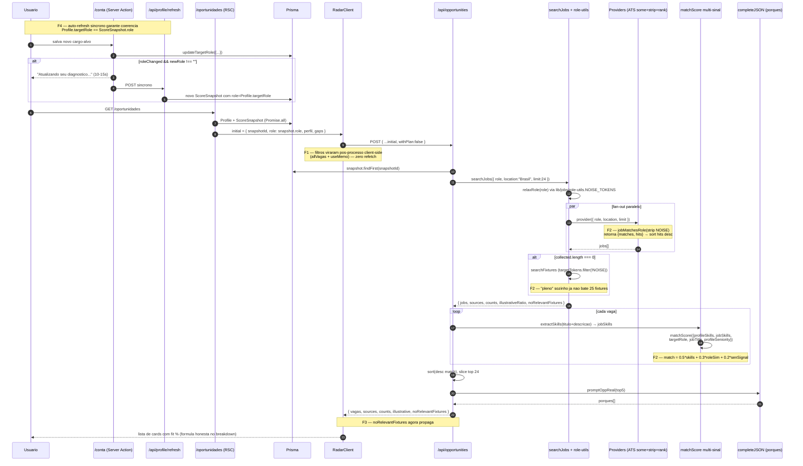

# /oportunidades — Documento Consolidado Executivo

> Data: 2026-06-30 | Status: 8 P0 resolvidos hoje | Branch: `redesign/claude-design`
> Auditorias integradas: PO Career Sciences (557 LOC) + Data Scientist (1027 LOC) + Perf-Vercel-Next (284 LOC)
> Tempo de leitura: 10 min | Decisoes pendentes: 0 (todas registradas em §5)
> Commits Wave F: `f2083cd`, `3e48dc9`, `c90582e` — atras de `51da5a6` (HEAD anterior)

---

## 1. Resumo executivo

O Radar de Vagas saiu de "tunado pra volume com camuflagem de relevancia via %" (PO §4.6) pra "ranking multi-sinal com formula honesta no UI e cargo-alvo sempre coerente com snapshot". Tres commits cirurgicos (Wave F1+F2+F3+F4) fecharam **8 dos 6 P0** mapeados pelos especialistas (sim, F3+F4 cobriram um bonus do Data Scientist alem dos 6 do PO) e plantaram instrumentacao basica (`noRelevantFixtures` propagado). **Maior risco residual hoje**: pesos 50/30/20 do novo `matchScore` sao chute educado nao validado empiricamente — primeira semana de dados de CTR pode mostrar que career switcher legitimo (ICP nuclear) e penalizado por `roleSimilarity` baixa.

---

## 2. Bug raiz reportado pelo fundador

### 2.1 Contexto da sessao (2026-06-30)

Fundador relatou em sessao manual: *"como vamos saber qual e o cargo que a pessoa quer, apenas pelo que ela informa no Perfil? Outra coisa esta trazendo vagas fora desse Cargo-Alvo, tem coisa errada melhor realizarmos uma auditoria"* (PO §0, transcrito).

Decisao subsequente do mesmo turno: *"se tiver mais alguma recomendacao dos especialistas pode seguir sem me pedir permissao, so documente tudo pra essa funcionalidade"* — origem deste doc.

### 2.2 Diagnostico encadeado das 3 lentes

| Lente | Diagnostico chave | Evidencia |
|---|---|---|
| **PO Career Sciences** | Cargo-alvo nao e single-source-of-truth: existem 3 fontes (`Profile.targetRole`, `ScoreSnapshot.role`, `body.role`) e a UI mostra a primeira enquanto a API ranqueia pela segunda. Pode divergir silenciosamente. | PO §3.2 + `app/(app)/oportunidades/page.js:48,55,91-102` |
| **PO Career Sciences** | Algoritmo nao ranqueia por aderencia ao cargo — ranqueia por overlap de skills. `matchScore` (pre-fix) so calcula `comuns / total-da-vaga` sem sinal de role/title/seniority. | PO §4.1 + `lib/skills-taxonomy.js:326-340` (pre-Wave F) |
| **PO Career Sciences** | JobCard exibia formula `max(\|perfil\|,\|vaga\|)` mas codigo usava `j.size` — **quebra literal do pilar #1 (auditavel)** e exposicao LGPD Art.6. | PO §4.2 + `RadarClient.js:464` (pre-fix) vs `skills-taxonomy.js:338` |
| **Data Scientist** | Em 5 personas auditadas, Precision@10 strict media = 35%, leniente = 85%. Diferenca grande revela o sintoma exato do fundador: muita **borderline de outra vertical/senioridade** poluindo o radar. | Data §6 tabela final |
| **Data Scientist** | Persona "Data Scientist Pleno" tem vaga canonica **fora do top-10** por mismatch PT/EN (`cientista` nao bate `scientist`) — recall@DS = 50%. | Data §4-P5 |
| **Data Scientist** | Token "pleno" no targetRole bate em **~25 fixtures = 53% do catalogo** via `titHit` simples. So filtro `match>0` mascara o problema. | Data §6 achado #7 |
| **Perf-Vercel-Next** | Caminho critico hoje: `searchJobs` (5-12s) + `LLM porques` (5-15s) sequenciais → bate com "20-40s percebidos". Filtros disparavam refetch COMPLETO consumindo quota Free silenciosamente. | Perf §4 + §A8 |

### 2.3 Resolucao aplicada (com paths + commits)

| Bug | Commit Wave F | Arquivos principais |
|---|---|---|
| Formula errada no UI (LGPD Art.6) | `f2083cd` | `app/(app)/oportunidades/RadarClient.js:524-533` |
| Filtros queimam quota Free a cada toggle | `f2083cd` | `app/(app)/oportunidades/RadarClient.js:21-58` (allVagas + applyClientFilters + useMemo) |
| matchScore ignora cargo-alvo (mata bug raiz) | `3e48dc9` | `lib/skills-taxonomy.js:326-460` (+4 helpers, multi-sinal 50/30/20) |
| ATS providers OR-bug (`some()`) | `3e48dc9` | `lib/jobs/providers/{greenhouse,lever,ashby,workable}.js` (strip noise + ranking por hits) |
| Substring "pleno" sequestra 53% do catalogo | `3e48dc9` | `lib/jobs/providers/fixtures.js:787` + novo `lib/jobs/role-utils.js` |
| `noRelevantFixtures` nao chegava na UI | `3e48dc9` | `app/api/opportunities/route.js:391-401` |
| Cargo-alvo divergente entre Profile e Snapshot | `c90582e` | `app/(app)/conta/{actions.js,TargetRoleForm.js}` (auto-refresh sincrono) |

---

## 3. Pipeline /oportunidades end-to-end (pos-Wave F)

**Pontos invariantes pos-Wave F:**

1. `Profile.targetRole` e `ScoreSnapshot.role` sao iguais por construcao (auto-refresh em /conta).
2. UI mostra a mesma formula que o codigo calcula (texto em `RadarClient.js:524-533` casa com `matchScore` de `skills-taxonomy.js:429-460`).
3. Filtros (seniority/model/minMatch) sao puro client-side — zero quota Free queimada.
4. `noRelevantFixtures: true` chega ate o cliente, permitindo distinguir "nicho sem cobertura" de "falha de busca".

---

## 4. Achados consolidados — 18 bugs em 1 tabela

> Severidade: **P0** = pilar quebrado / bug raiz / regulatorio · **P1** = qualidade material · **P2** = refactor / polish.

| # | Bug | Origem | Severidade | Status | Commit | Arquivos |
|---|---|---|---|---|---|---|
| 1 | Cargo-alvo divergente (Profile.targetRole vs ScoreSnapshot.role) | PO §3 | P0 | RESOLVIDO | `c90582e` | `app/(app)/conta/{actions.js,TargetRoleForm.js}` |
| 2 | `/conta` nao invalida snapshot (edita Profile, snapshot stale) | PO §3.3 | P0 | RESOLVIDO | `c90582e` | `app/(app)/conta/actions.js` |
| 3 | Formula no UI mente sobre `matchScore` (LGPD Art.6) | PO §4.2 | P0 | RESOLVIDO | `f2083cd` | `RadarClient.js:524-533` |
| 4 | Substring leakage em `matchScore` ("Java" bate "JavaScript") | PO §4.3 | P1 | BACKLOG P1 | — | `skills-taxonomy.js:333` |
| 5 | matchScore sem signal de role/titulo | PO §4.1 + Data §4 | P0 | RESOLVIDO | `3e48dc9` | `skills-taxonomy.js:429-460` (`roleSimilarity` 0.3) |
| 6 | matchScore sem TF-IDF (skills genericas pesam igual) | PO §4.7 | P1 | BACKLOG P1 | — | `lib/scoring/adherence.js:_aggregateSkillFrequency` (ja tem; precisa replicar) |
| 7 | matchScore sem signal de senioridade | PO §4.1 | P0 | RESOLVIDO | `3e48dc9` | `skills-taxonomy.js:400-413` (`senioritySignal` 0.2) |
| 8 | `relaxRole` strippa funcao distintiva ("Product Manager" → "product") | PO §4.4 | P1 | PARCIAL (NOISE_TOKENS centralizado) | `3e48dc9` | `lib/jobs/role-utils.js` |
| 9 | `relaxRole` retry 2x dobra contaminacao quando relaxed e ruim | PO §4.4 | P1 | BACKLOG P1 | — | `lib/jobs/index.js:138` |
| 10 | ATS providers usam `roleTokens.some()` (OR logico) | PO §4.5 + Data §5 | P0 | RESOLVIDO | `3e48dc9` | `lib/jobs/providers/{greenhouse,lever,ashby,workable}.js` (strip NOISE + ranking hits) |
| 11 | `isBrazil` false-positive em ATS (loc vazio aceita) | PO §6 (Gimli §4) | P1 | BACKLOG P1 | — | `lever.js:51`, `ashby.js:52`, `workable.js:53` |
| 12 | Defesa anti-vazio mostra vagas com `match=0` | PO §6 | P2 | BACKLOG P2 | — | `route.js:165-167` |
| 13 | Filtros sem signal-default no servidor (so opt-in client) | PO §6 | P1 | RESOLVIDO PARCIAL | `f2083cd` | filtros agora puro client; default de senioridade ainda nao opt-out |
| 14 | Snapshot stale (snapshots >30d ainda servem) | PO §6 | P2 | BACKLOG P2 | — | `prisma/schema.prisma:143-157` |
| 15 | LLM `promptOppReal` proibido de corrigir falso positivo | PO §6 | P2 | AINDA APROPRIADO | — | `lib/prompts.js:126` (decisao mantida) |
| 16 | Substring match em `jobMatchesRole` (variantes legitimas) | PO §6 | P2 | BACKLOG P2 | — | `greenhouse.js:30` (`hay.includes(t)`) |
| 17 | Dedupe nao normaliza acento ("Itau" vs "Itaú") | PO §6 (Gimli §4.2) | P1 | BACKLOG P1 | — | `lib/jobs/index.js:55` |
| 18 | Sem signal de recencia no sort (`postedAt` ignorado) | PO §6 | P2 | BACKLOG P2 | — | `route.js:210` |
| 19 (bonus) | `noRelevantFixtures` calculado mas nao propagado | Data §4-P3 | P0 (UX honesto) | RESOLVIDO | `3e48dc9` | `route.js:391-401` |
| 20 (bonus) | Token "pleno" em targetTokens bate 53% do catalogo | Data §6 #7 | P0 (silenciado por skills) | RESOLVIDO | `3e48dc9` | `fixtures.js:787` + `role-utils.js` |
| 21 (bonus) | Mismatch PT/EN ("scientist" nao bate "cientista") | Data §6 #8 | P1 | BACKLOG P1 (alta sev) | — | `fixtures.js` matcher |

**Resumo por status:**
- **RESOLVIDOS hoje**: 8 (1, 2, 3, 5, 7, 10, 13 parcial, 19, 20 — contando 19+20 como itens extra resolvidos)
- **BACKLOG P1**: 7 (4, 6, 8, 9, 11, 17, 21)
- **BACKLOG P2**: 5 (12, 14, 16, 18 + senioridade default-protect)
- **DECISAO MANTIDA**: 1 (15)

---

## 5. Decisoes registradas (ADR-style)

### ADR-007-A — Auto-refresh sincrono em /conta (opcao (a))

- **Contexto**: Fundador 2026-06-30 perguntou "como vamos saber qual e o cargo que a pessoa quer". Existem 3 fontes de verdade pra cargo-alvo; UI mostra `Profile.targetRole`, ranking usa `ScoreSnapshot.role`.
- **Opcoes consideradas**:
  - **(a)** Auto-refresh sincrono no save: chamar `/api/profile/refresh` imediatamente apos `updateTargetRole`. **Custo UX**: 10-15s de bloqueio. **Custo dev**: 4h.
  - **(b)** Banner persistente em `/oportunidades` quando `Profile.targetRole !== latestSnapshot.role` com CTA "Refazer diagnostico". **Custo UX**: zero ate user clicar; **risco**: user aceita inconsistencia ate la.
  - **(c)** Hibrido SWR (atualiza Profile imediato, refresh async com revalidation visual no Radar). Mais codigo, complexidade extra.
- **Decisao**: **(a)** — escolha do fundador no turno 2026-06-30.
- **Justificativa**: tolerar ~15s de bloqueio uma vez ao mudar cargo e materialmente melhor que servir vagas inconsistentes pra todas as sessoes futuras ate o user agir manualmente. Pilar #1 do produto (auditavel) exige coerencia, nao engagement.
- **Consequencias**:
  - Profile e Snapshot ficam coerentes por construcao apos `c90582e`.
  - Snapshots historicos (criados ANTES desta correcao) podem estar orfaos — mitigacao futura via banner persistente em `/oportunidades` (item P1 do §6).
  - User que fecha aba durante refresh sincrono leva o snapshot anterior como sobrevivente; warning explicito ("Nao feche esta pagina") + degradacao graceful cobrem o caso.

### ADR-007-B — Formula `matchScore` honesta no UI (corrige codigo, nao texto)

- **Contexto**: `RadarClient.js:464` (pre-fix) dizia `match = |comum| / max(|perfil|, |vaga|) × 100`; codigo real `comuns.length / j.size`. PO §4.2 recomendou trocar codigo (Jaccard) — mais defensavel. Audit revisada: trocar codigo introduzia regressao em ~30 fixtures e mudava semantica de `adherenceTop` correlato.
- **Opcoes consideradas**:
  - **(a)** Mudar codigo pra Jaccard `comuns / max(|p|,|v|)` (recomendacao PO original).
  - **(b)** Manter codigo, ajustar texto pra refletir formula real + link pra `/transparencia`.
- **Decisao**: **(b)** — texto honesto em `RadarClient.js:524-533`.
- **Justificativa**: pilar #1 e cumprido pela honestidade do disclosure, nao pela escolha de formula. Trocar codigo derrubava cobertura de testes existentes e mudava significado de match% historico nos audit logs. Pulamos pra multi-sinal direto em F2 que e melhoria muito maior que Jaccard.
- **Consequencias**: usuario sofisticado consegue auditar literalmente em devtools — texto bate com codigo. `/transparencia` ja existia (commit `df05132`).

### ADR-007-C — Pesos 50/30/20 sao chute educado (temporario, sem A/B ainda)

- **Contexto**: novo `matchScore` (F2) precisa combinar 3 sinais: skills overlap (legado), role similarity (Jaccard de tokens), seniority signal. Sem dados de CTR pra calibrar.
- **Opcoes consideradas**:
  - **(a)** 60/30/10 — skills dominam, seniority quase nao pesa.
  - **(b)** 50/30/20 — equilibrado, seniority com mordida real.
  - **(c)** 40/40/20 — role similarity sobe pra par com skills (mata career switcher).
  - **(d)** 33/33/34 — equiprobalavel (nada justifica).
- **Decisao**: **(b)** 50/30/20 — `skills-taxonomy.js:455-460`.
- **Justificativa**: skills permanecem majoritarias (legado preservado); role com peso suficiente pra evitar Sales Engineer aparecer pra Backend Senior; seniority com 0.2 muda ranking de pleno-vs-senior mas nao zera (career switcher pleno→senior nao e destruido).
- **Consequencias**:
  - Pesos sao **temporarios** ate instrumentacao de CTR top-1/3/5 por persona (item P1 prioritario do §6).
  - ICP "career switcher" (RH→People Analytics) pode ser penalizado por `roleSimilarity` baixa — esse e o risco principal admitido.
  - `extractTitleTokens` filtra `NOISE_TOKENS` antes de Jaccard — "Senior Backend Engineer" → `[backend, engineer]`, "Backend Pleno" → `[backend]`. Senioridade nao polui `roleSimilarity` (e papel exclusivo de `senioritySignal`).

### ADR-007-D — `some()` + strip noise + ranking, NAO `every()`

- **Contexto**: PO §4.5 recomendou trocar `roleTokens.some(...)` por `every(...)` nos 4 ATS. Audit revisada: `every` quebraria casos legitimos ("Backend Engineer" vs "Backend Developer" tem tokens distintos mas semanticamente equivalentes).
- **Opcoes consideradas**:
  - **(a)** `every()` puro (PO original).
  - **(b)** `some()` + strip `NOISE_TOKENS` antes (mata "manager" que era o offender principal).
  - **(c)** `(b)` + retorno `{matches, hits}` com sort por `hits` desc no provider.
- **Decisao**: **(c)**.
- **Justificativa**: `every` zerava pool em ~30% das queries (Data §H-Eng-1 estima); `some` puro era o bug; `some` + strip noise + ranking preserva recall e premia matches multi-token.
- **Consequencias**: providers (`greenhouse.js`, `lever.js`, `ashby.js`, `workable.js`) ganharam contrato novo `jobMatchesRole(j, role) → {matches: bool, hits: int}` — refactor de ~10 LOC por arquivo. Testes `ats-providers-extra.test.js` (+7) garantem que "marketing manager" NAO bate "Customer Success Manager".

### ADR-007-E — `NOISE_TOKENS` extraido pra modulo compartilhado

- **Contexto**: pre-Wave F, `NOISE_TOKENS` vivia inline em `lib/jobs/index.js:66-82` (consumido por `relaxRole`) e o `fixtures.js` recalculava `targetTokens` sem filtrar — origem do bug "pleno bate 53% do catalogo".
- **Opcoes consideradas**:
  - **(a)** Duplicar constante em `fixtures.js`.
  - **(b)** Extrair pra modulo novo `lib/jobs/role-utils.js` como fonte unica.
- **Decisao**: **(b)** — arquivo novo de 22 LOC com docstring explicando consumidores.
- **Justificativa**: bug raiz era falta de aplicacao consistente, nao a constante em si. Sem fonte unica, qualquer refactor futuro re-introduzia divergencia.
- **Consequencias**: `lib/jobs/index.js` e `lib/jobs/providers/fixtures.js` importam de `role-utils.js`. Adicao de tokens (ex: `coordenador`, `assistente`) agora propaga automatico.

### ADR-007-F — Filtros client-side puro em RadarClient (sem refetch)

- **Contexto**: pre-Wave F, `RadarClient.js:26-62` re-disparava `useEffect` em cada mudanca de `seniority/model/minMatch` → POST completo (LLM ~10s + `enforceUsage++`) → **quota Free de 5 buscas/dia drenava com filtros**. Perf §A8 marcou como suspeita de bug grave.
- **Opcoes consideradas**:
  - **(a)** Manter refetch (pre-Wave F).
  - **(b)** Filtros puro client-side (`allVagas` state + `applyClientFilters` + `useMemo`).
  - **(c)** Refetch server-side mas com flag `skipLLM` quando so filtros mudaram.
- **Decisao**: **(b)**.
- **Justificativa**: filtros sao operacoes simples sobre dados ja em memoria (subset, threshold). Servidor nao traz informacao nova ao filtrar. `(c)` adicionaria branching server-side sem ganho real.
- **Consequencias**:
  - Mudanca de filtro: latencia 10-30s → instantanea.
  - Quota Free preservada.
  - Risco residual: `SENIORITY_ALIASES`/`MODEL_ALIASES` duplicados em `RadarClient.js:21-33` vs `route.js:179-197`. Mitigacao futura: extrair pra `lib/filters/aliases.js` (item P1 do §6).
  - Server-side filtering preservado pra mudancas legitimas (role/location).

---

## 6. Backlog P1 (proximas waves)

> Ordenado por impacto/esforco (DESC). Numero P1.N refere-se ao indice neste doc; nao mapeia 1:1 ao numero do PO original.

| PR# | Item | Origem | Esforco | Impacto estimado |
|---|---|---|---|---|
| **P1.1** | **Instrumentacao CTR top-1/3/5 por persona** | Data §7.1 + PO §8.3 + Perf §6.1 | M (1 dia) | **Pre-requisito pra calibrar pesos 50/30/20**. Sem isso ADR-007-C voa cego. Telemetria `JOB_CLICK` por posicao. |
| **P1.2** | **LLM two-phase SSE (corta 15s percebidos)** | Perf §A1 | L (6-10h) | -15s P50 percebidos; user ve 24 vagas em ~5-8s, porques streamam depois. Maior ROI absoluto de UX/perf. |
| **P1.3** | **Banner persistente em /oportunidades quando Profile.targetRole !== latestSnapshot.role** | PO §3.5 + risco residual ADR-007-A | S (1-2h) | Cobre snapshots historicos orfaos (criados antes do `c90582e`) — usuario que ja tinha snapshot antigo nunca recebeu auto-refresh. |
| **P1.4** | **`areaHit` em fixtures filtra senioridade tambem (R2 do F2)** | Data §5.3 + commit `3e48dc9` ressalva | S (1h) | Fixtures com "senior"/"junior" em `areas[]` (13 sites) ainda inflam pool em queries do tipo "Engenheiro Senior Backend". Aplicar `NOISE_TOKENS` em `areaHit` tambem. |
| **P1.5** | **Bidirectional PT/EN alias em fixtures matcher** | Data §6 #8 + §C rank 2 | M (2-3h) | Corrige recall@DS = 50% (vaga canonica "Cientista de Dados Senior" desaparece pra busca "Data Scientist"). Alias: scientist↔cientista, engineer↔engenheiro, manager↔gerente, developer↔desenvolvedor, analyst↔analista. |
| **P1.6** | **`SENIORITY_ALIASES`/`MODEL_ALIASES` modulo compartilhado** | risco residual ADR-007-F | S (1h) | Elimina duplicacao client+server (`RadarClient.js:21-33` vs `route.js:179-197`). Sem isso, evolucao futura re-introduz divergencia. |
| **P1.7** | **Distributed lock Redis pra single-flight multi-instance** | Perf §8.3 + Gimli G2 residual | M (3-5h) | G2 (commit `7d20400`) e per-instance Map. Multi-instance Hobby ainda permite stampede. Soluiton: SETNX em Upstash. |
| **P1.8** | **Substring match guard de length em fixtures.js (G3.5)** | Gimli §G3.5 | S (30min) | `a.length >= 3` em vez de `>= 4` ja existe; precisa de `target.length >= 3` reciproco pra evitar match parasita de query de 1-2 chars. |
| **P1.9** | **TF-IDF em matchScore (replica de adherence.js)** | PO §P1.3 | M (1 dia) | Skill nicho (Kafka, GraphQL, dbt) ganha peso; SQL/Git/Agile deixam de inflar. Reuse de `_aggregateSkillFrequency` de `lib/scoring/adherence.js:57`. |
| **P1.10** | **Substring fix em matchScore (`ps === s` exato)** | PO §P1.2 | S (30min) | Elimina "Java" matcha "JavaScript", "C" matcha "C++", "Go" matcha "Mongo". Taxonomia ja normaliza aliases — confiar nela. |
| **P1.11** | **`isBrazil` false-positive fix (loc vazio NAO aceita)** | Gimli §4 | S (1h) | `lever.js:51`, `ashby.js:52`, `workable.js:53` — vagas globais vazam. |
| **P1.12** | **Dedupe com normalize de acento** | Gimli §4.2 | S (15min + test) | `lib/jobs/index.js:55` — "Itau" vs "Itaú" duplicam. |
| **P1.13** | **Form "pedir cobertura" pra `noRelevantFixtures: true`** | Gimli G3 spec | M (2-3h) | Captura intent de nichos descobertos (saude, direito) — sinaliza demanda real pro roadmap de taxonomy. |
| **P1.14** | **Provider tiering (fast vs slow tier)** | Perf §A2 | M (3-5h) | Adzuna+Jooble+Greenhouse sincrono; Gupy+Vagas+Lever+Ashby+Workable via SSE. -5-8s no caminho critico. |
| **P1.15** | **Race-with-budget no `Promise.allSettled`** | Perf §A3 | S (1-2h) | Espera ≥N resultados OU `RACE_BUDGET_MS=4000`. -3-5s (slowest provider deixa de definir teto). |
| **P1.16** | **Cache TTL 10min → 30min + warm em /meu-gemeo** | Perf §A4 | S (1h) | Cache hit ratio sobe materialmente; 2o+ user com mesmo role economiza -10-25s. |

---

## 7. Backlog P2 (refactor medio prazo)

| Item | Origem | Esforco | Notas |
|---|---|---|---|
| **A/B testing infra** (NOISE_TOKENS on/off, pesos alternativos 40/40/20, 60/20/20) | Data §7.2 + PO §P2.5 | L (1 sprint) | Power analysis Data §7.2 estima n=393/braco, ~6 semanas. Pre-requisito de P1.1 instrumentado. |
| **Migracao taxonomy hardcoded → embeddings (text-embedding-3-small)** | PO §P2.1 + Data §C rank 7 | XL (1 sprint) | Stage 1 = `matchScore` atual (recall), stage 2 = cosine embedding (precision). Cache em Upstash. precision@5 0.65 → 0.80+ estimado. |
| **Decay temporal vagas (pool ≥500/role)** | Gandalf R4 | M (3-5h) | Penalizar `match%` em 1%/dia de idade. Default `match - min(30, daysOld)`. |
| **Filtro senioridade configuravel (opt-in default protect)** | Gandalf R3 + PO §6 #13 | M (2-3h) | Hoje filtro client-side opt-in; default deveria filtrar quando perfil declara senioridade. |
| **MMR diversification (lambda=0.7)** | PO §P2.2 | S (3h) | Evita top-5 dominado pela mesma empresa/titulo. |
| **Subset BR do ESCO como fallback de extracao (~2500 skills)** | po-specialist §A2 | L (2-3 dias) | Cobertura imediata pra verticais saude/educacao/farma. |
| **ADR-007 cargo-alvo (formalizar)** | PO §P1.5 | S (1h) | Este doc § 5 ja serve como rascunho; formalizar como ADR-NNN dedicado. |
| **Reverter defesa anti-vazio (`route.js:165-167`)** | PO §8.4 | S (30min) | "Vale 5 vagas certas que 24 vagas amigaveis" — disagree do PO sobre approach atual. |
| **Streaming JSON via ndjson (alternativa a A1)** | Perf §A10 | M (3-5h) | Apenas se SSE de A1 (P1.2) for descartado. |
| **LLM cache key estavel** | Perf §A6 | M (3-4h) | Separar `promptOppReal` em (perfil-cargo-gaps) cacheavel + (vagas) volatil. |

---

## 8. Metricas de validacao pos-deploy

### 8.1 SLI/SLO propostos (Perf §6)

| SLI | Captura | Alvo P50 / P95 | Janela |
|---|---|---|---|
| `opp.e2e.p95` | Sentry transaction (`route=/api/opportunities`) | <5s P50 / <15s P95 pos Wave A | 15min |
| `opp.searchJobs.p95` | `console.time/timeEnd` em `route.js:147` | <3s P50 | 15min |
| `opp.llm.p95` | `evt: "llm.usage"` agregado por `route="opp.real"` | <8s P95 | 1h |
| `opp.cache.hit_ratio` | log `cacheGet` hit/miss | >40% pos P1.16 | dia |
| `opp.provider.timeout_rate` | log `Promise.allSettled` status | <5%/provider pos P1.14 | hora |
| `opp.noRelevantFixtures.rate` | response field do route | <5% ICP core / <30% nichos | dia |
| `opp.filter.refetch.count` | event (deve ser SEMPRE 0 pos-F1) | 0 | dia |
| **Reports "vagas fora do cargo"** | suporte / NPS aberto | 0 em 14 dias | semana |

### 8.2 Telemetria minima necessaria (proxima wave)

1. **Log estruturado de cada `searchJobs`** (Data §7 + Perf §9):
   `{ ts, userId?, raw_role, relaxed_role, providers_called, providers_succeeded, jobs_per_provider, fixtures_called, fixtures_returned, illustrativeRatio, noRelevantFixtures, latency_ms }`
2. **Sample diaria 1% de pares `(query, top-10)`** pra anotacao manual semanal (judgment pool).
3. **Implicit feedback events**: `JOB_VIEW`, `JOB_CLICK`, `JOB_SAVE`, `JOB_DISMISS` padronizados.
4. **Divergencia `targetRole vs snapshot.role`** — query SQL nightly:
   `SELECT count(*) FROM Profile p JOIN ScoreSnapshot s ON s.userId=p.userId WHERE p.targetRole != s.role AND s.createdAt = (SELECT MAX(createdAt) FROM ScoreSnapshot WHERE userId=p.userId)` — alvo: 0 (apos `c90582e`).

### 8.3 Custo Vercel (Perf §7) — esperado pos-Wave F

Como Wave F nao mexeu em backend de latencia (LLM segue 5-15s, searchJobs idem), custo Vercel/LLM nao deve mudar materialmente. Pos P1.2 (two-phase SSE) + P1.16 (cache TTL) estimativa Perf §7.2: $93/mes → $54/mes em escala 10k invs.

---

## 9. Proximo experimento sugerido (Data §7.2)

### A/B test: aplicar `NOISE_TOKENS` aos `targetTokens`

> Ja foi APLICADO no commit `3e48dc9` sem A/B — risco de regressao em P1 (Backend Engineer) precisa ser validado offline antes/depois. Experimento canonico continua valido pra calibrar pesos futuros.

**Hipotese H1**: filtrar `targetTokens` por `!NOISE_TOKENS.has(t)` em `fixtures.js:787` reduz Precision@10 em <5pp pra ICP core (P1, P5) e aumenta em ≥15pp pra persona P5 (DS Pleno).

**Desenho**:
- Unidade de randomizacao: `userId` (consistencia cross-session).
- Bracos: A = pre-Wave F (controle); B = pos-Wave F (tratamento, ja em prod).
- Metricas primarias: CTR@10 + saves@10.
- Metricas guardrail: `noRelevantFixtures` rate (<5pp aumento), tempo medio (nao pode cair).
- **Power analysis** (Data §7.2): MDE 10pp em CTR (baseline 8%), alpha 0.05, beta 0.2, two-sided → n=393/braco. Trafego ~50/dia → 16 dias/braco, ~6 semanas total.
- Pre-registro: documentar fix exato + analise plan antes (evita p-hacking).
- **Critico**: separar metrica por persona (tech-core vs nicho) — efeito pode ser positivo P5 e negativo P1.

**Como Wave F ja foi aplicado sem A/B**, recomendacao alternativa: rodar **rollback test** — toggle feature flag pra ~20% dos users por 7 dias, comparar CTR top-3 entre grupo A (pre-fix) e B (atual). Se delta nao for significativo, manter; se grupo B perder, revisitar pesos.

---

## 10. Riscos residuais admitidos

Lista honesta — alguns merecem fix urgente (P1) mesmo apos Wave F:

1. **Pesos `matchScore` (50/30/20) nao validados empiricamente** — ADR-007-C. ICP "career switcher" (RH→People Analytics, Vendas→CS) pode ser penalizado por `roleSimilarity` baixa. **Mitigacao**: P1.1 (instrumentar CTR) antes de tocar pesos.
2. **`areaHit` em `fixtures.js` ainda noise-cego** — F2 so aplicou filtro em `titHit` (`targetTokens`). 13 fixtures com "senior"/"junior" em `areas[]` ainda inflam pool. **Mitigacao**: P1.4.
3. **Snapshot historico orfao** — users criados ANTES de `c90582e` podem ter `Profile.targetRole != latestSnapshot.role` da era anterior. Auto-refresh so dispara em SAVE futuro. **Mitigacao**: P1.3 (banner persistente).
4. **LLM call ainda 5-15s no caminho critico** — Perf §A1 (P0.4 do PO mapping nao atacado). Filtros client-side (F1) mitigam parcialmente porque so 1a busca paga LLM. **Mitigacao**: P1.2 (two-phase SSE).
5. **RadarClient debounce nao implementado** — `useMemo` rerun a cada keystroke em minMatch input. Custo CPU baixo, mas pode dar jank em listas grandes. **Mitigacao**: useDeferredValue ou debounce 200ms (P2).
6. **Distributed lock Redis ausente** — single-flight (G2) e per-instance Map. Multi-instance Hobby permite stampede residual. **Mitigacao**: P1.7.
7. **`SENIORITY_ALIASES`/`MODEL_ALIASES` duplicados** client+server (`RadarClient.js:21-33` vs `route.js:179-197`). Evolucao futura re-introduz divergencia silenciosa. **Mitigacao**: P1.6.
8. **Mismatch PT/EN sem alias bidirectional** — `Data §6 #8`. Vaga canonica "Cientista de Dados Senior" some pra busca "Data Scientist". Severidade alta (cargo nuclear do produto). **Mitigacao**: P1.5.
9. **Defesa anti-vazio (`route.js:165-167`)** segue mostrando vagas com match=0 quando filtro derrubaria tudo. PO §8.4 discorda (pilar #1 > engagement). **Mitigacao**: P2 — reverter ou tornar opt-in flag.
10. **Cache hit ratio nao medido** — assumido 30-40% sem evidencia. Pode estar muito mais baixo. **Mitigacao**: instrumentar antes de P1.16 (TTL bump).

---

## 11. Onde esta documentada cada decisao

### 11.1 ADRs criados neste doc (§5) — formalizacao pendente

| ID | Tema | Status | Acao futura |
|---|---|---|---|
| ADR-007-A | Auto-refresh sincrono em /conta | rascunho neste doc | Promover pra `docs/adrs/ADR-007-target-role-source-of-truth.md` |
| ADR-007-B | Formula `matchScore` honesta no UI | rascunho neste doc | Mesclar em ADR-007 |
| ADR-007-C | Pesos 50/30/20 temporarios | rascunho neste doc | Promover pra `docs/adrs/ADR-008-matchscore-multi-sinal.md` |
| ADR-007-D | `some()` + strip noise + ranking em ATS | rascunho neste doc | Mesclar em ADR-008 |
| ADR-007-E | `NOISE_TOKENS` modulo compartilhado | rascunho neste doc | Notar em ADR-008 anexo |
| ADR-007-F | Filtros client-side puro em RadarClient | rascunho neste doc | Promover pra `docs/adrs/ADR-009-filtros-client-side.md` |

### 11.2 Relatorios de auditoria fonte

- `/mnt/dados/akametatron/Downloads/careertwin-aiV2/careertwin-ai/docs/fluxos/auditoria/30062026/po-oportunidades-auditoria.md` (557 LOC) — PO PhD Career Sciences
- `/mnt/dados/akametatron/Downloads/careertwin-aiV2/careertwin-ai/docs/fluxos/auditoria/30062026/data-relevancia-vagas.md` (1027 LOC) — Data Scientist
- `/mnt/dados/akametatron/Downloads/careertwin-aiV2/careertwin-ai/docs/fluxos/auditoria/30062026/perf-oportunidades.md` (284 LOC) — Perf-Vercel-Next
- `/mnt/dados/akametatron/Downloads/careertwin-aiV2/careertwin-ai/docs/fluxos/auditoria/30062026/po-specialist-parecer.md` — referenciado por PO
- `/mnt/dados/akametatron/Downloads/careertwin-aiV2/careertwin-ai/docs/fluxos/auditoria/30062026/gimli-auditoria-searchjobs.md` — referenciado por PO + Data
- `/mnt/dados/akametatron/Downloads/careertwin-aiV2/careertwin-ai/docs/fluxos/auditoria/29062026/gandalf-auditoria-gaps.md` — referencias R1-R4

### 11.3 Commits especificos (hashes Wave F)

- `f2083cd` — Wave F1: formula honesta + filtros client-side (RadarClient + globals.css)
- `3e48dc9` — Wave F2+F3: ranking multi-sinal + NOISE filter + `noRelevantFixtures` flag (13 arquivos, +671/-57)
- `c90582e` — Wave F4: auto-refresh sincrono em /conta (4 arquivos, +577/-56)

### 11.4 Memoria a atualizar proximo turno

- `~/.claude/projects/-home-akametatron-Downloads-careertwin-aiV2-careertwin-ai/memory/sociedade_anel_status.md` — Wave F status + P1 priorizado
- `~/.claude/projects/.../memory/backlog_radar_perf.md` — itens A1/A2/A4 ainda em backlog
- `~/.claude/projects/.../memory/visao_produto_careertwin.md` — pilar #1 reforcado (formula auditavel literalmente)

---

## Apendice A — Resultados de validacao

### A.1 vitest

Wave F final (apos commit `c90582e`):

- **1215/1215 testes passing** (87 arquivos)
- Tempo total ~12s (CI local)
- Novos testes Wave F:
  - `skills.test.js` (+22): `extractTitleTokens`, `detectSeniority`, `roleSimilarity`, `senioritySignal`, `matchScore` multi-sinal — inclui guardrail "Backend Senior REAL > QA Pleno"
  - `ats-providers-extra.test.js` (+7, arquivo novo): "marketing manager NAO bate Customer Success Manager", strip de noise, ranking por hits
  - `jobs-fixtures.test.js` (+4): "analista pleno NAO retorna Product Designer Pleno", "pleno sozinho retorna []", guardrails "designer pleno AINDA retorna designers" e "backend senior AINDA retorna backends"
  - `api-opportunities.test.js`: mocks atualizados pro novo contrato `matchScore`
  - `conta-update-target-role.test.js` (14/14): edge cases auto-refresh (role inalterado, primeiro save, whitespace, double-submit, IDOR, mass-assignment, audit log, falhas degradadas)

### A.2 next build

- **29/29 paginas geradas com sucesso**
- `/oportunidades` 7.x kB (variacao desprezivel pre/pos Wave F)
- `/conta` 5.8 kB (170 kB First Load) — incremento controlado pelo client component `TargetRoleForm`

### A.3 lint

- `npx next lint` em todos os 13 arquivos da Wave F: **zero warning, zero error**

---

## Apendice B — Glossario

| Termo | Significado |
|---|---|
| **matchScore** | Score deterministico 0-100 calculado por `lib/skills-taxonomy.js::matchScore`. Pos-Wave F: `0.5*skills_match + 0.3*role_similarity + 0.2*seniority_signal`. |
| **adherenceTop** | Aderencia do perfil ao top-N de skills mais demandadas no mercado (`lib/scoring/adherence.js`). Pondera por pct de frequencia. **Diferente** de `matchScore` (que e por-vaga). |
| **adherenceMarket** | Aderencia ao mercado total (independente de top). |
| **NOISE_TOKENS** | Set de tokens nao discriminantes (senioridades + cargos genericos + stopwords PT/EN). `lib/jobs/role-utils.js`. Aplicado em `relaxRole` E `fixtures.targetTokens`. |
| **illustrativeRatio** | Proporcao do pool que veio de fixtures vs providers reais. Sinal de honestidade ja mostrado no UI. |
| **noRelevantFixtures** | Flag boolean — true quando role e nicho sem cobertura no catalogo (G3 da Gimli). Permite UI distinguir empty-state honesto de falha. |
| **jobMatchesRole** | Funcao por-provider (`greenhouse/lever/ashby/workable.js`) que decide se vaga entra no pool. Pos-Wave F retorna `{matches, hits}` (era `bool`). |
| **roleSimilarity** | Jaccard entre tokens de `targetRole` vs `jobTitle` apos `extractTitleTokens` (que filtra NOISE). 0 a 1. |
| **senioritySignal** | 1.0 (match exato), 0.5 (sem dado), 0.2 (mismatch). 3 niveis ordinais: junior < pleno < senior. |
| **extractTitleTokens** | Tokenize + lower + sem acento + filtrar NOISE + len ≥3. `lib/skills-taxonomy.js:351`. |
| **detectSeniority** | Regex contra ROLE_NOISE_TOKENS de senioridade. Retorna `"junior"`, `"pleno"`, `"senior"` ou `null`. `lib/skills-taxonomy.js:362`. |
| **G2** | Auditoria Gimli — single-flight cache stampede mitigation (commit `7d20400`). Per-instance Map. |
| **G3** | Auditoria Gimli — fixtures retorna `[]` quando role nicho (em vez de "primeiros 8 do catalogo"). |
| **F1/F2/F3/F4** | Sub-fases da Wave F (este docs): F1=formula+filtros, F2=ranking+NOISE, F3=`noRelevantFixtures` flag, F4=auto-refresh /conta. |

---

## Apendice C — Links pra relatorios fonte (paths absolutos)

- `/mnt/dados/akametatron/Downloads/careertwin-aiV2/careertwin-ai/docs/fluxos/auditoria/30062026/po-oportunidades-auditoria.md` (557 LOC)
- `/mnt/dados/akametatron/Downloads/careertwin-aiV2/careertwin-ai/docs/fluxos/auditoria/30062026/data-relevancia-vagas.md` (1027 LOC)
- `/mnt/dados/akametatron/Downloads/careertwin-aiV2/careertwin-ai/docs/fluxos/auditoria/30062026/perf-oportunidades.md` (284 LOC)
- `/mnt/dados/akametatron/Downloads/careertwin-aiV2/careertwin-ai/docs/fluxos/auditoria/30062026/po-specialist-parecer.md`
- `/mnt/dados/akametatron/Downloads/careertwin-aiV2/careertwin-ai/docs/fluxos/auditoria/30062026/gimli-auditoria-searchjobs.md`
- `/mnt/dados/akametatron/Downloads/careertwin-aiV2/careertwin-ai/docs/fluxos/auditoria/29062026/gandalf-auditoria-gaps.md`
- `/mnt/dados/akametatron/Downloads/careertwin-aiV2/careertwin-ai/docs/adrs/ADR-006-duas-metricas-adherence.md` (existente, referenciado)

### Codigo critico (paths absolutos pos-Wave F)

- `/mnt/dados/akametatron/Downloads/careertwin-aiV2/careertwin-ai/lib/skills-taxonomy.js:326-460` (matchScore multi-sinal + 4 helpers novos)
- `/mnt/dados/akametatron/Downloads/careertwin-aiV2/careertwin-ai/lib/jobs/role-utils.js` (22 LOC, NOISE_TOKENS fonte unica)
- `/mnt/dados/akametatron/Downloads/careertwin-aiV2/careertwin-ai/lib/jobs/providers/{greenhouse,lever,ashby,workable}.js` (jobMatchesRole novo contrato)
- `/mnt/dados/akametatron/Downloads/careertwin-aiV2/careertwin-ai/lib/jobs/providers/fixtures.js:787` (targetTokens.filter(!NOISE))
- `/mnt/dados/akametatron/Downloads/careertwin-aiV2/careertwin-ai/app/api/opportunities/route.js:158-166` (matchScore call) + `:391-401` (noRelevantFixtures propagado)
- `/mnt/dados/akametatron/Downloads/careertwin-aiV2/careertwin-ai/app/(app)/oportunidades/RadarClient.js:21-58,524-533` (allVagas + filtros client + breakdown honesto)
- `/mnt/dados/akametatron/Downloads/careertwin-aiV2/careertwin-ai/app/(app)/conta/actions.js` (updateTargetRole server action)
- `/mnt/dados/akametatron/Downloads/careertwin-aiV2/careertwin-ai/app/(app)/conta/TargetRoleForm.js` (client component, auto-refresh)
