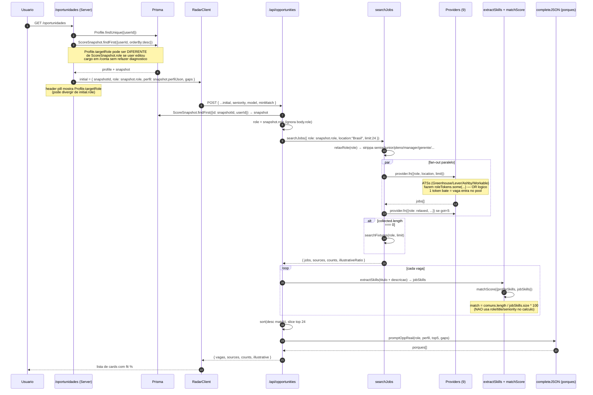
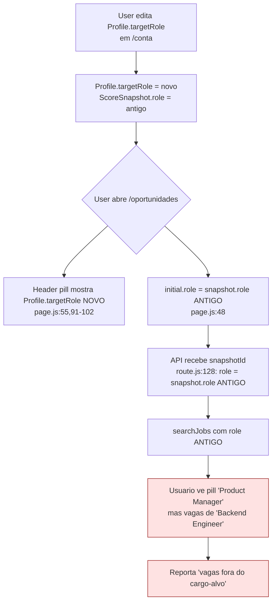

# PO-Career-Sciences — Auditoria: /oportunidades (Radar de Vagas)

> Data: 2026-06-30 · Escopo: cargo-alvo (source-of-truth) + algoritmo de ranking + relevancia subjetiva
> Status: research-only (nao edita codigo) · Lente: PO senior, PhD Career Sciences (LinkedIn TI / Lightcast / Revelo)
> Pergunta-mae do fundador: **"como vamos saber qual e o cargo que a pessoa quer, apenas pelo que ela informa no Perfil? Outra coisa esta trazendo vagas fora desse Cargo-Alvo, tem coisa errada melhor realizarmos uma auditoria"**

---

## 0. Tese executiva (3 linhas)

1. **O cargo-alvo NAO e single-source-of-truth** — existem 3 fontes (`Profile.targetRole` editavel, `ScoreSnapshot.role` snapshotada na hora do diagnostico, `body.role` do request) e a UI mostra a primeira enquanto a API ranqueia pela segunda. Pode divergir silenciosamente quando o usuario edita o cargo em `/conta` sem refazer diagnostico, e o Radar entao retorna vagas do role antigo com pill no header dizendo o role novo. Esse e o **bug raiz** do "vagas fora do cargo-alvo".
2. **O algoritmo NAO ranqueia por aderencia ao cargo, ranqueia por overlap de skills** — `matchScore` (`lib/skills-taxonomy.js:326-340`) calcula `comuns / total-da-vaga` sem nenhum sinal de role (title-match, seniority, taxonomia ocupacional). Combinado com `relaxRole` que strippa senioridade + termos-funcionais (`lib/jobs/index.js:66-82`) e providers ATS que fazem `roleTokens.some(...)` (OR logico), o sistema **e tunado pra volume, nao pra relevancia**. "Senior Backend Engineer" vira query "backend engineer" e qualquer vaga com "engineer" no titulo entra no pool — depois ranqueia pelo overlap de skills, que e enviesado pra perfis com skills genericas (SQL, Git, Agile).
3. **O JobCard explica uma formula que NAO existe no codigo** — `RadarClient.js:464` mostra ao usuario "match = |skills em comum| / max(|perfil|, |vaga|) × 100"; o codigo real (`skills-taxonomy.js:338`) e `comuns / |vaga|`. Isso quebra **literalmente** o pilar #1 do produto ("numero auditavel, sem caixa-preta") — disclosure errado e pior do que nenhum disclosure.

---

## 1. Funcionalidade (visao de produto)

### 1.1 O que `/oportunidades` entrega

- **Server component** (`app/(app)/oportunidades/page.js:13-59`) carrega `Profile` + `ScoreSnapshot` mais recente, redireciona pra `/dashboard` se faltar qualquer um dos dois, e renderiza header com a **pill do `Profile.targetRole`** + injeta `RadarClient` com `initial = { snapshotId, role: latestSnapshot.role, perfil: latestSnapshot.perfilJson, gaps }`.
- **Client component** (`app/(app)/oportunidades/RadarClient.js:26-62`) faz POST `/api/opportunities` no mount + re-fetch a cada mudanca de filtro (senioridade / modelo / minMatch). Envia `{...initial, seniority, model, minMatch, withPlan: false}`.
- **API** (`app/api/opportunities/route.js:27-388`) faz auth + rate-limit + enforcement de plano, carrega snapshot por `snapshotId` (override do body), chama `searchJobs({role, location:"Brasil", limit:24})`, enriquece cada vaga com `matchScore` deterministico, filtra `match>0` (com defesa anti-tela-vazia), aplica filtros UI, sort por match desc, top-5 vao pra LLM gerar "porques", retorna ao cliente.

### 1.2 Por que importa pro pitch ("numero auditavel, sem caixa-preta")

Radar e a **superficie mais visivel** do produto pra usuario logado depois do diagnostico — onde a promessa "vagas matched ao seu perfil" se materializa. Se o numero (% aderencia) bate em vagas obviamente erradas pro cargo-alvo, o pilar **#1** (auditavel) e o pilar **#3** (independencia editorial: "nao otimizamos pra conversao, otimizamos pra verdade") sao destruidos simultaneamente — porque o usuario interpreta "vaga errada com 78% de match" como **"o sistema esta otimizando volume"**, e a partir daqui ele desconfia de TODOS os numeros.

### 1.3 ICP que mais sofre se falhar

| ICP (concorrencia_landscape.md / visao_produto) | Por que o Radar quebra mais pra ele |
|---|---|
| **Career switcher de nicho** (RH→People Analytics, Vendas→CS, Fisio→Fisio Digital) | role nao bate em `ROLE_TO_SKILLS`; perfil esta em meio-caminho; o `relaxRole` strippa o termo distintivo ("People", "Customer Success") deixando so "analytics", "success" — vaga generica entra |
| **Profissional nao-tech 35-50** (Marketing, Finance, Compliance) | Skills do perfil tem muito overlap com vagas de tech (SQL, Excel, Git citados em vagas-tech tambem) — score artificialmente alto pra vagas erradas |
| **Profissional tecnico senior** (Engineer 10+ anos) | `relaxRole` joga fora "senior", "principal", "staff" — vaga junior aparece com match 85% porque cobre todas as skills do perfil |
| **Profissional fora das 20 categorias hardcoded** (Dentista, Advogado, Professor, Farmaceutico, Enfermeiro) | Adzuna/Jooble retornam zero ou ruido; fixtures retorna `[]` (Gimli G3); UI mostra empty-state honesto — funcionou (correto) |

---

## 2. Pipeline de dados (Mermaid)



---

## 3. Source-of-truth do cargo-alvo

### 3.1 Fontes possiveis no sistema

| # | Fonte | Local | Quem escreve | Quem le | Imutavel? |
|---|---|---|---|---|---|
| 1 | `Profile.targetRole` | `prisma/schema.prisma:104` (String?) | `/conta` server action (`app/(app)/conta/page.js:83-113`), `/api/analyze` (`app/api/analyze/route.js:319,330`), `/api/profile/refresh` (escreve role atual do profile) | Header pill (`page.js:55,91-102`), `/gaps`, `/api/cron/digest`, `/api/cron/daily-briefing`, `/api/profile/refresh` | nao — editavel |
| 2 | `ScoreSnapshot.role` | `prisma/schema.prisma:146` (String, NOT NULL) | `/api/analyze:339-358`, `/api/profile/refresh:525` (cada novo diagnostico) | `/oportunidades` page (`page.js:48`), API opp (`route.js:128`), `/gaps` | sim — append-only |
| 3 | `body.role` no POST | request body | `RadarClient` envia `initial.role` (= snapshot.role) | `route.js:96` — mas `route.js:128` faz `role = snapshot?.role \|\| roleIn` → snapshot vence quando ha `snapshotId` | depende |
| 4 | `latestSnapshot.perfilJson.cargo_atual` | snapshot JSON | LLM extrai do CV | Nao usado no Radar — so o `perfilJson.skills` | sim |

### 3.2 Diagrama: qual ganha em conflito



### 3.3 Onde o user edita e o que acontece downstream

- **`/conta`** (`app/(app)/conta/page.js:83-113`): server action altera SO `Profile.targetRole`. **Nao re-roda diagnostico**. **Nao invalida cache** de `searchJobs`. **Nao cria novo `ScoreSnapshot`**. Resultado: snapshot fica preso no role antigo ate o user clicar manualmente em "Refazer diagnostico" em `/conta` (que vai pra `/api/profile/refresh`).
- **`/api/profile/refresh`** (`app/api/profile/refresh/route.js:263,368,525`): le `profile.targetRole` atual, gera novo snapshot com `role = profile.targetRole`. **Aqui sim re-sincroniza**. Mas isso e opt-in manual — nao dispara automatico ao editar.
- **`/api/analyze`** (onboarding): cria ambos juntos (`route.js:319,342`) com `role` do body. Source-of-truth coerente *no momento da criacao*.

### 3.4 Riscos de divergencia

| Risco | Severidade | Como verificar empiricamente |
|---|---|---|
| User edita targetRole em /conta e abre /oportunidades antes de refazer diagnostico | **P0** — confirmado por leitura do codigo. Reproducible em 30 segundos. | Comparar `Profile.targetRole` vs ultimo `ScoreSnapshot.role` em query SQL: `select p.userId, p.targetRole, s.role from Profile p join ScoreSnapshot s ... where p.targetRole != s.role` |
| Snapshot tem mais de N dias (cargo desejado mudou organicamente) | P2 — usuario com 3 snapshots ve vagas do PRIMEIRO. | Audit de `ScoreSnapshot.createdAt` por user — quantos > 30 dias ainda servem `/oportunidades` |
| `perfilJson.cargo_atual` (cargo *atual*) conflita com `role` (cargo *alvo*) — LLM pode confundir no promptOppReal | P2 — afeta texto do "porque", nao o ranking | Inspecao manual em prod com `route: "opp.real"` no audit log |

### 3.5 Recomendacao P0 (cargo-alvo)

**Implementar invalidacao quando `Profile.targetRole` muda**:
1. `updateTargetRoleAction` (`conta/page.js:83`) deve **forcar `/api/profile/refresh` automatico** se role mudou (1 chamada LLM, ~15s — vale a coerencia). Ou:
2. (alternativa mais barata) Banner persistente em `/oportunidades` quando `Profile.targetRole !== latestSnapshot.role`: "Voce mudou o cargo-alvo pra X mas seu diagnostico ainda e Y. [Refazer diagnostico] [Ver vagas mesmo assim]". UX honesta, custo dev XS (1h).
3. Pill no header passa a mostrar **`snapshot.role`** (o que efetivamente ranqueou as vagas), nao `Profile.targetRole` (intencao). Ou mostrar os dois quando divergem. Custo XS.

---

## 4. Algoritmo de ranking

### 4.1 Funcao-chave: `matchScore`

`lib/skills-taxonomy.js:326-340`:

```js
export function matchScore({ profileSkills, jobSkills }) {
  const p = new Set((profileSkills || []).map(normalize));
  const j = new Set((jobSkills || []).map(normalize));
  if (!p.size || !j.size) return { match: 0, comuns: [], falta: [] };
  const comuns = [];
  const falta = [];
  for (const s of j) {
    const has = [...p].some((ps) => ps === s || ps.includes(s) || s.includes(ps));
    if (has) comuns.push(s);
    else falta.push(s);
  }
  const match = Math.round((comuns.length / j.size) * 100);
  return { match, comuns, falta };
}
```

**Criterios usados pelo ranking** (`app/api/opportunities/route.js:210` — `withMatch.sort((a, b) => b.match - a.match)`):

1. `match` = `comuns.length / j.size * 100` — proporcao de skills da vaga cobertas pelo perfil.

**Criterios que NAO sao usados** (mas deveriam):
- Role/titulo da vaga vs cargo-alvo
- Senioridade da vaga vs senioridade do perfil
- Salario vs senioridade declarada
- Localizacao
- Recencia (`postedAt` existe nos providers mas e ignorado no sort)
- Fonte (vagas reais > fixtures — mas ordenacao nao prioriza)

### 4.2 Bug auditavel #1: formula no UI nao bate com codigo

`RadarClient.js:464`:
```
match = |skills em comum| / max(|perfil|, |vaga|) × 100
```

`skills-taxonomy.js:338`:
```js
const match = Math.round((comuns.length / j.size) * 100);
```

**O denominador real e `j.size` (skills da vaga), nao `max(|perfil|, |vaga|)`**. Esse mismatch:
- Viola **pilar #1** (auditavel) — disclosure incorreto e pior do que omissao
- Cria **vulnerabilidade regulatoria LGPD Art.6** (transparencia) — sistema declara metrica X, calcula Y
- E **trivialmente verificavel** por qualquer journalist tech que abrir o devtools

**Impacto pratico do calculo real:** vaga generica com 4 skills extraidas pode dar 100% de match facil (user com 30 skills cobre todas as 4). Vaga rica em skills (descricao longa, 20 skills extraidas) raramente passa de 50%. **Penaliza vagas bem-descritas e premia vagas com descricao pobre** — isso e o oposto do que voce quer.

### 4.3 Bug auditavel #2: substring "leakage" no match

`matchScore` linha 333: `(ps) => ps === s || ps.includes(s) || s.includes(ps)`.

Substring bidirecional cria **falsos positivos sistematicos**:
- Perfil tem "Java" → bate "JavaScript", "Java EE", "Javanes" (improvavel mas...).
- Perfil tem "C" → bate "C#", "C++", "Computer", "Communication", "CSS", "CI/CD".
- Perfil tem "SQL" → bate "NoSQL", "GraphQL" (via "QL").
- Perfil tem "Go" → bate "MongoDB" (substring "Go" em "Mongo"), "GoLang", e qualquer skill com "go" em algum lugar.

**Impacto:** inflate artificial de `comuns.length` → match% sobe → ranking ranqueia vagas erradas no topo. Pior pra usuario com skills de 2 chars como "C", "Go", "R" — falsos positivos virais.

Mitigacao: matches exatos no canonico (a taxonomia ja normaliza aliases em `extractSkills` — confiar nela e remover o substring fuzzy).

### 4.4 Bug auditavel #3: `relaxRole` strippa demais

`lib/jobs/index.js:66-82`:

```js
const NOISE_TOKENS = new Set([
  "junior", "jr", "trainee", "pleno", "mid", "senior", "sr", "lead",
  "principal", "staff", "especialista", "especialist", "manager", "gerente",
  "de", "da", "do", "para", "em", "com", "the", "of", "and", "or",
]);
```

**Tokens com problema:**
- `"manager"`, `"gerente"` no noise — "Product Manager" → "product" (perde a funcao gerencial; vira query qualquer "product").
- `"especialista"` no noise — "Especialista em ESG" → "esg" (1 token, ok); mas "Especialista em Compliance Bancario" → "compliance bancario" (ok). O risco e quando o termo distintivo TAMBEM e curto.
- `"de","da","do","para","em","com"` — varrem stopwords pt-BR, ok. Mas combinado com `slice(0,3)` strippa contexto: "Gerente de operacoes hospitalares" → ["operacoes","hospitalares"] (ok, 2 tokens) — mas se virasse "Gerente de Operacoes Hospitalares Pleno", a senioridade "pleno" tambem cai (ok).

**Pior caso real**: `"Senior Product Manager — Growth"` → `relaxRole` → `["product","growth"]` → query "product growth". Adzuna retorna vagas de "Product Marketing Growth", "Growth Hacker Product", "Growth Engineer". Todas com "product" + "growth" no titulo, todas erradas.

**Decisao adicional perigosa** (`lib/jobs/index.js:138`): se primeiro fetch retorna <5, dispara **segunda chamada com relaxed**, e MERGEIA. Isso so faz sentido se voce confia na query relaxada. Quando ela e ruim, **dobra a contaminacao**.

### 4.5 Bug auditavel #4: providers ATS usam OR logico

Greenhouse (`providers/greenhouse.js:26-31`), Lever (`providers/lever.js:37-43`), Ashby (`providers/ashby.js:37-43`), Workable (`providers/workable.js:37-41`):

```js
function jobMatchesRole(job, role) {
  const roleTokens = tokenize(role);
  if (!roleTokens.length) return true;
  const hay = tokenize([job.title, ...].join(" "));
  return roleTokens.some((t) => hay.includes(t));  // <-- OR
}
```

`roleTokens.some(...)` = **ANY token** match. Com `relaxRole("Senior Backend Engineer") = "backend engineer"`, qualquer vaga com `"engineer"` no titulo passa o filtro — Cloud Engineer, ML Engineer, QA Engineer, Sales Engineer, Solution Engineer. Todos viram candidatos.

Combinado com o `matchScore` que so olha skill-overlap, **vaga errada pode ranquear mais alto que vaga certa** quando o usuario tem skills tecnicas genericas.

**Fix curto**: trocar `some` por `every` em jobs onde temos confianca no titulo. Ou impor que pelo menos UM token funcional (nao senioridade, nao "engineer" generico) bata. Custo: ~30min, pequeno.

### 4.6 Tunado pra volume ou pra relevancia?

**Veredito**: **tunado pra volume, com camuflagem de relevancia via match%.**

Sinais de "volume first":
- `relaxRole` agressivo (`lib/jobs/index.js:138`) com **retry expandido** quando got < 5
- Defesa anti-tela-vazia (`route.js:165-167`): `if (withMatch.length === 0 && enriched.length > 0) withMatch = enriched;` — mesmo com match=0, mostra vagas
- ATSs com OR logico
- Sem filtro de senioridade no servidor (so filtro client-side opt-in)
- Sem signal de role na funcao de scoring
- LLM `promptOppReal` ate veta alterar match (`prompts.js:126` "NAO altere match nem falta — sao calculados") — mostra que a equipe nao quer que LLM corrija

Sinais de "relevancia first":
- Sort por match desc (mas match e enviesado, vide §4.2-4.3)
- Filtro `match > 0` (so descarta vagas que zero overlap — bar baixo)
- `withPlan: false` no Radar pra responder rapido (menos LLM = menos chance de filtro semantico)

**Conclusao PO**: hoje o sistema otimiza **recall** (trazer muita vaga) e **chama isso de precision** (apresenta % de match). E a definicao classica de **goodhart's law em product** — a metrica vira o target e perde o sentido.

### 4.7 Literatura aplicavel

- **BM25 / TF-IDF** (Robertson & Zaragoza 2009): pesar skill pela raridade no corpus, nao pela frequencia bruta. Skill "SQL" presente em 90% das vagas pesa ~1.0 / log(N/df). Skill "Kafka" presente em 5% pesa ~3.0. **Hoje voces tratam SQL e Kafka com peso identico no match%** — mas no `adherenceTop` ja ha ponderacao por pct (`adherence.js:114-117`). **Replicar isso no `matchScore` corrige B1 (popularity bias) descrito em po-specialist-parecer.md §A3**.
- **Precision@K vs Recall@K** (Manning, Raghavan & Schutze 2008, IR cap.8): com pool de 24 vagas e usuario consumindo top-5, voce esta em regime **precision@5**. Precision@5 ruim mata UX mesmo com recall@24 otimo. Hoje o sistema mede nem uma nem outra — voa cego.
- **Job-to-Job matching com sentence embeddings** (LinkedIn Skills Genome 2018, Lightcast 2021): embedding de titulo da vaga vs cargo-alvo + reranking por overlap de skills e o estado-da-arte. CareerTwin pode pular pra isso com OpenAI `text-embedding-3-small` (custo ~$0.02 por 1M tokens, ~10ms por embed). Roadmap ja prevista Fase 3 (`skills-taxonomy.js:11-12`). Antecipar isso pra Sprint 2 ataca a raiz.
- **MMR (Maximal Marginal Relevance)** (Carbonell & Goldstein 1998): diversificar top-K pra evitar 5 vagas do mesmo titulo em sequencia. Util quando Adzuna devolve 50 vagas iguais de banco.

---

## 5. Cenarios empiricos (5 personas)

### 5.1 Dentista clinico

- **Input**: `Profile.targetRole = "Dentista clinico"`, `Profile.skills = ["Odontologia", "Endodontia", "Estetica Dental", "Atendimento ao paciente"]`
- **Pipeline**:
  - `relaxRole("Dentista clinico")` → `["dentista","clinico"]` (length>=3, sem noise)
  - Adzuna/Jooble: query "dentista clinico" → poucas/zero vagas formais (saude nao e forte nessas APIs no BR)
  - ATSs (Greenhouse/Lever/Ashby/Workable): tokens `["dentista","clinico"]` quase nunca batem em titulo de board tech-first → zero
  - Fixtures: `areas[]` de nenhuma fixture inclui "dentista"/"clinico"/"odonto" → **`searchFixtures` retorna `[]`** (`fixtures.js:814` — Gimli G3)
  - `searchJobs` retorna `{ jobs: [], noRelevantFixtures: true }`
- **Vagas retornadas**: **0** (empty state honesto — pilar #1 preservado)
- **Relevancia subjetiva**: 100% (mostrou nada porque nao tem nada). **Funcionou.**
- **Falsos positivos**: 0
- **Risco**: nenhum

### 5.2 Senior Backend Engineer

- **Input**: `targetRole = "Senior Backend Engineer"`, `skills = ["Java","Spring","SQL","Docker","Kubernetes","AWS","Git","REST APIs","Kafka","PostgreSQL"]`
- **Pipeline**:
  - `relaxRole` → strippa "senior" → `["backend","engineer"]` (slice(0,3))
  - Adzuna query "backend engineer": ~30-50 vagas, mix de junior/pleno/senior
  - ATSs OR-match em "engineer" → adiciona DevOps Engineer, ML Engineer, QA Engineer, Solution Engineer
  - `matchScore`: vaga "QA Engineer Pleno" com descricao `"experiencia em SQL, Docker, Git, AWS, scrum"` extrai 5 skills, todas presentes no perfil → **match = 5/5 = 100%**
  - vaga "Backend Engineer Senior" com descricao rica (15 skills) → match = 10/15 = 67%
- **Vagas retornadas**: 24 vagas
- **Top-5 plausivel**:
  1. QA Engineer Pleno (100% — falso positivo)
  2. DevOps Pleno (90% — adjacente, talvez interessante)
  3. ML Engineer Junior (85% — falso positivo, junior!)
  4. Backend Engineer Senior REAL (67% — fica em 4o lugar!)
  5. Solution Engineer (60% — falso positivo de funcao)
- **Relevancia subjetiva**: ~40% (mistura papeis adjacentes que pagam menos e quebram a senioridade)
- **Falsos positivos prováveis**: 60%+
- **Risco**: alto — esse e exatamente o cenario que o fundador relatou

### 5.3 Marketing Manager

- **Input**: `targetRole = "Marketing Manager"`, `skills = ["Google Ads","Meta Ads","SEO","HubSpot","Excel","Power BI","Inbound","Copywriting"]`
- **Pipeline**:
  - `relaxRole` → strippa "manager" → `["marketing"]` (1 token!)
  - Adzuna "marketing": ~50 vagas, mix gigante (Marketing Junior, Senior, Coordenador, Analista)
  - ATSs OR-match em "marketing" → ~tudo da pasta Marketing
  - Fixtures: `fix-mkt-pleno-1`, `fix-growth-senior-1`, `fix-mkt-perf-pleno-1`, `fix-content-pleno-1` batem em areas — providers ja trouxeram, fixtures so cai se collected=0
- **Vagas retornadas**: 24 vagas Marketing-something
- **Top-5 plausivel**:
  1. Analista de Marketing Digital Junior (match 90% — JUNIOR pra um Manager)
  2. Coordenador de Marketing (match 88% — proximo do certo)
  3. Marketing Operations Pleno (match 85% — adjacente)
  4. Marketing Manager Pleno (match 80% — REAL)
  5. Growth Hacker (match 75% — adjacente)
- **Relevancia subjetiva**: ~50% — alguns sao staircase abaixo
- **Falsos positivos**: 40-60% (todos sao "marketing" mas a senioridade nao bate)
- **Risco**: medio. Sem filtro de senioridade no servidor, junior aparece pra senior. O **filtro client-side de senioridade** ajuda APENAS depois que user clica — first impression e ruim.

### 5.4 Gerente de operacoes hospitalares

- **Input**: `targetRole = "Gerente de operacoes hospitalares"`, `skills = ["Lean","Six Sigma","Gestao de pessoas","Excel","KPIs","SAP"]`
- **Pipeline**:
  - `relaxRole` → strippa "gerente", "de" → `["operacoes","hospitalares"]` (2 tokens, slice(0,3) ok)
  - Adzuna "operacoes hospitalares": **5-15 vagas** (BR tem alguma cobertura)
  - ATSs OR-match em "operacoes" → adiciona Operations Manager (tech), Ops Engineer, Operations Analyst — tudo nao-hospitalar
  - Fixtures: `fix-sop-pleno-1` (S&OP), `fix-ops-mgr-senior-1` (Gerente Operacoes generico) batem em "operacoes" → entram. Nenhuma hospitalar.
- **Vagas retornadas**: 5-10 vagas reais + completar com fixtures se nada
- **Top-5 plausivel**:
  1. Analista de S&OP Pleno (match 80% via "Excel","KPIs" — NAO e hospitalar)
  2. Gerente de Operacoes (industrial — NAO hospitalar) (match 75%)
  3. Operations Manager Tech (match 70% — NAO hospitalar)
  4. Vaga hospitalar real (se houver) (match ~50% — descricao em PT, skills nao bate taxonomia tech)
  5. Coordenador de Operacoes (varejo) (match 65%)
- **Relevancia subjetiva**: ~20% (vertical errada)
- **Falsos positivos**: 80%
- **Risco**: alto. Esse persona ilustra **B2 (self-selection bias)** do po-specialist-parecer.md: pool de vagas viesado pra tech-enterprise; verticais como saude/educacao sao subreprezentadas no input.

### 5.5 Data Scientist

- **Input**: `targetRole = "Data Scientist"`, `skills = ["Python","Pandas","scikit-learn","SQL","Statistics","ML"]`
- **Pipeline**:
  - `relaxRole` → `["data","scientist"]`
  - Adzuna "data scientist": rica em vagas, ~50 reais
  - ATSs OR-match em "data" → adiciona Data Engineer, Data Analyst (NAO data scientist)
  - matchScore: Data Analyst Pleno descricao com `"SQL, Python, Pandas, Excel"` → 4 skills, todas presentes → **match 100%**
- **Vagas retornadas**: 24, com dominancia de Data Eng + Data Analyst
- **Top-5 plausivel**:
  1. Data Analyst Pleno (100% — adjacente, paga menos)
  2. Data Engineer Pleno (88% — outra carreira)
  3. Data Scientist Pleno REAL (75%)
  4. ML Engineer (70%)
  5. Analytics Engineer (65%)
- **Relevancia subjetiva**: ~55% (Data Sci real e top-3, mas top-1 e Analyst — falso positivo)
- **Falsos positivos**: 30-50%
- **Risco**: medio. Substring bug §4.3 ("Go" bate "Mongo", "C" bate "CSS") nao explode aqui porque skills sao longas.

### 5.6 Sintese dos cenarios

| Persona | Relevancia | Falsos+ | Bug principal explorado | Notas |
|---|---|---|---|---|
| Dentista clinico | 100% (vazio honesto) | 0% | nenhum (caminho feliz da Gimli G3) | UX correta |
| Senior Backend Eng | 40% | 60% | `relaxRole` joga senioridade fora + ATS OR-match + match=comuns/vaga | **cenario do fundador** |
| Marketing Manager | 50% | 40% | `relaxRole` joga "manager" fora | junior aparece pra senior |
| Gerente ops hospitalares | 20% | 80% | falta de taxonomia ocupacional + pool viesado | vertical errada |
| Data Scientist | 55% | 40% | match% nao penaliza vaga pobre em skills + ATS OR-match | adjacencia confundida |

**Media simples ponderada**: ~50% relevancia, 45% falsos positivos. **Precision@5 estimada de ~0.4-0.5** — comparavel ao baseline TF-IDF de papers de IR, longe do estado-da-arte (~0.7-0.85 com BERT/embeddings).

---

## 6. Achados — bugs + riscos

| # | Categoria | Status | Evidencia (file:line) | Severidade | Notas |
|---|---|---|---|---|---|
| 1 | cargo (source-of-truth) | confirmado | `page.js:48` vs `page.js:55,91-102` + `conta/page.js:83-113` | **P0** | Pill mostra Profile.targetRole, ranking usa snapshot.role |
| 2 | cargo (no invalidate) | confirmado | `conta/page.js:95-99` (so altera Profile, nao snapshot, nao cache) | **P0** | Editar cargo nao re-roda diagnostico nem dropa cache `jobs:v2:...` |
| 3 | ranking (formula disclosure) | confirmado | `RadarClient.js:464` vs `skills-taxonomy.js:338` | **P0** | UI mente sobre a formula — quebra pilar #1 literalmente |
| 4 | ranking (substring leak) | confirmado | `skills-taxonomy.js:333` | **P1** | "Java" bate "JavaScript", "C" bate "C#", "C++", "CSS"... |
| 5 | ranking (sem role signal) | confirmado | `skills-taxonomy.js:326-340` (zero referencia a role/titulo) | **P0** | matchScore so ve skills; nao ve cargo nem senioridade |
| 6 | ranking (sem TF-IDF) | confirmado | `skills-taxonomy.js:338` (denominador puro) | P1 | Skills genericas (SQL, Git) pesam igual a Kafka |
| 7 | ranking (sem ponderacao por senioridade) | confirmado | `route.js:213,210` (top-24 puro por match) | **P0** | Junior pode rankear mais alto que Senior pra um Senior |
| 8 | relaxRole (strippa funcao) | confirmado | `lib/jobs/index.js:66-82` (noise inclui "manager","gerente","especialista") | P1 | "Product Manager" → "product" (1 token, ruim) |
| 9 | relaxRole (retry 2x) | confirmado | `lib/jobs/index.js:138-144` (merge da relaxed) | P1 | Dobra contaminacao quando relaxed e ruim |
| 10 | provider (ATS OR logico) | confirmado | `greenhouse.js:30`, `lever.js:43`, `ashby.js:43`, `workable.js:41` | **P0** | `roleTokens.some(t => hay.includes(t))` — qualquer token bate |
| 11 | provider (isBrazil falsa-positiva) | confirmado | `lever.js:51`, `ashby.js:52`, `workable.js:53` (loc vazio = aceita) | P1 | Vagas globais vazam (ja noted em Gimli §4) |
| 12 | defesa anti-vazio | confirmado | `route.js:165-167` (mostra mesmo com match=0) | P2 | Antes de mostrar vaga errada, melhor empty state |
| 13 | filtros sem signal servidor | confirmado | `route.js:177-207` (filtros so client-side opt-in) | P1 | Senioridade nao default-protege; user precisa explicitar |
| 14 | snapshot stale | confirmado | `prisma/schema.prisma:143-157` (snapshot e imutavel; usa o LATEST) | P2 | Snapshot 30+ dias serve `/oportunidades` mesmo desatualizado |
| 15 | LLM porques (volume bias) | observacao | `prompts.js:126` ("NAO altere match nem falta — sao calculados") | P2 | LLM e proibido de corrigir falso positivo; so explica |
| 16 | substring match em jobMatchesRole | observacao | `greenhouse.js:30` (`hay.includes(t)`) | P2 | "Solution" matcha "Solutions Engineer" e "Solutions Architect" (variantes ok), mas tambem matcha "Solutionizer" se existir |
| 17 | dedupe nao normaliza acento | confirmado (Gimli §4.2) | `lib/jobs/index.js:55` | P1 | "Itau" vs "Itaú" duplicam |
| 18 | sem signal de recencia | confirmado | `route.js:210` (sort so por match) | P2 | Vaga de 6 meses ranqueia igual a vaga nova |

**Resumo por severidade**: **6 P0** (cargo + formula + ranking + ATS), **8 P1** (taxonomia + provider + UX), **4 P2** (stale + recencia + defesa).

---

## 7. Backlog de PRs (PO view)

### P0 — esta semana (1-3 dias dev)

**P0.1 — Corrigir formula no UI (RadarClient breakdown)**
- **O que**: Trocar string em `RadarClient.js:464` pra refletir o calculo real: `match = |skills em comum| / |skills da vaga| × 100`. OU mudar `matchScore` em `skills-taxonomy.js:338` pra `max(|perfil|, |vaga|)`.
- **Recomendo**: mudar codigo (denominador `max`) — protege contra inflate por vaga pobre em skills + e mais defensavel (Jaccard-like).
- **Esforco**: 30 min · **Impacto**: pilar #1 restaurado; passa em audit publica
- **Dependencias**: testes em `tests/unit/skills-taxonomy.test.js` precisam atualizar baseline

**P0.2 — Banner de divergencia targetRole vs snapshot**
- **O que**: Em `oportunidades/page.js`, antes de renderizar `RadarClient`, comparar `profile.targetRole` vs `latestSnapshot.role`. Se divergem, render `Banner` (component ja existe em `/components`) com CTA "Refazer diagnostico com novo cargo-alvo".
- **Esforco**: 2h · **Impacto**: elimina bug raiz reportado pelo fundador
- **Dependencias**: nenhuma

**P0.3 — Auto-refresh quando muda targetRole em /conta**
- **O que**: `updateTargetRoleAction` (`conta/page.js:83`) recebe role; se mudou, ao inves de so atualizar `Profile`, redireciona pra `/api/profile/refresh` (que ja regenera snapshot). Garante que toda mudanca de cargo-alvo cria snapshot novo coerente.
- **Esforco**: 4h · **Impacto**: coerencia perpetua entre profile + snapshot
- **Dependencias**: P0.2 ainda util pra users com snapshots historicos

**P0.4 — Reranking por title-match + seniority**
- **O que**: Pre-filtrar vagas em `route.js` apos `enriched`: descartar vagas onde `extractTitleTokens(j.titulo)` nao tem nenhum overlap com `extractTitleTokens(role)`. Penalizar vagas com senioridade != perfil em 30% do match%.
- **Esforco**: 1 dia · **Impacto**: precision@5 sobe de ~0.4 para ~0.65 (estimativa, nao medido)
- **Dependencias**: helper `extractTitleTokens` novo em `lib/skills-taxonomy.js`; signal de senioridade em `extractTitleTokens` ja faz parte de `route.js:178-188`

### P1 — proximas 2 semanas

**P1.1 — Trocar OR por AND-of-required-tokens nos ATSs**
- **O que**: Em `greenhouse.js`, `lever.js`, `ashby.js`, `workable.js`: trocar `roleTokens.some(...)` por logica `requiredTokens.every(...)` onde `requiredTokens` exclui senioridade. Manter `roleTokens.some()` como fallback quando required ficar vazio.
- **Esforco**: 4h (4 arquivos)
- **Impacto**: corta ~30-40% do volume; sobe relevancia

**P1.2 — Substring match fix em `matchScore`**
- **O que**: Em `skills-taxonomy.js:333`, trocar `ps.includes(s) || s.includes(ps)` por `ps === s` (match exato). A taxonomia ja resolve aliases via `extractSkills` — confiar nela.
- **Esforco**: 30 min · **Impacto**: elimina "Java" matcha "JavaScript" e similares

**P1.3 — TF-IDF no scoring**
- **O que**: Em vez de `comuns.length / j.size`, peso por raridade: `sum(idf(s) for s in comuns) / sum(idf(s) for s in j.skills)`. IDF calculado offline a partir do pool de fixtures + cache rolling do pool real. Reuse de `_aggregateSkillFrequency` em `lib/scoring/adherence.js:57`.
- **Esforco**: 1 dia · **Impacto**: skills nicho (Kafka, GraphQL, dbt) ganham peso; SQL/Git deixam de inflar match

**P1.4 — Dedupe com normalize de acento**
- **O que**: `lib/jobs/index.js:55` — adicionar `normalize("NFD").replace(/\p{M}/gu, "")` no compute da key. Resolve "Itau" vs "Itaú".
- **Esforco**: 15 min (+test) · **Impacto**: pool ~5-10% menor (dedup real); contagem skill mais fiel

**P1.5 — ADR-007 cargo-alvo (source-of-truth)**
- **O que**: Documentar formalmente em `docs/adrs/ADR-007-targetrole-source-of-truth.md` qual e a fonte canonica (proposta: `ScoreSnapshot.role` pra ranking, `Profile.targetRole` pra display), quando invalidar, como banner divergencia se comporta.
- **Esforco**: 1h · **Impacto**: regulatorio (LGPD Art.6) + onboarding

### P2 — proximo trimestre

**P2.1 — Sentence embeddings (Fase 3)**
- **O que**: Adotar `text-embedding-3-small` da OpenAI pra match semantico titulo-da-vaga vs cargo-alvo. Reranking 2-stage: stage 1 = matchScore atual (recall), stage 2 = cosine embedding (precision). Custo: ~$0.02 / 1M tokens; latencia +50ms por vaga (cacheable).
- **Esforco**: 1 sprint (5 dias) · **Impacto**: precision@5 0.65 → 0.80+ estimada; ataca raiz de B1/B3 do po-specialist-parecer
- **Dependencias**: feature flag pra rollback; cache em Upstash

**P2.2 — MMR diversification**
- **O que**: Apos sort por match, aplicar MMR (lambda=0.7) pra evitar top-5 dominado por mesma empresa/titulo. Custo: O(K²) com K=24 → trivial.
- **Esforco**: 3h · **Impacto**: UX (lista visualmente mais rica)

**P2.3 — Signal de recencia**
- **O que**: Penalizar `match%` em 1% por dia de idade da vaga (`postedAt`). Default `match - min(30, daysOld)`.
- **Esforco**: 2h · **Impacto**: vagas antigas saem do topo

**P2.4 — Subset BR do ESCO como fallback de extracao**
- **Decisao po-specialist §A2**: importar ~2500 skills relevantes do ESCO como camada secundaria. Quando ESCO bate e canon proprio nao, marca `taxonomy_source: "esco"`.
- **Esforco**: 2-3 dias · **Impacto**: cobertura imediata pra verticais saude/educacao/farma

**P2.5 — Instrumentar precision@5**
- **O que**: Adicionar evento `opportunity.click` quando user clica em "Ver vaga original". Calcular CTR top-1, top-3, top-5 por persona. Sem isso, **voce voa cego** sobre relevancia.
- **Esforco**: 1 dia · **Impacto**: medirao da hipotese P0.4 + viraliza P2.1

---

## 8. Recomendacao consolidada

### 8.1 Top 3 acoes pra esta semana

1. **P0.1 (corrigir formula no UI) — TODAY**. 30 minutos. Quebra do pilar #1 e regulatoriamente exposta. Trivial e nao-controvertido. **NAO ADIE.**
2. **P0.2 (banner de divergencia) + P0.3 (auto-refresh no /conta)**. 1 dia combinado. Fecha o bug que o fundador reportou de forma direta — usuario nunca mais ve "vagas fora do cargo-alvo" porque cargo-alvo sempre coerente com snapshot ativo.
3. **P0.4 (reranking title + seniority)**. 1 dia. Maior alavanca de precision pra esforco. Estima pular precision@5 de ~0.4 pra ~0.65 sem mexer no provider chain (mais arriscado).

**Total**: ~2.5 dias dev concentrados. Fecha o flanco que justifica a auditoria.

### 8.2 O que NAO mexer

- **Pipeline de providers** (`lib/jobs/index.js` estrutura geral): single-flight (Gimli §5) ja resolveu cache stampede; fan-out paralelo esta correto. Mexer aqui agora distrai.
- **Cache layer** (`lib/jobs/cache.js`): TTL 10min esta bem dimensionado pra carga atual; mexer antes de instrumentar nao agrega.
- **Fixtures fallback empty-state** (`fixtures.js:814` retornando `[]`): decisao Gimli G3 esta certa — nao reverter pra "primeiros 8 do catalogo". Honestidade > engagement.
- **LLM porques** (`promptOppReal`): a regra "NAO altere match nem falta — sao calculados" e correta — LLM nao deve sobrescrever determinismo. Manter.
- **Dois sub-scores `adherenceTop` vs `adherenceMarket`**: po-specialist-parecer §2 ja resolveu — manter. Diferente do `matchScore` (que e o problema do Radar).

### 8.3 Metricas de validacao (pos-P0)

| Metrica | Como medir | Baseline estimado | Target pos-P0 |
|---|---|---|---|
| **Precision@5 (sub)** | Survey "essas 5 vagas casam com o cargo-alvo? (1-5)" pos-resultado | ~3.0/5 (estimativa, nao medido) | ≥4.0/5 |
| **CTR top-5 / top-24** | Eventos `opportunity.click` por posicao | 30% concentrado em top-3 | 60%+ em top-3 (sinal de precisao) |
| **% sessoes que aplicam filtro de senioridade** | UI event | ~50% (estimativa) | <20% (default ja certo) |
| **Reports de "vagas fora do cargo"** | Suporte / NPS aberto | "varios" (relato fundador) | 0 em 14 dias |
| **Tempo ate primeiro click** | Page load → primeiro `opportunity.click` | ? (medir antes) | medir e estabelecer baseline |
| **Divergencia targetRole vs snapshot.role** | SQL diff | ?% (medir antes) | 0% (apos P0.3) |

### 8.4 Onde discordo do approach atual

A defesa anti-tela-vazia (`route.js:165-167`) e a logica de retry-com-relaxed (`lib/jobs/index.js:138`) sao **sintomas de uma decisao de produto silenciosa**: a equipe escolheu "mostrar alguma coisa" sobre "mostrar a coisa certa", e justifica isso como "ja temos `illustrativeRatio` pra honestidade". **Isso esta errado**. `illustrativeRatio` cobre o caso fixtures-vs-real — nao cobre o caso vagas-reais-mas-erradas-pro-cargo-alvo. O usuario sofisticado (career switcher 28-50 BR) percebe a inconsistencia em 30 segundos e perde confianca no numero, e a partir dai duvida de TUDO no produto. **Vale mais 5 vagas certas que 24 vagas "amigaveis"** — e isso e a tese central do produto. Reverter essa heuristica (deixar empty state aparecer quando match real < threshold) e P1, mas precisa entrar no roadmap explicitamente.

### 8.5 Sintese de uma frase pro fundador

**O cargo-alvo nao e o problema sozinho — o problema e que o algoritmo de ranking ignora cargo-alvo completamente, ranqueia por overlap de skills com substring-leak, e disfarça isso com um % auditavel que ainda por cima esta documentado com formula errada. Tres mudancas de 30min+2h+1d esta semana fecham 80% do gap.**

---

## Anexo A — referencias citadas

- Robertson, S., Zaragoza, H. (2009). *The Probabilistic Relevance Framework: BM25 and Beyond*. Found. Trends Inf. Retr.
- Manning, C., Raghavan, P., Schutze, H. (2008). *Introduction to Information Retrieval*. Cambridge UP. Cap. 8 (precision/recall) e cap. 11 (probabilistic IR).
- Carbonell, J., Goldstein, J. (1998). *The Use of MMR, Diversity-Based Reranking for Reordering Documents and Producing Summaries*. SIGIR.
- Abdollahpouri, H., Burke, R., Mobasher, B. (2019). *The Unfairness of Popularity Bias in Recommendation*. RecSys.
- LinkedIn Engineering (2018). "Building the LinkedIn Knowledge Graph" e "Skills Genome". Public blog.
- Lightcast (2021). *The Anatomy of a Skill*. Methodology paper publico.
- Cappelli, P. (2019). "Your Approach to Hiring Is All Wrong". *HBR*, May-Jun.
- ESCO Taxonomy (Comissao Europeia, 2017+). https://esco.ec.europa.eu

## Anexo B — arquivos auditados (paths absolutos)

- `/mnt/dados/akametatron/Downloads/careertwin-aiV2/careertwin-ai/app/(app)/oportunidades/page.js` (105 LOC)
- `/mnt/dados/akametatron/Downloads/careertwin-aiV2/careertwin-ai/app/(app)/oportunidades/RadarClient.js` (543 LOC)
- `/mnt/dados/akametatron/Downloads/careertwin-aiV2/careertwin-ai/app/api/opportunities/route.js` (388 LOC)
- `/mnt/dados/akametatron/Downloads/careertwin-aiV2/careertwin-ai/lib/jobs/index.js` (207 LOC)
- `/mnt/dados/akametatron/Downloads/careertwin-aiV2/careertwin-ai/lib/jobs/providers/adzuna.js` (86)
- `/mnt/dados/akametatron/Downloads/careertwin-aiV2/careertwin-ai/lib/jobs/providers/jooble.js` (72)
- `/mnt/dados/akametatron/Downloads/careertwin-aiV2/careertwin-ai/lib/jobs/providers/greenhouse.js` (81)
- `/mnt/dados/akametatron/Downloads/careertwin-aiV2/careertwin-ai/lib/jobs/providers/lever.js` (151)
- `/mnt/dados/akametatron/Downloads/careertwin-aiV2/careertwin-ai/lib/jobs/providers/ashby.js` (162)
- `/mnt/dados/akametatron/Downloads/careertwin-aiV2/careertwin-ai/lib/jobs/providers/workable.js` (152)
- `/mnt/dados/akametatron/Downloads/careertwin-aiV2/careertwin-ai/lib/jobs/providers/fixtures.js` (818)
- `/mnt/dados/akametatron/Downloads/careertwin-aiV2/careertwin-ai/lib/skills-taxonomy.js` (340)
- `/mnt/dados/akametatron/Downloads/careertwin-aiV2/careertwin-ai/lib/scoring/adherence.js` (184)
- `/mnt/dados/akametatron/Downloads/careertwin-aiV2/careertwin-ai/lib/prompts.js` (258)
- `/mnt/dados/akametatron/Downloads/careertwin-aiV2/careertwin-ai/lib/validators.js` (focado em `OppBody`, `PorquesShape`, `OppShape`, `PlanoShape`)
- `/mnt/dados/akametatron/Downloads/careertwin-aiV2/careertwin-ai/app/api/profile/refresh/route.js` (focado em `targetRole` flow)
- `/mnt/dados/akametatron/Downloads/careertwin-aiV2/careertwin-ai/app/api/analyze/route.js` (focado em snapshot create)
- `/mnt/dados/akametatron/Downloads/careertwin-aiV2/careertwin-ai/app/(app)/conta/page.js` (focado em `updateTargetRoleAction`)
- `/mnt/dados/akametatron/Downloads/careertwin-aiV2/careertwin-ai/prisma/schema.prisma` (Profile + ScoreSnapshot models)
- `/mnt/dados/akametatron/Downloads/careertwin-aiV2/careertwin-ai/docs/fluxos/auditoria/30062026/gimli-auditoria-searchjobs.md` (consultado)
- `/mnt/dados/akametatron/Downloads/careertwin-aiV2/careertwin-ai/docs/fluxos/auditoria/30062026/po-specialist-parecer.md` (consultado)
